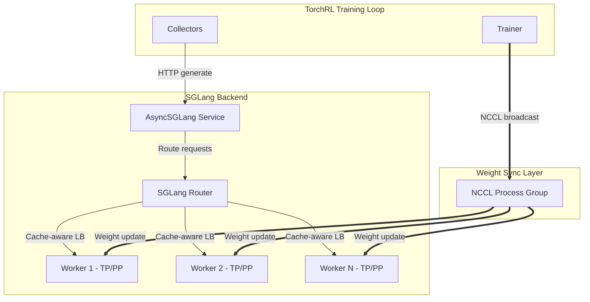

# SGLang Backend Port to TorchRL

This plan ports SGLang to TorchRL following the established vLLM patterns. Each commit represents a logical, independently testable unit.

## Architecture Overview




## File Structure

```
torchrl/modules/llm/backends/
├── sglang/
│   ├── __init__.py           # Lazy exports
│   ├── base.py               # RLSGLangEngine abstract base
│   ├── sglang_server.py      # AsyncSGLang service (server-based)
│   └── sglang_utils.py       # Shared utilities

torchrl/modules/llm/policies/
├── sglang_wrapper.py         # SGLangWrapper (like vLLMWrapper)

torchrl/weight_update/llm/
├── sglang_nccl.py            # SGLangWeightSyncScheme, Sender, Receiver

test/llm/
├── test_sglang.py            # SGLang integration tests
├── test_sglang_wrapper.py    # Wrapper tests
├── test_sglang_updaters.py   # Weight sync tests
```

---

## Commit 1: Base Infrastructure and Abstract Interface

**Message**: `[Feature] Add SGLang backend base infrastructure`

**Files**:

- `torchrl/modules/llm/backends/sglang/__init__.py`
- `torchrl/modules/llm/backends/sglang/base.py`
- `torchrl/modules/llm/backends/sglang/sglang_utils.py`

**Key Components**:

`base.py` - Abstract base class mirroring `RLvLLMEngine`:

```python
class RLSGLangEngine(abc.ABC):
    """Abstract base for TorchRL SGLang engines."""
    
    @abc.abstractmethod
    def get_tp_size(self) -> int: ...
    
    @abc.abstractmethod
    def get_model_metadata(self) -> dict[str, tuple[torch.dtype, torch.Size]]: ...
    
    @abc.abstractmethod
    def init_weight_update_group(self, master_address: str, master_port: int) -> None: ...
    
    @abc.abstractmethod
    def update_weights_from_distributed(self, name: str, dtype: str, shape: tuple) -> None: ...
```

`sglang_utils.py` - Shared utilities:

- HTTP client helpers for SGLang native APIs
- Server health check utilities
- Sampling parameter conversion (TorchRL standard → SGLang format)

---

## Commit 2: SGLang Server Service (AsyncSGLang)

**Message**: `[Feature] Add AsyncSGLang server-based inference service`

**Files**:

- `torchrl/modules/llm/backends/sglang/sglang_server.py`

**Key Class**: `AsyncSGLang` implementing `RLSGLangEngine`

**Features**:

- Connect to external SGLang server via URL
- Optionally launch server via subprocess (managed mode)
- Generation via HTTP to Router (cache-aware load balancing)
- Weight updates via NCCL (init group + distributed broadcast)
- Server lifecycle management (health checks, shutdown)

**Interface** (mirrors `AsyncVLLM`):

```python
class AsyncSGLang(RLSGLangEngine):
    def __init__(
        self,
        server_url: str | None = None,
        model_path: str | None = None,  # For managed mode
        tp_size: int = 1,
        dp_size: int = 1,
        num_replicas: int = 1,
        **server_kwargs,
    ): ...
    
    @classmethod
    def from_pretrained(cls, model_name: str, **kwargs) -> AsyncSGLang: ...
    
    @classmethod  
    def connect(cls, server_url: str) -> AsyncSGLang: ...
    
    def generate(self, prompts, sampling_params, **kwargs): ...
    
    def init_weight_update_group(self, master_address: str, master_port: int): ...
    
    def update_weights(self, weights: Iterator[tuple[str, torch.Tensor]]): ...
    
    def shutdown(self): ...
```

---

## Commit 3: SGLang Wrapper

**Message**: `[Feature] Add SGLangWrapper policy module`

**Files**:

- `torchrl/modules/llm/policies/sglang_wrapper.py`
- Update `torchrl/modules/llm/__init__.py` (add exports)
- Update `torchrl/modules/llm/policies/__init__.py` (add exports)

**Key Class**: `SGLangWrapper` extending `LLMWrapperBase`

**Features**:

- Same interface as `vLLMWrapper` for drop-in compatibility
- Input modes: history, text, tokens
- Output: Tokens, Text, LogProbs, Masks, ChatHistory
- Batching support (async requests to server)
- Standardized parameter mapping

**Interface**:

```python
class SGLangWrapper(LLMWrapperBase):
    def __init__(
        self,
        model: AsyncSGLang | str,  # AsyncSGLang or server URL
        *,
        tokenizer: callable | str | None = None,
        input_mode: str = "history",
        generate: bool = True,
        generate_kwargs: dict | None = None,
        return_log_probs: bool = True,
        # ... same kwargs as vLLMWrapper
    ): ...
```

---

## Commit 4: Weight Synchronization Scheme

**Message**: `[Feature] Add SGLang NCCL weight synchronization scheme`

**Files**:

- `torchrl/weight_update/llm/sglang_nccl.py`
- Update `torchrl/weight_update/llm/__init__.py` (add exports)

**Key Classes**:

```python
class SGLangWeightSyncScheme(WeightSyncScheme):
    """NCCL-based weight sync for SGLang server."""
    
    def __init__(
        self,
        server_url: str,
        master_address: str = "localhost",
        master_port: int | None = None,
        num_workers: int = 1,
        strategy: Literal["tensordict", "state_dict"] = "tensordict",
    ): ...
    
    def create_sender(self) -> SGLangWeightSender: ...
    def create_receiver(self, sglang_engine) -> SGLangWeightReceiver: ...

class SGLangWeightSender:
    """Trainer-side weight sender using NCCL broadcast."""
    
    def register_model(self, model): ...
    def init_all_workers_group(self, model_metadata): ...
    def update_weights(self, weights=None): ...

class SGLangWeightReceiver:
    """SGLang worker-side receiver (coordinates via HTTP, receives via NCCL)."""
    
    def init_all_workers_group(self, model_metadata): ...
```

**Weight Update Flow**:

1. `POST /init_weights_update_group` - Tell server to join NCCL group
2. Trainer initializes as rank 0
3. For each weight: `POST /update_weights_from_distributed` (coordinate) + NCCL broadcast (data)

---

## Commit 5: Module Exports and Integration

**Message**: `[Feature] Integrate SGLang backend into TorchRL module structure`

**Files**:

- Update `torchrl/modules/llm/backends/__init__.py`
- Update `torchrl/modules/llm/__init__.py`

**Exports to add**:

```python
# In backends/__init__.py
__all__ += [
    "RLSGLangEngine",
    "AsyncSGLang", 
    "make_sglang_server",
]

# In modules/llm/__init__.py
__all__ += [
    "SGLangWrapper",
    "AsyncSGLang",
    "make_sglang_server",
]
```

---

## Commit 6: Core Tests

**Message**: `[Test] Add SGLang backend and wrapper tests`

**Files**:

- `test/llm/test_sglang.py`

**Test Coverage**:

- `AsyncSGLang` connection (to external server)
- `AsyncSGLang.from_pretrained()` (managed server)
- Generation API compatibility (text, tokens, batch)
- `SGLangWrapper` input modes (history, text, tokens)
- Log probability extraction
- Sampling parameter conversion

**Structure** (mirrors `test_vllm.py`):

```python
@pytest.fixture(scope="module")
def sglang_server():
    """Launch SGLang server for tests."""
    ...

class TestAsyncSGLang:
    def test_connect_to_server(self, sglang_server): ...
    def test_generate_text(self, sglang_server): ...
    def test_generate_tokens(self, sglang_server): ...
    def test_generate_batch(self, sglang_server): ...

class TestSGLangWrapper:
    def test_history_mode(self, sglang_server): ...
    def test_text_mode(self, sglang_server): ...
    def test_tokens_mode(self, sglang_server): ...
    def test_log_probs(self, sglang_server): ...
```

---

## Commit 7: Weight Sync Tests

**Message**: `[Test] Add SGLang weight synchronization tests`

**Files**:

- `test/llm/test_sglang_updaters.py`

**Test Coverage**:

- `SGLangWeightSyncScheme` initialization
- NCCL group setup between trainer and server
- Weight broadcast from trainer to workers
- Integration with `LLMCollector`

---

## Commit 8: Documentation

**Message**: `[Docs] Add SGLang backend documentation`

**Files**:

- `docs/source/reference/llm.rst` (add SGLang section)
- Docstrings in all new modules

**Content**:

- Installation requirements (`pip install sglang`)
- Usage examples (managed vs external server)
- Weight sync setup
- Migration guide from vLLM

---

## Key Differences from vLLM Implementation


| Aspect           | vLLM                              | SGLang                                  |
| ---------------- | --------------------------------- | --------------------------------------- |
| Engine access    | Direct async engine in Ray actors | HTTP to server (Router)                 |
| Batching         | Ray actors + internal batching    | Router cache-aware load balancing       |
| Weight updates   | NCCL via collective_rpc           | NCCL via /init_weights_update_group API |
| Server lifecycle | Ray actor lifecycle               | Subprocess or external                  |


---

## Dependencies

- `sglang` package (with `sglang[all]` for full features)
- `requests` for HTTP client
- `torch.distributed` for NCCL (already available)

---

## Testing Strategy

1. **Unit tests**: Mock HTTP responses for offline testing
2. **Integration tests**: Real SGLang server (marked `@pytest.mark.slow`)
3. **GPU tests**: Weight sync tests (marked `@pytest.mark.gpu`)

Tests will use small models (`Qwen/Qwen2.5-0.5B`) consistent with vLLM tests.