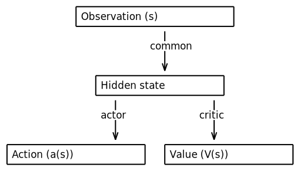

# ActorValueOperator

*class*torchrl.modules.ActorValueOperator(**args*, ***kwargs*)[[source]](../../_modules/torchrl/modules/tensordict_module/actors.html#ActorValueOperator)

Actor-value operator.

This class wraps together an actor and a value model that share a common
observation embedding network:

[](../../_images/aafig-2229301c32d3e27b4cec9be5284f11e681ba0607.svg)

Note

For a similar class that returns an action and a Quality value \(Q(s, a)\),
see [`ActorCriticOperator`](torchrl.modules.ActorCriticOperator.html#torchrl.modules.ActorCriticOperator). For a version without common embedding,
refer to [`ActorCriticWrapper`](torchrl.modules.ActorCriticWrapper.html#torchrl.modules.ActorCriticWrapper).

To facilitate the workflow, this class comes with a get_policy_operator() and get_value_operator() methods, which
will both return a standalone TDModule with the dedicated functionality.

Parameters:

- **common_operator** (*TensorDictModule*) - a common operator that reads
observations and produces a hidden variable
- **policy_operator** (*TensorDictModule*) - a policy operator that reads the
hidden variable and returns an action
- **value_operator** (*TensorDictModule*) - a value operator, that reads the
hidden variable and returns a value

Examples

```
>>> import torch
>>> from tensordict import TensorDict
>>> from torchrl.modules import ProbabilisticActor, SafeModule
>>> from torchrl.modules import ValueOperator, TanhNormal, ActorValueOperator, NormalParamExtractor
>>> module_hidden = torch.nn.Linear(4, 4)
>>> td_module_hidden = SafeModule(
... module=module_hidden,
... in_keys=["observation"],
... out_keys=["hidden"],
... )
>>> module_action = TensorDictModule(
... nn.Sequential(torch.nn.Linear(4, 8), NormalParamExtractor()),
... in_keys=["hidden"],
... out_keys=["loc", "scale"],
... )
>>> td_module_action = ProbabilisticActor(
... module=module_action,
... in_keys=["loc", "scale"],
... out_keys=["action"],
... distribution_class=TanhNormal,
... return_log_prob=True,
... )
>>> module_value = torch.nn.Linear(4, 1)
>>> td_module_value = ValueOperator(
... module=module_value,
... in_keys=["hidden"],
... )
>>> td_module = ActorValueOperator(td_module_hidden, td_module_action, td_module_value)
>>> td = TensorDict({"observation": torch.randn(3, 4)}, [3,])
>>> td_clone = td_module(td.clone())
>>> print(td_clone)
TensorDict(
 fields={
 action: Tensor(shape=torch.Size([3, 4]), device=cpu, dtype=torch.float32, is_shared=False),
 hidden: Tensor(shape=torch.Size([3, 4]), device=cpu, dtype=torch.float32, is_shared=False),
 loc: Tensor(shape=torch.Size([3, 4]), device=cpu, dtype=torch.float32, is_shared=False),
 observation: Tensor(shape=torch.Size([3, 4]), device=cpu, dtype=torch.float32, is_shared=False),
 sample_log_prob: Tensor(shape=torch.Size([3]), device=cpu, dtype=torch.float32, is_shared=False),
 scale: Tensor(shape=torch.Size([3, 4]), device=cpu, dtype=torch.float32, is_shared=False),
 state_value: Tensor(shape=torch.Size([3, 1]), device=cpu, dtype=torch.float32, is_shared=False)},
 batch_size=torch.Size([3]),
 device=None,
 is_shared=False)
>>> td_clone = td_module.get_policy_operator()(td.clone())
>>> print(td_clone) # no value
TensorDict(
 fields={
 action: Tensor(shape=torch.Size([3, 4]), device=cpu, dtype=torch.float32, is_shared=False),
 hidden: Tensor(shape=torch.Size([3, 4]), device=cpu, dtype=torch.float32, is_shared=False),
 loc: Tensor(shape=torch.Size([3, 4]), device=cpu, dtype=torch.float32, is_shared=False),
 observation: Tensor(shape=torch.Size([3, 4]), device=cpu, dtype=torch.float32, is_shared=False),
 sample_log_prob: Tensor(shape=torch.Size([3]), device=cpu, dtype=torch.float32, is_shared=False),
 scale: Tensor(shape=torch.Size([3, 4]), device=cpu, dtype=torch.float32, is_shared=False)},
 batch_size=torch.Size([3]),
 device=None,
 is_shared=False)
>>> td_clone = td_module.get_value_operator()(td.clone())
>>> print(td_clone) # no action
TensorDict(
 fields={
 hidden: Tensor(shape=torch.Size([3, 4]), device=cpu, dtype=torch.float32, is_shared=False),
 observation: Tensor(shape=torch.Size([3, 4]), device=cpu, dtype=torch.float32, is_shared=False),
 state_value: Tensor(shape=torch.Size([3, 1]), device=cpu, dtype=torch.float32, is_shared=False)},
 batch_size=torch.Size([3]),
 device=None,
 is_shared=False)
```

get_policy_head() → [TensorDictModule](https://docs.pytorch.org/tensordict/stable/reference/generated/tensordict.nn.TensorDictModule.html#tensordict.nn.TensorDictModule)[[source]](../../_modules/torchrl/modules/tensordict_module/actors.html#ActorValueOperator.get_policy_head)

Returns the policy head.

get_policy_operator() → [TensorDictSequential](https://docs.pytorch.org/tensordict/stable/reference/generated/tensordict.nn.TensorDictSequential.html#tensordict.nn.TensorDictSequential)[[source]](../../_modules/torchrl/modules/tensordict_module/actors.html#ActorValueOperator.get_policy_operator)

Returns a standalone policy operator that maps an observation to an action.

get_value_head() → [TensorDictModule](https://docs.pytorch.org/tensordict/stable/reference/generated/tensordict.nn.TensorDictModule.html#tensordict.nn.TensorDictModule)[[source]](../../_modules/torchrl/modules/tensordict_module/actors.html#ActorValueOperator.get_value_head)

Returns the value head.

get_value_operator() → [TensorDictSequential](https://docs.pytorch.org/tensordict/stable/reference/generated/tensordict.nn.TensorDictSequential.html#tensordict.nn.TensorDictSequential)[[source]](../../_modules/torchrl/modules/tensordict_module/actors.html#ActorValueOperator.get_value_operator)

Returns a standalone value network operator that maps an observation to a value estimate.