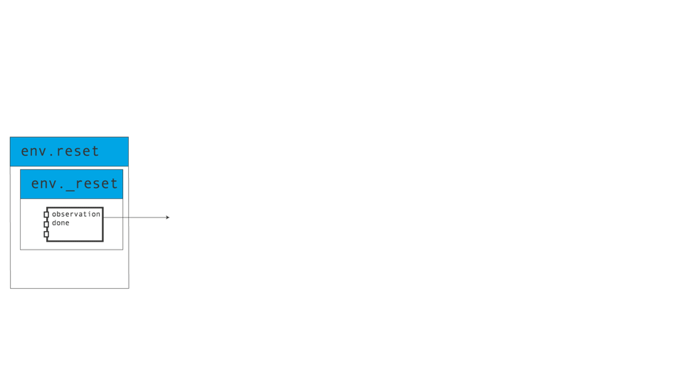

[](https://github.com/pytorch/rl/actions/workflows/test-linux.yml)
[](https://pytorch.org/rl/)
[](https://pytorch.github.io/rl/dev/bench/)
[](https://codecov.io/gh/pytorch/rl)
[](https://twitter.com/torchrl1)
[](https://www.python.org/downloads/)
[](https://github.com/pytorch/rl/blob/main/LICENSE)
<a href="https://pypi.org/project/torchrl"></a>
<a href="https://pypi.org/project/torchrl-nightly"></a>
[](https://pepy.tech/project/torchrl)
[)](https://pepy.tech/project/torchrl-nightly)
[](https://discord.gg/cZs26Qq3Dd)

# TorchRL

<p align="center">
  
</p>

[**Documentation**](#documentation-and-knowledge-base) | [**TensorDict**](#writing-simplified-and-portable-rl-codebase-with-tensordict) |
[**Features**](#features) | [**Examples, tutorials and demos**](#examples-tutorials-and-demos) | [**Citation**](#citation) | [**Installation**](#installation) |
[**Asking a question**](#asking-a-question) | [**Contributing**](#contributing)

**TorchRL** is an open-source Reinforcement Learning (RL) library for PyTorch.

It provides pytorch and **python-first**, low and high level abstractions for RL that are intended to be **efficient**, **modular**, **documented** and properly **tested**.
The code is aimed at supporting research in RL. Most of it is written in python in a highly modular way, such that researchers can easily swap components, transform them or write new ones with little effort.

This repo attempts to align with the existing pytorch ecosystem libraries in that it has a dataset pillar ([torchrl/envs](torchrl/envs)), [transforms](torchrl/envs/transforms), [models](torchrl/modules), data utilities (e.g. collectors and containers), etc.
TorchRL aims at having as few dependencies as possible (python standard library, numpy and pytorch). Common environment libraries (e.g. OpenAI gym) are only optional.

On the low-level end, torchrl comes with a set of highly re-usable functionals for [cost functions](torchrl/objectives/costs), [returns](torchrl/objectives/returns) and data processing.

TorchRL aims at (1) a high modularity and (2) good runtime performance. Read the [full paper](https://arxiv.org/abs/2306.00577) for a more curated description of the library.

## Getting started

Check our [Getting Started tutorials](https://pytorch.org/rl/index.html#getting-started) for quickly ramp up with the basic 
features of the library!

## Documentation and knowledge base

The TorchRL documentation can be found [here](https://pytorch.org/rl).
It contains tutorials and the API reference.

TorchRL also provides a RL knowledge base to help you debug your code, or simply
learn the basics of RL. Check it out [here](https://pytorch.org/rl/reference/knowledge_base.html).

We have some introductory videos for you to get to know the library better, check them out:

- [TorchRL intro at PyTorch day 2022](https://youtu.be/cIKMhZoykEE)
- [PyTorch 2.0 Q&A: TorchRL](https://www.youtube.com/live/myEfUoYrbts?feature=share)

## Writing simplified and portable RL codebase with `TensorDict`

RL algorithms are very heterogeneous, and it can be hard to recycle a codebase
across settings (e.g. from online to offline, from state-based to pixel-based 
learning).
TorchRL solves this problem through [`TensorDict`](https://github.com/pytorch/tensordict/),
a convenient data structure<sup>(1)</sup> that can be used to streamline one's
RL codebase.
With this tool, one can write a *complete PPO training script in less than 100
lines of code*!

  <details>
    <summary>Code</summary>

  ```python
  import torch
  from tensordict.nn import TensorDictModule
  from tensordict.nn.distributions import NormalParamExtractor
  from torch import nn
  
  from torchrl.collectors import SyncDataCollector
  from torchrl.data.replay_buffers import TensorDictReplayBuffer, \
      LazyTensorStorage, SamplerWithoutReplacement
  from torchrl.envs.libs.gym import GymEnv
  from torchrl.modules import ProbabilisticActor, ValueOperator, TanhNormal
  from torchrl.objectives import ClipPPOLoss
  from torchrl.objectives.value import GAE
  
  env = GymEnv("Pendulum-v1")
  model = TensorDictModule(
      nn.Sequential(
          nn.Linear(3, 128), nn.Tanh(),
          nn.Linear(128, 128), nn.Tanh(),
          nn.Linear(128, 128), nn.Tanh(),
          nn.Linear(128, 2),
          NormalParamExtractor()
      ),
      in_keys=["observation"],
      out_keys=["loc", "scale"]
  )
  critic = ValueOperator(
      nn.Sequential(
          nn.Linear(3, 128), nn.Tanh(),
          nn.Linear(128, 128), nn.Tanh(),
          nn.Linear(128, 128), nn.Tanh(),
          nn.Linear(128, 1),
      ),
      in_keys=["observation"],
  )
  actor = ProbabilisticActor(
      model,
      in_keys=["loc", "scale"],
      distribution_class=TanhNormal,
      distribution_kwargs={"min": -1.0, "max": 1.0},
      return_log_prob=True
      )
  buffer = TensorDictReplayBuffer(
      LazyTensorStorage(1000),
      SamplerWithoutReplacement()
      )
  collector = SyncDataCollector(
      env,
      actor,
      frames_per_batch=1000,
      total_frames=1_000_000
      )
  loss_fn = ClipPPOLoss(actor, critic, gamma=0.99)
  optim = torch.optim.Adam(loss_fn.parameters(), lr=2e-4)
  adv_fn = GAE(value_network=critic, gamma=0.99, lmbda=0.95, average_gae=True)
  for data in collector:  # collect data
      for epoch in range(10):
          adv_fn(data)  # compute advantage
          buffer.extend(data.view(-1))
          for i in range(20):  # consume data
              sample = buffer.sample(50)  # mini-batch
              loss_vals = loss_fn(sample)
              loss_val = sum(
                  value for key, value in loss_vals.items() if
                  key.startswith("loss")
                  )
              loss_val.backward()
              optim.step()
              optim.zero_grad()
      print(f"avg reward: {data['next', 'reward'].mean().item(): 4.4f}")
  ```
  </details>

Here is an example of how the [environment API](https://pytorch.org/rl/reference/envs.html)
relies on tensordict to carry data from one function to another during a rollout
execution:


`TensorDict` makes it easy to re-use pieces of code across environments, models and
algorithms.
  <details>
    <summary>Code</summary>
  
  For instance, here's how to code a rollout in TorchRL:

  ```diff
  - obs, done = env.reset()
  + tensordict = env.reset()
  policy = SafeModule(
      model,
      in_keys=["observation_pixels", "observation_vector"],
      out_keys=["action"],
  )
  out = []
  for i in range(n_steps):
  -     action, log_prob = policy(obs)
  -     next_obs, reward, done, info = env.step(action)
  -     out.append((obs, next_obs, action, log_prob, reward, done))
  -     obs = next_obs
  +     tensordict = policy(tensordict)
  +     tensordict = env.step(tensordict)
  +     out.append(tensordict)
  +     tensordict = step_mdp(tensordict)  # renames next_observation_* keys to observation_*
  - obs, next_obs, action, log_prob, reward, done = [torch.stack(vals, 0) for vals in zip(*out)]
  + out = torch.stack(out, 0)  # TensorDict supports multiple tensor operations
  ```
  </details>

Using this, TorchRL abstracts away the input / output signatures of the modules, env, 
collectors, replay buffers and losses of the library, allowing all primitives
to be easily recycled across settings.

  <details>
    <summary>Code</summary>

  Here's another example of an off-policy training loop in TorchRL (assuming 
  that a data collector, a replay buffer, a loss and an optimizer have been instantiated):
  
  ```diff
  - for i, (obs, next_obs, action, hidden_state, reward, done) in enumerate(collector):
  + for i, tensordict in enumerate(collector):
  -     replay_buffer.add((obs, next_obs, action, log_prob, reward, done))
  +     replay_buffer.add(tensordict)
      for j in range(num_optim_steps):
  -         obs, next_obs, action, hidden_state, reward, done = replay_buffer.sample(batch_size)
  -         loss = loss_fn(obs, next_obs, action, hidden_state, reward, done)
  +         tensordict = replay_buffer.sample(batch_size)
  +         loss = loss_fn(tensordict)
          loss.backward()
          optim.step()
          optim.zero_grad()
  ```
  This training loop can be re-used across algorithms as it makes a minimal number of assumptions about the structure of the data.
  </details>

  TensorDict supports multiple tensor operations on its device and shape
  (the shape of TensorDict, or its batch size, is the common arbitrary N first dimensions of all its contained tensors):

  <details>
    <summary>Code</summary>

  ```python
  # stack and cat
  tensordict = torch.stack(list_of_tensordicts, 0)
  tensordict = torch.cat(list_of_tensordicts, 0)
  # reshape
  tensordict = tensordict.view(-1)
  tensordict = tensordict.permute(0, 2, 1)
  tensordict = tensordict.unsqueeze(-1)
  tensordict = tensordict.squeeze(-1)
  # indexing
  tensordict = tensordict[:2]
  tensordict[:, 2] = sub_tensordict
  # device and memory location
  tensordict.cuda()
  tensordict.to("cuda:1")
  tensordict.share_memory_()
  ```
  </details>

TensorDict comes with a dedicated [`tensordict.nn`](https://pytorch.github.io/tensordict/reference/nn.html)
module that contains everything you might need to write your model with it.
And it is `functorch` and `torch.compile` compatible!

  <details>
    <summary>Code</summary>

  ```diff
  transformer_model = nn.Transformer(nhead=16, num_encoder_layers=12)
  + td_module = SafeModule(transformer_model, in_keys=["src", "tgt"], out_keys=["out"])
  src = torch.rand((10, 32, 512))
  tgt = torch.rand((20, 32, 512))
  + tensordict = TensorDict({"src": src, "tgt": tgt}, batch_size=[20, 32])
  - out = transformer_model(src, tgt)
  + td_module(tensordict)
  + out = tensordict["out"]
  ```

  The `TensorDictSequential` class allows to branch sequences of `nn.Module` instances in a highly modular way.
  For instance, here is an implementation of a transformer using the encoder and decoder blocks:
  ```python
  encoder_module = TransformerEncoder(...)
  encoder = TensorDictSequential(encoder_module, in_keys=["src", "src_mask"], out_keys=["memory"])
  decoder_module = TransformerDecoder(...)
  decoder = TensorDictModule(decoder_module, in_keys=["tgt", "memory"], out_keys=["output"])
  transformer = TensorDictSequential(encoder, decoder)
  assert transformer.in_keys == ["src", "src_mask", "tgt"]
  assert transformer.out_keys == ["memory", "output"]
  ```

  `TensorDictSequential` allows to isolate subgraphs by querying a set of desired input / output keys:
  ```python
  transformer.select_subsequence(out_keys=["memory"])  # returns the encoder
  transformer.select_subsequence(in_keys=["tgt", "memory"])  # returns the decoder
  ```
  </details>

  Check [TensorDict tutorials](https://pytorch.github.io/tensordict/) to
  learn more!


## Features

- A common [interface for environments](torchrl/envs)
  which supports common libraries (OpenAI gym, deepmind control lab, etc.)<sup>(1)</sup> and state-less execution 
  (e.g. Model-based environments).
  The [batched environments](torchrl/envs/batched_envs.py) containers allow parallel execution<sup>(2)</sup>.
  A common PyTorch-first class of [tensor-specification class](torchrl/data/tensor_specs.py) is also provided.
  TorchRL's environments API is simple but stringent and specific. Check the 
  [documentation](https://pytorch.org/rl/reference/envs.html)
  and [tutorial](https://pytorch.org/rl/tutorials/pendulum.html) to learn more!
  <details>
    <summary>Code</summary>

  ```python
  env_make = lambda: GymEnv("Pendulum-v1", from_pixels=True)
  env_parallel = ParallelEnv(4, env_make)  # creates 4 envs in parallel
  tensordict = env_parallel.rollout(max_steps=20, policy=None)  # random rollout (no policy given)
  assert tensordict.shape == [4, 20]  # 4 envs, 20 steps rollout
  env_parallel.action_spec.is_in(tensordict["action"])  # spec check returns True
  ```
  </details>

- multiprocess and distributed [data collectors](torchrl/collectors/collectors.py)<sup>(2)</sup>
  that work synchronously or asynchronously.
  Through the use of TensorDict, TorchRL's training loops are made very similar
  to regular training loops in supervised
  learning (although the "dataloader" -- read data collector -- is modified on-the-fly):
  <details>
    <summary>Code</summary>

  ```python
  env_make = lambda: GymEnv("Pendulum-v1", from_pixels=True)
  collector = MultiaSyncDataCollector(
      [env_make, env_make],
      policy=policy,
      devices=["cuda:0", "cuda:0"],
      total_frames=10000,
      frames_per_batch=50,
      ...
  )
  for i, tensordict_data in enumerate(collector):
      loss = loss_module(tensordict_data)
      loss.backward()
      optim.step()
      optim.zero_grad()
      collector.update_policy_weights_()
  ```
  </details>

  Check our [distributed collector examples](sota-implementations/distributed/collectors) to
  learn more about ultra-fast data collection with TorchRL.

- efficient<sup>(2)</sup> and generic<sup>(1)</sup> [replay buffers](torchrl/data/replay_buffers/replay_buffers.py) with modularized storage:
  <details>
    <summary>Code</summary>

  ```python
  storage = LazyMemmapStorage(  # memory-mapped (physical) storage
      cfg.buffer_size,
      scratch_dir="/tmp/"
  )
  buffer = TensorDictPrioritizedReplayBuffer(
      alpha=0.7,
      beta=0.5,
      collate_fn=lambda x: x,
      pin_memory=device != torch.device("cpu"),
      prefetch=10,  # multi-threaded sampling
      storage=storage
  )
  ```
  </details>

  Replay buffers are also offered as wrappers around common datasets for *offline RL*:
  <details>
    <summary>Code</summary>

  ```python
  from torchrl.data.replay_buffers import SamplerWithoutReplacement
  from torchrl.data.datasets.d4rl import D4RLExperienceReplay
  data = D4RLExperienceReplay(
      "maze2d-open-v0",
      split_trajs=True,
      batch_size=128,
      sampler=SamplerWithoutReplacement(drop_last=True),
  )
  for sample in data:  # or alternatively sample = data.sample()
      fun(sample)
  ```
  </details>


- cross-library [environment transforms](torchrl/envs/transforms/transforms.py)<sup>(1)</sup>,
  executed on device and in a vectorized fashion<sup>(2)</sup>,
  which process and prepare the data coming out of the environments to be used by the agent:
  <details>
    <summary>Code</summary>

  ```python
  env_make = lambda: GymEnv("Pendulum-v1", from_pixels=True)
  env_base = ParallelEnv(4, env_make, device="cuda:0")  # creates 4 envs in parallel
  env = TransformedEnv(
      env_base,
      Compose(
          ToTensorImage(),
          ObservationNorm(loc=0.5, scale=1.0)),  # executes the transforms once and on device
  )
  tensordict = env.reset()
  assert tensordict.device == torch.device("cuda:0")
  ```
  Other transforms include: reward scaling (`RewardScaling`), shape operations (concatenation of tensors, unsqueezing etc.), concatenation of
  successive operations (`CatFrames`), resizing (`Resize`) and many more.

  Unlike other libraries, the transforms are stacked as a list (and not wrapped in each other), which makes it
  easy to add and remove them at will:
  ```python
  env.insert_transform(0, NoopResetEnv())  # inserts the NoopResetEnv transform at the index 0
  ```
  Nevertheless, transforms can access and execute operations on the parent environment:
  ```python
  transform = env.transform[1]  # gathers the second transform of the list
  parent_env = transform.parent  # returns the base environment of the second transform, i.e. the base env + the first transform
  ```
  </details>

- various tools for distributed learning (e.g. [memory mapped tensors](https://github.com/pytorch/tensordict/blob/main/tensordict/memmap.py))<sup>(2)</sup>;
- various [architectures](torchrl/modules/models/) and models (e.g. [actor-critic](torchrl/modules/tensordict_module/actors.py))<sup>(1)</sup>:
  <details>
    <summary>Code</summary>

  ```python
  # create an nn.Module
  common_module = ConvNet(
      bias_last_layer=True,
      depth=None,
      num_cells=[32, 64, 64],
      kernel_sizes=[8, 4, 3],
      strides=[4, 2, 1],
  )
  # Wrap it in a SafeModule, indicating what key to read in and where to
  # write out the output
  common_module = SafeModule(
      common_module,
      in_keys=["pixels"],
      out_keys=["hidden"],
  )
  # Wrap the policy module in NormalParamsWrapper, such that the output
  # tensor is split in loc and scale, and scale is mapped onto a positive space
  policy_module = SafeModule(
      NormalParamsWrapper(
          MLP(num_cells=[64, 64], out_features=32, activation=nn.ELU)
      ),
      in_keys=["hidden"],
      out_keys=["loc", "scale"],
  )
  # Use a SafeProbabilisticTensorDictSequential to combine the SafeModule with a
  # SafeProbabilisticModule, indicating how to build the
  # torch.distribution.Distribution object and what to do with it
  policy_module = SafeProbabilisticTensorDictSequential(  # stochastic policy
      policy_module,
      SafeProbabilisticModule(
          in_keys=["loc", "scale"],
          out_keys="action",
          distribution_class=TanhNormal,
      ),
  )
  value_module = MLP(
      num_cells=[64, 64],
      out_features=1,
      activation=nn.ELU,
  )
  # Wrap the policy and value funciton in a common module
  actor_value = ActorValueOperator(common_module, policy_module, value_module)
  # standalone policy from this
  standalone_policy = actor_value.get_policy_operator()
  ```
  </details>

- exploration [wrappers](torchrl/modules/tensordict_module/exploration.py) and
  [modules](torchrl/modules/models/exploration.py) to easily swap between exploration and exploitation<sup>(1)</sup>:
  <details>
    <summary>Code</summary>

  ```python
  policy_explore = EGreedyWrapper(policy)
  with set_exploration_type(ExplorationType.RANDOM):
      tensordict = policy_explore(tensordict)  # will use eps-greedy
  with set_exploration_type(ExplorationType.MODE):
      tensordict = policy_explore(tensordict)  # will not use eps-greedy
  ```
  </details>

- A series of efficient [loss modules](https://github.com/pytorch/rl/tree/main/torchrl/objectives)
  and highly vectorized
  [functional return and advantage](https://github.com/pytorch/rl/blob/main/torchrl/objectives/value/functional.py)
  computation.

  <details>
    <summary>Code</summary>

  ### Loss modules
  ```python
  from torchrl.objectives import DQNLoss
  loss_module = DQNLoss(value_network=value_network, gamma=0.99)
  tensordict = replay_buffer.sample(batch_size)
  loss = loss_module(tensordict)
  ```

  ### Advantage computation
  ```python
  from torchrl.objectives.value.functional import vec_td_lambda_return_estimate
  advantage = vec_td_lambda_return_estimate(gamma, lmbda, next_state_value, reward, done, terminated)
  ```

  </details>

- a generic [trainer class](torchrl/trainers/trainers.py)<sup>(1)</sup> that
  executes the aforementioned training loop. Through a hooking mechanism,
  it also supports any logging or data transformation operation at any given
  time.

- various [recipes](torchrl/trainers/helpers/models.py) to build models that
    correspond to the environment being deployed.

If you feel a feature is missing from the library, please submit an issue!
If you would like to contribute to new features, check our [call for contributions](https://github.com/pytorch/rl/issues/509) and our [contribution](CONTRIBUTING.md) page.


## Examples, tutorials and demos

A series of [examples](examples/) are provided with an illustrative purpose:
- [DQN](sota-implementations/dqn)
- [DDPG](sota-implementations/ddpg/ddpg.py)
- [IQL](sota-implementations/iql/iql.py)
- [CQL](sota-implementations/iql/cql.py)
- [TD3](sota-implementations/td3/td3.py)
- [A2C](examples/a2c_old/a2c.py)
- [PPO](sota-implementations/ppo/ppo.py)
- [SAC](sota-implementations/sac/sac.py)
- [REDQ](sota-implementations/redq/redq.py)
- [Dreamer](sota-implementations/dreamer/dreamer.py)
- [Decision Transformers](sota-implementations/decision_transformer)
- [RLHF](examples/rlhf)

and many more to come!

Check the [examples markdown](sota-implementations/SOTA-IMPLEMENTATIONS.md) directory for more details 
about handling the various configuration settings.

We also provide [tutorials and demos](https://pytorch.org/rl/#tutorials) that give a sense of
what the library can do.

## Citation

If you're using TorchRL, please refer to this BibTeX entry to cite this work:
```
@misc{bou2023torchrl,
      title={TorchRL: A data-driven decision-making library for PyTorch}, 
      author={Albert Bou and Matteo Bettini and Sebastian Dittert and Vikash Kumar and Shagun Sodhani and Xiaomeng Yang and Gianni De Fabritiis and Vincent Moens},
      year={2023},
      eprint={2306.00577},
      archivePrefix={arXiv},
      primaryClass={cs.LG}
}
```

## Installation

Create a conda environment where the packages will be installed.

```
conda create --name torch_rl python=3.9
conda activate torch_rl
```

**PyTorch**

Depending on the use of functorch that you want to make, you may want to 
install the latest (nightly) PyTorch release or the latest stable version of PyTorch.
See [here](https://pytorch.org/get-started/locally/) for a detailed list of commands, 
including `pip3` or other special installation instructions.

**Torchrl**

You can install the **latest stable release** by using
```
pip3 install torchrl
```
This should work on linux, Windows 10 and OsX (Intel or Silicon chips).
On certain Windows machines (Windows 11), one should install the library locally (see below).

The **nightly build** can be installed via
```
pip install torchrl-nightly
```
which we currently only ship for Linux and OsX (Intel) machines.
Importantly, the nightly builds require the nightly builds of PyTorch too.

To install extra dependencies, call
```
pip3 install "torchrl[atari,dm_control,gym_continuous,rendering,tests,utils,marl,checkpointing]"
```
or a subset of these.

One may also desire to install the library locally. Three main reasons can motivate this:
- the nightly/stable release isn't available for one's platform (eg, Windows 11, nightlies for Apple Silicon etc.);
- contributing to the code;
- install torchrl with a previous version of PyTorch (note that this should also be doable via a regular install followed
  by a downgrade to a previous pytorch version -- but the C++ binaries will not be available.)

To install the library locally, start by cloning the repo:
```
git clone https://github.com/pytorch/rl
```

Go to the directory where you have cloned the torchrl repo and install it (after
installing `ninja`)
```
cd /path/to/torchrl/
pip install ninja -U
python setup.py develop
```

(unfortunately, `pip install -e .` will not work).

On M1 machines, this should work out-of-the-box with the nightly build of PyTorch.
If the generation of this artifact in MacOs M1 doesn't work correctly or in the execution the message
`(mach-o file, but is an incompatible architecture (have 'x86_64', need 'arm64e'))` appears, then try

```
ARCHFLAGS="-arch arm64" python setup.py develop
```

To run a quick sanity check, leave that directory (e.g. by executing `cd ~/`)
and try to import the library.
```
python -c "import torchrl"
```
This should not return any warning or error.

**Optional dependencies**

The following libraries can be installed depending on the usage one wants to
make of torchrl:
```
# diverse
pip3 install tqdm tensorboard "hydra-core>=1.1" hydra-submitit-launcher

# rendering
pip3 install moviepy

# deepmind control suite
pip3 install dm_control

# gym, atari games
pip3 install "gym[atari]" "gym[accept-rom-license]" pygame

# tests
pip3 install pytest pyyaml pytest-instafail

# tensorboard
pip3 install tensorboard

# wandb
pip3 install wandb
```

**Troubleshooting**

If a `ModuleNotFoundError: No module named ‘torchrl._torchrl` errors occurs (or
a warning indicating that the C++ binaries could not be loaded),
it means that the C++ extensions were not installed or not found.

- One common reason might be that you are trying to import torchrl from within the
  git repo location. The following code snippet should return an error if
  torchrl has not been installed in `develop` mode:
  ```
  cd ~/path/to/rl/repo
  python -c 'from torchrl.envs.libs.gym import GymEnv'
  ```
  If this is the case, consider executing torchrl from another location.
- If you're not importing torchrl from within its repo location, it could be
  caused by a problem during the local installation. Check the log after the
  `python setup.py develop`. One common cause is a g++/C++ version discrepancy
  and/or a problem with the `ninja` library.
- If the problem persists, feel free to open an issue on the topic in the repo,
  we'll make our best to help!
- On **MacOs**, we recommend installing XCode first. 
  With Apple Silicon M1 chips, make sure you are using the arm64-built python
  (e.g. [here](https://betterprogramming.pub/how-to-install-pytorch-on-apple-m1-series-512b3ad9bc6)).
  Running the following lines of code
  ```
  wget https://raw.githubusercontent.com/pytorch/pytorch/master/torch/utils/collect_env.py
  python collect_env.py
  ```
  should display
  ```
  OS: macOS *** (arm64)
  ```
  and not
  ```
  OS: macOS **** (x86_64)
  ```

Versioning issues can cause error message of the type ```undefined symbol```
and such. For these, refer to the [versioning issues document](knowledge_base/VERSIONING_ISSUES.md)
for a complete explanation and proposed workarounds.

## Asking a question

If you spot a bug in the library, please raise an issue in this repo.

If you have a more generic question regarding RL in PyTorch, post it on
the [PyTorch forum](https://discuss.pytorch.org/c/reinforcement-learning/6).

## Contributing

Internal collaborations to torchrl are welcome! Feel free to fork, submit issues and PRs.
You can checkout the detailed contribution guide [here](CONTRIBUTING.md).
As mentioned above, a list of open contributions can be found in [here](https://github.com/pytorch/rl/issues/509).

Contributors are recommended to install [pre-commit hooks](https://pre-commit.com/) (using `pre-commit install`). pre-commit will check for linting related issues when the code is committed locally. You can disable th check by appending `-n` to your commit command: `git commit -m <commit message> -n`


## Disclaimer

This library is released as a PyTorch beta feature.
BC-breaking changes are likely to happen but they will be introduced with a deprecation
warranty after a few release cycles.

# License
TorchRL is licensed under the MIT License. See [LICENSE](LICENSE) for details.
