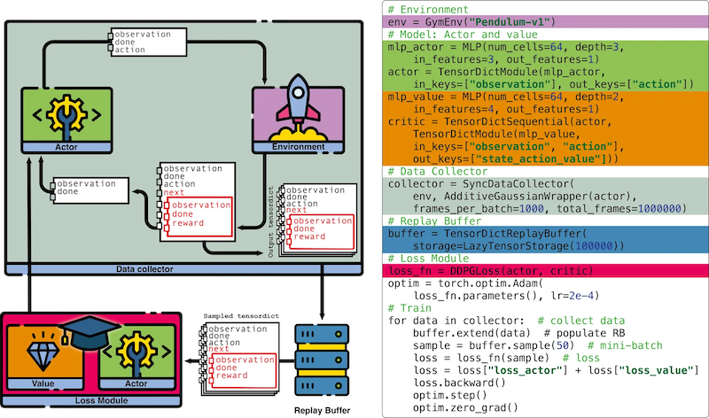

[](https://github.com/pytorch/rl/actions/workflows/test-linux.yml)
[](https://pytorch.org/rl/)
[](https://pytorch.github.io/rl/dev/bench/)
[](https://codecov.io/gh/pytorch/rl)
[](https://pytorch.github.io/rl/flaky/)
[](https://twitter.com/torchrl1)
[](https://www.python.org/downloads/)
[](https://github.com/pytorch/rl/blob/main/LICENSE)
<a href="https://pypi.org/project/torchrl"></a>
<a href="https://pypi.org/project/torchrl-nightly"></a>
[](https://pepy.tech/project/torchrl)
[)](https://pepy.tech/project/torchrl-nightly)
[](https://discord.gg/cZs26Qq3Dd)

# TorchRL

<p align="center">
  
</p>

[**What's New**](#-whats-new) | [**LLM API**](#llm-api---complete-framework-for-language-model-fine-tuning) | [**Getting Started**](#getting-started) | [**Documentation**](#documentation-and-knowledge-base) | [**TensorDict**](#writing-simplified-and-portable-rl-codebase-with-tensordict) |
[**Features**](#features) | [**Examples, tutorials and demos**](#examples-tutorials-and-demos) | [**Citation**](#citation) | [**Installation**](#installation) |
[**Asking a question**](#asking-a-question) | [**Contributing**](#contributing)

**TorchRL** is an open-source Reinforcement Learning (RL) library for PyTorch.

## 🚀 What's New

### 🚀 **Command-Line Training Interface** - Train RL Agents Without Writing Code! (Experimental)

TorchRL now provides a **powerful command-line interface** that lets you train state-of-the-art RL agents with simple bash commands! No Python scripting required - just run training with customizable parameters:

- 🎯 **One-Command Training**: `python sota-implementations/ppo_trainer/train.py`
- ⚙️ **Full Customization**: Override any parameter via command line: `trainer.total_frames=2000000 optimizer.lr=0.0003`
- 🌍 **Multi-Environment Support**: Switch between Gym, Brax, DM Control, and more with `env=gym training_env.create_env_fn.base_env.env_name=HalfCheetah-v4`
- 📊 **Built-in Logging**: TensorBoard, Weights & Biases, CSV logging out of the box
- 🔧 **Hydra-Powered**: Leverages Hydra's powerful configuration system for maximum flexibility
- 🏃‍♂️ **Production Ready**: Same robust training pipeline as our SOTA implementations

**Perfect for**: Researchers, practitioners, and anyone who wants to train RL agents without diving into implementation details. 

⚠️ **Note**: This is an experimental feature. The API may change in future versions. We welcome feedback and contributions to help improve this implementation!

📋 **Prerequisites**: The training interface requires Hydra for configuration management. Install with:
```bash
pip install "torchrl[utils]"
# or manually:
pip install hydra-core omegaconf
```

Check out the [complete CLI documentation](https://github.com/pytorch/rl/tree/main/sota-implementations/ppo_trainer) to get started!

### 🚀 **vLLM Revamp** - Major Enhancement to LLM Infrastructure (v0.10)

This release introduces a comprehensive revamp of TorchRL's vLLM integration, delivering significant improvements in performance, scalability, and usability for large language model inference and training workflows:

- 🔥 **AsyncVLLM Service**: Production-ready distributed vLLM inference with multi-replica scaling and automatic Ray actor management
- ⚖️ **Multiple Load Balancing Strategies**: Routing strategies including prefix-aware, request-based, and KV-cache load balancing for optimal performance
- 🏗️ **Unified vLLM Architecture**: New `RLvLLMEngine` interface standardizing all vLLM backends with simplified `vLLMUpdaterV2` for seamless weight updates
- 🌐 **Distributed Data Loading**: New `RayDataLoadingPrimer` for shared, distributed data loading across multiple environments
- 📈 **Enhanced Performance**: Native vLLM batching, concurrent request processing, and optimized resource allocation via Ray placement groups

```python
# Simple AsyncVLLM usage - production ready!
from torchrl.modules.llm import AsyncVLLM, vLLMWrapper

# Create distributed vLLM service with load balancing
service = AsyncVLLM.from_pretrained(
    "Qwen/Qwen2.5-7B",
    num_devices=2,      # Tensor parallel across 2 GPUs
    num_replicas=4,     # 4 replicas for high throughput
    max_model_len=4096
)

# Use with TorchRL's LLM wrappers
wrapper = vLLMWrapper(service, input_mode="history")

# Simplified weight updates
from torchrl.collectors.llm import vLLMUpdaterV2
updater = vLLMUpdaterV2(service)  # Auto-configures from engine
```

This revamp positions TorchRL as the leading platform for scalable LLM inference and training, providing production-ready tools for both research and deployment scenarios.

### 🧪 PPOTrainer (Experimental) - High-Level Training Interface

TorchRL now includes an **experimental PPOTrainer** that provides a complete, configurable PPO training solution! This prototype feature combines TorchRL's modular components into a cohesive training system with sensible defaults:

- 🎯 **Complete Training Pipeline**: Handles environment setup, data collection, loss computation, and optimization automatically
- ⚙️ **Extensive Configuration**: Comprehensive Hydra-based config system for easy experimentation and hyperparameter tuning
- 📊 **Built-in Logging**: Automatic tracking of rewards, actions, episode completion rates, and training statistics
- 🔧 **Modular Design**: Built on existing TorchRL components (collectors, losses, replay buffers) for maximum flexibility
- 📝 **Minimal Code**: Complete SOTA implementation in [just ~20 lines](sota-implementations/ppo_trainer/train.py)!

**Working Example**: See [`sota-implementations/ppo_trainer/`](sota-implementations/ppo_trainer/) for a complete, working PPO implementation that trains on Pendulum-v1 with full Hydra configuration support.

**Prerequisites**: Requires Hydra for configuration management: `pip install "torchrl[utils]"`

<details>
  <summary>Complete Training Script (sota-implementations/ppo_trainer/train.py)</summary>

```python
import hydra
from torchrl.trainers.algorithms.configs import *

@hydra.main(config_path="config", config_name="config", version_base="1.1")
def main(cfg):
    trainer = hydra.utils.instantiate(cfg.trainer)
    trainer.train()

if __name__ == "__main__":
    main()
```
*Complete PPO training in ~20 lines with full configurability.*

</details>

<details>
  <summary>API Usage Examples</summary>

```bash
# Basic usage - train PPO on Pendulum-v1 with default settings
python sota-implementations/ppo_trainer/train.py

# Custom configuration with command-line overrides
python sota-implementations/ppo_trainer/train.py \
    trainer.total_frames=2000000 \
    training_env.create_env_fn.base_env.env_name=HalfCheetah-v4 \
    networks.policy_network.num_cells=[256,256] \
    optimizer.lr=0.0003

# Use different environment and logger
python sota-implementations/ppo_trainer/train.py \
    env=gym \
    training_env.create_env_fn.base_env.env_name=Walker2d-v4 \
    logger=tensorboard

# See all available options
python sota-implementations/ppo_trainer/train.py --help
```

</details>

**Future Plans**: Additional algorithm trainers (SAC, TD3, DQN) and full integration of all TorchRL components within the configuration system are planned for upcoming releases.

## LLM API - Complete Framework for Language Model Fine-tuning

TorchRL includes a comprehensive **LLM API** for post-training and fine-tuning of language models! This framework provides everything you need for RLHF, supervised fine-tuning, and tool-augmented training:

- 🤖 **Unified LLM Wrappers**: Seamless integration with Hugging Face models and vLLM inference engines
- 💬 **Conversation Management**: Advanced [`History`](torchrl/data/llm/history.py) class for multi-turn dialogue with automatic chat template detection
- 🛠️ **Tool Integration**: [Built-in support](torchrl/envs/llm/transforms/) for Python code execution, function calling, and custom tool transforms
- 🎯 **Specialized Objectives**: [GRPO](torchrl/objectives/llm/grpo.py) (Group Relative Policy Optimization) and [SFT](torchrl/objectives/llm/sft.py) loss functions optimized for language models
- ⚡ **High-Performance Collectors**: [Async data collection](torchrl/collectors/llm/) with distributed training support
- 🔄 **Flexible Environments**: Transform-based architecture for reward computation, data loading, and conversation augmentation

The LLM API follows TorchRL's modular design principles, allowing you to mix and match components for your specific use case. Check out the [complete documentation](https://pytorch.org/rl/main/reference/llms.html) and [GRPO implementation example](https://github.com/pytorch/rl/tree/main/sota-implementations/grpo) to get started!

<details>
  <summary>Quick LLM API Example</summary>

```python
from torchrl.envs.llm import ChatEnv
from torchrl.modules.llm import TransformersWrapper
from torchrl.objectives.llm import GRPOLoss
from torchrl.collectors.llm import LLMCollector

# Create environment with Python tool execution
env = ChatEnv(
    tokenizer=tokenizer,
    system_prompt="You are an assistant that can execute Python code.",
    batch_size=[1]
).append_transform(PythonInterpreter())

# Wrap your language model
llm = TransformersWrapper(
    model=model,
    tokenizer=tokenizer,
    input_mode="history"
)

# Set up GRPO training
loss_fn = GRPOLoss(llm, critic, gamma=0.99)
collector = LLMCollector(env, llm, frames_per_batch=100)

# Training loop
for data in collector:
    loss = loss_fn(data)
    loss.backward()
    optimizer.step()
```

</details>

## Key features

- 🐍 **Python-first**: Designed with Python as the primary language for ease of use and flexibility
- ⏱️ **Efficient**: Optimized for performance to support demanding RL research applications
- 🧮 **Modular, customizable, extensible**: Highly modular architecture allows for easy swapping, transformation, or creation of new components
- 📚 **Documented**: Thorough documentation ensures that users can quickly understand and utilize the library
- ✅ **Tested**: Rigorously tested to ensure reliability and stability
- ⚙️ **Reusable functionals**: Provides a set of highly reusable functions for cost functions, returns, and data processing

### Design Principles

- 🔥 **Aligns with PyTorch ecosystem**: Follows the structure and conventions of popular PyTorch libraries
  (e.g., dataset pillar, transforms, models, data utilities)
- ➖ Minimal dependencies: Only requires Python standard library, NumPy, and PyTorch; optional dependencies for
  common environment libraries (e.g., OpenAI Gym) and datasets (D4RL, OpenX...)

Read the [full paper](https://arxiv.org/abs/2306.00577) for a more curated description of the library.

## Getting started

Check our [Getting Started tutorials](https://pytorch.org/rl/stable/index.html#getting-started) for quickly ramp up with the basic 
features of the library!

<p align="center">
  
</p>

## Documentation and knowledge base

The TorchRL documentation can be found [here](https://pytorch.org/rl).
It contains tutorials and the API reference.

TorchRL also provides a RL knowledge base to help you debug your code, or simply
learn the basics of RL. Check it out [here](https://pytorch.org/rl/stable/reference/knowledge_base.html).

We have some introductory videos for you to get to know the library better, check them out:

- [TalkRL podcast](https://www.talkrl.com/episodes/vincent-moens-on-torchrl)
- [TorchRL intro at PyTorch day 2022](https://youtu.be/cIKMhZoykEE)
- [PyTorch 2.0 Q&A: TorchRL](https://www.youtube.com/live/myEfUoYrbts?feature=share)

## Spotlight publications

TorchRL being domain-agnostic, you can use it across many different fields. Here are a few examples:

- [ACEGEN](https://pubs.acs.org/doi/10.1021/acs.jcim.4c00895): Reinforcement Learning of Generative Chemical Agents
  for Drug Discovery
- [BenchMARL](https://www.jmlr.org/papers/v25/23-1612.html): Benchmarking Multi-Agent Reinforcement Learning
- [BricksRL](https://arxiv.org/abs/2406.17490): A Platform for Democratizing Robotics and Reinforcement Learning
  Research and Education with LEGO
- [OmniDrones](https://ieeexplore.ieee.org/abstract/document/10409589): An Efficient and Flexible Platform for Reinforcement Learning in Drone Control
- [RL4CO](https://arxiv.org/abs/2306.17100): an Extensive Reinforcement Learning for Combinatorial Optimization Benchmark
- [Robohive](https://proceedings.neurips.cc/paper_files/paper/2023/file/8a84a4341c375b8441b36836bb343d4e-Paper-Datasets_and_Benchmarks.pdf): A unified framework for robot learning

## Writing simplified and portable RL codebase with `TensorDict`

RL algorithms are very heterogeneous, and it can be hard to recycle a codebase
across settings (e.g. from online to offline, from state-based to pixel-based 
learning).
TorchRL solves this problem through [`TensorDict`](https://github.com/pytorch/tensordict/),
a convenient data structure<sup>(1)</sup> that can be used to streamline one's
RL codebase.
With this tool, one can write a *complete PPO training script in less than 100
lines of code*!

  <details>
    <summary>Code</summary>

  ```python
  import torch
  from tensordict.nn import TensorDictModule
  from tensordict.nn.distributions import NormalParamExtractor
  from torch import nn
  
  from torchrl.collectors import SyncDataCollector
  from torchrl.data.replay_buffers import TensorDictReplayBuffer, \
    LazyTensorStorage, SamplerWithoutReplacement
  from torchrl.envs.libs.gym import GymEnv
  from torchrl.modules import ProbabilisticActor, ValueOperator, TanhNormal
  from torchrl.objectives import ClipPPOLoss
  from torchrl.objectives.value import GAE
  
  env = GymEnv("Pendulum-v1") 
  model = TensorDictModule(
    nn.Sequential(
        nn.Linear(3, 128), nn.Tanh(),
        nn.Linear(128, 128), nn.Tanh(),
        nn.Linear(128, 128), nn.Tanh(),
        nn.Linear(128, 2),
        NormalParamExtractor()
    ),
    in_keys=["observation"],
    out_keys=["loc", "scale"]
  )
  critic = ValueOperator(
    nn.Sequential(
        nn.Linear(3, 128), nn.Tanh(),
        nn.Linear(128, 128), nn.Tanh(),
        nn.Linear(128, 128), nn.Tanh(),
        nn.Linear(128, 1),
    ),
    in_keys=["observation"],
  )
  actor = ProbabilisticActor(
    model,
    in_keys=["loc", "scale"],
    distribution_class=TanhNormal,
    distribution_kwargs={"low": -1.0, "high": 1.0},
    return_log_prob=True
    )
  buffer = TensorDictReplayBuffer(
    storage=LazyTensorStorage(1000),
    sampler=SamplerWithoutReplacement(),
    batch_size=50,
    )
  collector = SyncDataCollector(
    env,
    actor,
    frames_per_batch=1000,
    total_frames=1_000_000,
  )
  loss_fn = ClipPPOLoss(actor, critic)
  adv_fn = GAE(value_network=critic, average_gae=True, gamma=0.99, lmbda=0.95)
  optim = torch.optim.Adam(loss_fn.parameters(), lr=2e-4)
  
  for data in collector:  # collect data
    for epoch in range(10):
        adv_fn(data)  # compute advantage
        buffer.extend(data)
        for sample in buffer:  # consume data
            loss_vals = loss_fn(sample)
            loss_val = sum(
                value for key, value in loss_vals.items() if
                key.startswith("loss")
                )
            loss_val.backward()
            optim.step()
            optim.zero_grad()
    print(f"avg reward: {data['next', 'reward'].mean().item(): 4.4f}")
  ```
  </details>

Here is an example of how the [environment API](https://pytorch.org/rl/stable/reference/envs.html)
relies on tensordict to carry data from one function to another during a rollout
execution:


`TensorDict` makes it easy to re-use pieces of code across environments, models and
algorithms.
  <details>
    <summary>Code</summary>
  
  For instance, here's how to code a rollout in TorchRL:

  ```diff
  - obs, done = env.reset()
  + tensordict = env.reset()
  policy = SafeModule(
      model,
      in_keys=["observation_pixels", "observation_vector"],
      out_keys=["action"],
  )
  out = []
  for i in range(n_steps):
  -     action, log_prob = policy(obs)
  -     next_obs, reward, done, info = env.step(action)
  -     out.append((obs, next_obs, action, log_prob, reward, done))
  -     obs = next_obs
  +     tensordict = policy(tensordict)
  +     tensordict = env.step(tensordict)
  +     out.append(tensordict)
  +     tensordict = step_mdp(tensordict)  # renames next_observation_* keys to observation_*
  - obs, next_obs, action, log_prob, reward, done = [torch.stack(vals, 0) for vals in zip(*out)]
  + out = torch.stack(out, 0)  # TensorDict supports multiple tensor operations
  ```
  </details>

Using this, TorchRL abstracts away the input / output signatures of the modules, env, 
collectors, replay buffers and losses of the library, allowing all primitives
to be easily recycled across settings.

  <details>
    <summary>Code</summary>

  Here's another example of an off-policy training loop in TorchRL (assuming 
  that a data collector, a replay buffer, a loss and an optimizer have been instantiated):
  
  ```diff
  - for i, (obs, next_obs, action, hidden_state, reward, done) in enumerate(collector):
  + for i, tensordict in enumerate(collector):
  -     replay_buffer.add((obs, next_obs, action, log_prob, reward, done))
  +     replay_buffer.add(tensordict)
      for j in range(num_optim_steps):
  -         obs, next_obs, action, hidden_state, reward, done = replay_buffer.sample(batch_size)
  -         loss = loss_fn(obs, next_obs, action, hidden_state, reward, done)
  +         tensordict = replay_buffer.sample(batch_size)
  +         loss = loss_fn(tensordict)
          loss.backward()
          optim.step()
          optim.zero_grad()
  ```
  This training loop can be re-used across algorithms as it makes a minimal number of assumptions about the structure of the data.
  </details>

  TensorDict supports multiple tensor operations on its device and shape
  (the shape of TensorDict, or its batch size, is the common arbitrary N first dimensions of all its contained tensors):

  <details>
    <summary>Code</summary>

  ```python
  # stack and cat
  tensordict = torch.stack(list_of_tensordicts, 0)
  tensordict = torch.cat(list_of_tensordicts, 0)
  # reshape
  tensordict = tensordict.view(-1)
  tensordict = tensordict.permute(0, 2, 1)
  tensordict = tensordict.unsqueeze(-1)
  tensordict = tensordict.squeeze(-1)
  # indexing
  tensordict = tensordict[:2]
  tensordict[:, 2] = sub_tensordict
  # device and memory location
  tensordict.cuda()
  tensordict.to("cuda:1")
  tensordict.share_memory_()
  ```
  </details>

TensorDict comes with a dedicated [`tensordict.nn`](https://pytorch.github.io/tensordict/reference/nn.html)
module that contains everything you might need to write your model with it.
And it is `functorch` and `torch.compile` compatible!

  <details>
    <summary>Code</summary>

  ```diff
  transformer_model = nn.Transformer(nhead=16, num_encoder_layers=12)
  + td_module = SafeModule(transformer_model, in_keys=["src", "tgt"], out_keys=["out"])
  src = torch.rand((10, 32, 512))
  tgt = torch.rand((20, 32, 512))
  + tensordict = TensorDict({"src": src, "tgt": tgt}, batch_size=[20, 32])
  - out = transformer_model(src, tgt)
  + td_module(tensordict)
  + out = tensordict["out"]
  ```

  The `TensorDictSequential` class allows to branch sequences of `nn.Module` instances in a highly modular way.
  For instance, here is an implementation of a transformer using the encoder and decoder blocks:
  ```python
  encoder_module = TransformerEncoder(...)
  encoder = TensorDictSequential(encoder_module, in_keys=["src", "src_mask"], out_keys=["memory"])
  decoder_module = TransformerDecoder(...)
  decoder = TensorDictModule(decoder_module, in_keys=["tgt", "memory"], out_keys=["output"])
  transformer = TensorDictSequential(encoder, decoder)
  assert transformer.in_keys == ["src", "src_mask", "tgt"]
  assert transformer.out_keys == ["memory", "output"]
  ```

  `TensorDictSequential` allows to isolate subgraphs by querying a set of desired input / output keys:
  ```python
  transformer.select_subsequence(out_keys=["memory"])  # returns the encoder
  transformer.select_subsequence(in_keys=["tgt", "memory"])  # returns the decoder
  ```
  </details>

  Check [TensorDict tutorials](https://pytorch.github.io/tensordict/) to
  learn more!


## Features

- A common [interface for environments](https://github.com/pytorch/rl/blob/main/torchrl/envs)
  which supports common libraries (OpenAI gym, deepmind control lab, etc.)<sup>(1)</sup> and state-less execution 
  (e.g. Model-based environments).
  The [batched environments](https://github.com/pytorch/rl/blob/main/torchrl/envs/batched_envs.py) containers allow parallel execution<sup>(2)</sup>.
  A common PyTorch-first class of [tensor-specification class](https://github.com/pytorch/rl/blob/main/torchrl/data/tensor_specs.py) is also provided.
  TorchRL's environments API is simple but stringent and specific. Check the 
  [documentation](https://pytorch.org/rl/stable/reference/envs.html)
  and [tutorial](https://pytorch.org/rl/stable/tutorials/pendulum.html) to learn more!
  <details>
    <summary>Code</summary>

  ```python
  env_make = lambda: GymEnv("Pendulum-v1", from_pixels=True)
  env_parallel = ParallelEnv(4, env_make)  # creates 4 envs in parallel
  tensordict = env_parallel.rollout(max_steps=20, policy=None)  # random rollout (no policy given)
  assert tensordict.shape == [4, 20]  # 4 envs, 20 steps rollout
  env_parallel.action_spec.is_in(tensordict["action"])  # spec check returns True
  ```
  </details>

- multiprocess and distributed [data collectors](https://github.com/pytorch/rl/blob/main/torchrl/collectors/collectors.py)<sup>(2)</sup>
  that work synchronously or asynchronously.
  Through the use of TensorDict, TorchRL's training loops are made very similar
  to regular training loops in supervised
  learning (although the "dataloader" -- read data collector -- is modified on-the-fly):
  <details>
    <summary>Code</summary>

  ```python
  env_make = lambda: GymEnv("Pendulum-v1", from_pixels=True)
  collector = MultiaSyncDataCollector(
      [env_make, env_make],
      policy=policy,
      devices=["cuda:0", "cuda:0"],
      total_frames=10000,
      frames_per_batch=50,
      ...
  )
  for i, tensordict_data in enumerate(collector):
      loss = loss_module(tensordict_data)
      loss.backward()
      optim.step()
      optim.zero_grad()
      collector.update_policy_weights_()
  ```
  </details>

  Check our [distributed collector examples](https://github.com/pytorch/rl/blob/main/examples/distributed/collectors) to
  learn more about ultra-fast data collection with TorchRL.

- efficient<sup>(2)</sup> and generic<sup>(1)</sup> [replay buffers](https://github.com/pytorch/rl/blob/main/torchrl/data/replay_buffers/replay_buffers.py) with modularized storage:
  <details>
    <summary>Code</summary>

  ```python
  storage = LazyMemmapStorage(  # memory-mapped (physical) storage
      cfg.buffer_size,
      scratch_dir="/tmp/"
  )
  buffer = TensorDictPrioritizedReplayBuffer(
      alpha=0.7,
      beta=0.5,
      collate_fn=lambda x: x,
      pin_memory=device != torch.device("cpu"),
      prefetch=10,  # multi-threaded sampling
      storage=storage
  )
  ```
  </details>

  Replay buffers are also offered as wrappers around common datasets for *offline RL*:
  <details>
    <summary>Code</summary>

  ```python
  from torchrl.data.replay_buffers import SamplerWithoutReplacement
  from torchrl.data.datasets.d4rl import D4RLExperienceReplay
  data = D4RLExperienceReplay(
      "maze2d-open-v0",
      split_trajs=True,
      batch_size=128,
      sampler=SamplerWithoutReplacement(drop_last=True),
  )
  for sample in data:  # or alternatively sample = data.sample()
      fun(sample)
  ```
  </details>


- cross-library [environment transforms](https://github.com/pytorch/rl/blob/main/torchrl/envs/transforms/transforms.py)<sup>(1)</sup>,
  executed on device and in a vectorized fashion<sup>(2)</sup>,
  which process and prepare the data coming out of the environments to be used by the agent:
  <details>
    <summary>Code</summary>

  ```python
  env_make = lambda: GymEnv("Pendulum-v1", from_pixels=True)
  env_base = ParallelEnv(4, env_make, device="cuda:0")  # creates 4 envs in parallel
  env = TransformedEnv(
      env_base,
      Compose(
          ToTensorImage(),
          ObservationNorm(loc=0.5, scale=1.0)),  # executes the transforms once and on device
  )
  tensordict = env.reset()
  assert tensordict.device == torch.device("cuda:0")
  ```
  Other transforms include: reward scaling (`RewardScaling`), shape operations (concatenation of tensors, unsqueezing etc.), concatenation of
  successive operations (`CatFrames`), resizing (`Resize`) and many more.

  Unlike other libraries, the transforms are stacked as a list (and not wrapped in each other), which makes it
  easy to add and remove them at will:
  ```python
  env.insert_transform(0, NoopResetEnv())  # inserts the NoopResetEnv transform at the index 0
  ```
  Nevertheless, transforms can access and execute operations on the parent environment:
  ```python
  transform = env.transform[1]  # gathers the second transform of the list
  parent_env = transform.parent  # returns the base environment of the second transform, i.e. the base env + the first transform
  ```
  </details>

- various tools for distributed learning (e.g. [memory mapped tensors](https://github.com/pytorch/tensordict/blob/main/tensordict/memmap.py))<sup>(2)</sup>;
- various [architectures](https://github.com/pytorch/rl/blob/main/torchrl/modules/models/) and models (e.g. [actor-critic](https://github.com/pytorch/rl/blob/main/torchrl/modules/tensordict_module/actors.py))<sup>(1)</sup>:
  <details>
    <summary>Code</summary>

  ```python
  # create an nn.Module
  common_module = ConvNet(
      bias_last_layer=True,
      depth=None,
      num_cells=[32, 64, 64],
      kernel_sizes=[8, 4, 3],
      strides=[4, 2, 1],
  )
  # Wrap it in a SafeModule, indicating what key to read in and where to
  # write out the output
  common_module = SafeModule(
      common_module,
      in_keys=["pixels"],
      out_keys=["hidden"],
  )
  # Wrap the policy module in NormalParamsWrapper, such that the output
  # tensor is split in loc and scale, and scale is mapped onto a positive space
  policy_module = SafeModule(
      NormalParamsWrapper(
          MLP(num_cells=[64, 64], out_features=32, activation=nn.ELU)
      ),
      in_keys=["hidden"],
      out_keys=["loc", "scale"],
  )
  # Use a SafeProbabilisticTensorDictSequential to combine the SafeModule with a
  # SafeProbabilisticModule, indicating how to build the
  # torch.distribution.Distribution object and what to do with it
  policy_module = SafeProbabilisticTensorDictSequential(  # stochastic policy
      policy_module,
      SafeProbabilisticModule(
          in_keys=["loc", "scale"],
          out_keys="action",
          distribution_class=TanhNormal,
      ),
  )
  value_module = MLP(
      num_cells=[64, 64],
      out_features=1,
      activation=nn.ELU,
  )
  # Wrap the policy and value funciton in a common module
  actor_value = ActorValueOperator(common_module, policy_module, value_module)
  # standalone policy from this
  standalone_policy = actor_value.get_policy_operator()
  ```
  </details>

- exploration [wrappers](https://github.com/pytorch/rl/blob/main/torchrl/modules/tensordict_module/exploration.py) and
  [modules](https://github.com/pytorch/rl/blob/main/torchrl/modules/models/exploration.py) to easily swap between exploration and exploitation<sup>(1)</sup>:
  <details>
    <summary>Code</summary>

  ```python
  policy_explore = EGreedyWrapper(policy)
  with set_exploration_type(ExplorationType.RANDOM):
      tensordict = policy_explore(tensordict)  # will use eps-greedy
  with set_exploration_type(ExplorationType.DETERMINISTIC):
      tensordict = policy_explore(tensordict)  # will not use eps-greedy
  ```
  </details>

- A series of efficient [loss modules](https://github.com/pytorch/rl/tree/main/torchrl/objectives)
  and highly vectorized
  [functional return and advantage](https://github.com/pytorch/rl/blob/main/torchrl/objectives/value/functional.py)
  computation.

  <details>
    <summary>Code</summary>

  ### Loss modules
  ```python
  from torchrl.objectives import DQNLoss
  loss_module = DQNLoss(value_network=value_network, gamma=0.99)
  tensordict = replay_buffer.sample(batch_size)
  loss = loss_module(tensordict)
  ```

  ### Advantage computation
  ```python
  from torchrl.objectives.value.functional import vec_td_lambda_return_estimate
  advantage = vec_td_lambda_return_estimate(gamma, lmbda, next_state_value, reward, done, terminated)
  ```

  </details>

- a generic [trainer class](https://github.com/pytorch/rl/blob/main/torchrl/trainers/trainers.py)<sup>(1)</sup> that
  executes the aforementioned training loop. Through a hooking mechanism,
  it also supports any logging or data transformation operation at any given
  time.

- various [recipes](https://github.com/pytorch/rl/blob/main/torchrl/trainers/helpers/models.py) to build models that
    correspond to the environment being deployed.

- **LLM API**: Complete framework for language model fine-tuning with unified wrappers for Hugging Face and vLLM backends, 
  conversation management with automatic chat template detection, tool integration (Python execution, function calling), 
  specialized objectives (GRPO, SFT), and high-performance async collectors. Perfect for RLHF, supervised fine-tuning, 
  and tool-augmented training scenarios.
  <details>
    <summary>Code</summary>

  ```python
  from torchrl.envs.llm import ChatEnv
  from torchrl.modules.llm import TransformersWrapper
  from torchrl.envs.llm.transforms import PythonInterpreter
  
  # Create environment with tool execution
  env = ChatEnv(
      tokenizer=tokenizer,
      system_prompt="You can execute Python code.",
      batch_size=[1]
  ).append_transform(PythonInterpreter())
  
  # Wrap language model for training
  llm = TransformersWrapper(
      model=model,
      tokenizer=tokenizer,
      input_mode="history"
  )
  
  # Multi-turn conversation with tool use
  obs = env.reset(TensorDict({"query": "Calculate 2+2"}, batch_size=[1]))
  llm_output = llm(obs)  # Generates response
  obs = env.step(llm_output)  # Environment processes response
  ```
  </details>

If you feel a feature is missing from the library, please submit an issue!
If you would like to contribute to new features, check our [call for contributions](https://github.com/pytorch/rl/issues/509) and our [contribution](https://github.com/pytorch/rl/blob/main/CONTRIBUTING.md) page.


## Examples, tutorials and demos

A series of [State-of-the-Art implementations](https://github.com/pytorch/rl/blob/main/sota-implementations/) are provided with an illustrative purpose:

<table>
  <tr>
   <td><strong>Algorithm</strong>
   </td>
   <td><strong>Compile Support**</strong>
   </td>
   <td><strong>Tensordict-free API</strong>
   </td>
   <td><strong>Modular Losses</strong>
   </td>
   <td><strong>Continuous and Discrete</strong>
   </td>
  </tr>
  <tr>
   <td><a href="https://github.com/pytorch/rl/blob/main/sota-implementations/dqn">DQN</a>
   </td>
   <td> 1.9x
   </td>
   <td> +
   </td>
   <td> NA
   </td>
   <td> + (through <a href="https://pytorch.org/rl/stable/reference/generated/torchrl.envs.transforms.ActionDiscretizer.html?highlight=actiondiscretizer">ActionDiscretizer</a> transform)
   </td>
  </tr>
  <tr>
   <td><a href="https://github.com/pytorch/rl/blob/main/sota-implementations/ddpg/ddpg.py">DDPG</a>
   </td>
   <td> 1.87x
   </td>
   <td> +
   </td>
   <td> +
   </td>
   <td> - (continuous only)
   </td>
  </tr>
  <tr>
   <td><a href="https://github.com/pytorch/rl/blob/main/sota-implementations/iql/">IQL</a>
   </td>
   <td> 3.22x
   </td>
   <td> +
   </td>
   <td> +
   </td>
   <td> +
   </td>
  </tr>
  <tr>
   <td><a href="https://github.com/pytorch/rl/blob/main/sota-implementations/cql/cql_offline.py">CQL</a>
   </td>
   <td> 2.68x
   </td>
   <td> +
   </td>
   <td> +
   </td>
   <td> +
   </td>
  </tr>
  <tr>
   <td><a href="https://github.com/pytorch/rl/blob/main/sota-implementations/td3/td3.py">TD3</a>
   </td>
   <td> 2.27x
   </td>
   <td> +
   </td>
   <td> +
   </td>
   <td> - (continuous only)
   </td>
  </tr>
  <tr>
   <td>
    <a href="https://github.com/pytorch/rl/blob/main/sota-implementations/td3_bc/td3_bc.py">TD3+BC</a>
   </td>
   <td> untested
   </td>
   <td> +
   </td>
   <td> +
   </td>
   <td> - (continuous only)
   </td>
  </tr>
  <tr>
   <td>
    <a href="https://github.com/pytorch/rl/blob/main/examples/a2c/">A2C</a>
   </td>
   <td> 2.67x
   </td>
   <td> +
   </td>
   <td> -
   </td>
   <td> +
   </td>
  </tr>
  <tr>
   <td>
    <a href="https://github.com/pytorch/rl/blob/main/sota-implementations/ppo/">PPO</a>
   </td>
   <td> 2.42x
   </td>
   <td> +
   </td>
   <td> -
   </td>
   <td> +
   </td>
  </tr>
  <tr>
   <td><a href="https://github.com/pytorch/rl/blob/main/sota-implementations/sac/sac.py">SAC</a>
   </td>
   <td> 2.62x
   </td>
   <td> +
   </td>
   <td> -
   </td>
   <td> +
   </td>
  </tr>
  <tr>
   <td><a href="https://github.com/pytorch/rl/blob/main/sota-implementations/redq/redq.py">REDQ</a>
   </td>
   <td> 2.28x
   </td>
   <td> +
   </td>
   <td> -
   </td>
   <td> - (continuous only)
   </td>
  </tr>
  <tr>
   <td><a href="https://github.com/pytorch/rl/blob/main/sota-implementations/dreamer/dreamer.py">Dreamer v1</a>
   </td>
   <td> untested
   </td>
   <td> +
   </td>
   <td> + (<a href="https://pytorch.org/rl/stable/reference/objectives.html#dreamer">different classes</a>)
   </td>
   <td> - (continuous only)
   </td>
  </tr>
  <tr>
   <td><a href="https://github.com/pytorch/rl/blob/main/sota-implementations/decision_transformer">Decision Transformers</a>
   </td>
   <td> untested
   </td>
   <td> +
   </td>
   <td> NA
   </td>
   <td> - (continuous only)
   </td>
  </tr>
  <tr>
   <td><a href="https://github.com/pytorch/rl/blob/main/sota-implementations/crossq">CrossQ</a>
   </td>
   <td> untested
   </td>
   <td> +
   </td>
   <td> +
   </td>
   <td> - (continuous only)
   </td>
  </tr>
  <tr>
   <td><a href="https://github.com/pytorch/rl/blob/main/sota-implementations/gail">Gail</a>
   </td>
   <td> untested
   </td>
   <td> +
   </td>
   <td> NA
   </td>
   <td> +
   </td>
  </tr>
  <tr>
   <td><a href="https://github.com/pytorch/rl/blob/main/sota-implementations/impala">Impala</a>
   </td>
   <td> untested
   </td>
   <td> +
   </td>
   <td> -
   </td>
   <td> +
   </td>
  </tr>
  <tr>
   <td><a href="https://github.com/pytorch/rl/blob/main/sota-implementations/multiagent/iql.py">IQL (MARL)</a>
   </td>
   <td> untested
   </td>
   <td> +
   </td>
   <td> +
   </td>
   <td> +
   </td>
  </tr>
  <tr>
   <td><a href="https://github.com/pytorch/rl/blob/main/sota-implementations/multiagent/maddpg_iddpg.py">DDPG (MARL)</a>
   </td>
   <td> untested
   </td>
   <td> +
   </td>
   <td> +
   </td>
   <td> - (continuous only)
   </td>
  </tr>
  <tr>
   <td><a href="https://github.com/pytorch/rl/blob/main/sota-implementations/multiagent/mappo_ippo.py">PPO (MARL)</a>
   </td>
   <td> untested
   </td>
   <td> +
   </td>
   <td> -
   </td>
   <td> +
   </td>
  </tr>
  <tr>
   <td><a href="https://github.com/pytorch/rl/blob/main/sota-implementations/multiagent/qmix_vdn.py">QMIX-VDN (MARL)</a>
   </td>
   <td> untested
   </td>
   <td> +
   </td>
   <td> NA
   </td>
   <td> +
   </td>
  </tr>
  <tr>
   <td><a href="https://github.com/pytorch/rl/blob/main/sota-implementations/multiagent/sac.py">SAC (MARL)</a>
   </td>
   <td> untested
   </td>
   <td> +
   </td>
   <td> -
   </td>
   <td> +
   </td>
  </tr>
  <tr>
   <td><a href="https://github.com/pytorch/rl/blob/main/examples/rlhf">RLHF</a>
   </td>
   <td> NA
   </td>
   <td> +
   </td>
   <td> NA
   </td>
   <td> NA
   </td>
  </tr>
  <tr>
   <td><a href="https://github.com/pytorch/rl/blob/main/sota-implementations/grpo">LLM API (GRPO)</a>
   </td>
   <td> NA
   </td>
   <td> +
   </td>
   <td> +
   </td>
   <td> NA
   </td>
  </tr>
</table>

** The number indicates expected speed-up compared to eager mode when executed on CPU. Numbers may vary depending on
  architecture and device.

and many more to come!

[Code examples](examples/) displaying toy code snippets and training scripts are also available 
- [LLM API & GRPO](sota-implementations/grpo) - Complete language model fine-tuning pipeline
- [RLHF](examples/rlhf)
- [Memory-mapped replay buffers](examples/torchrl_features)


Check the [examples](https://github.com/pytorch/rl/blob/main/sota-implementations/) directory for more details 
about handling the various configuration settings.

We also provide [tutorials and demos](https://pytorch.org/rl/stable#tutorials) that give a sense of
what the library can do.

## Citation

If you're using TorchRL, please refer to this BibTeX entry to cite this work:
```
@misc{bou2023torchrl,
      title={TorchRL: A data-driven decision-making library for PyTorch}, 
      author={Albert Bou and Matteo Bettini and Sebastian Dittert and Vikash Kumar and Shagun Sodhani and Xiaomeng Yang and Gianni De Fabritiis and Vincent Moens},
      year={2023},
      eprint={2306.00577},
      archivePrefix={arXiv},
      primaryClass={cs.LG}
}
```

## Installation

### Create a new virtual environment:
```bash
python -m venv torchrl
source torchrl/bin/activate  # On Windows use: venv\Scripts\activate
```

Or create a conda environment where the packages will be installed.

```
conda create --name torchrl python=3.10
conda activate torchrl
```

### Install dependencies:

#### PyTorch

Depending on the use of torchrl that you want to make, you may want to 
install the latest (nightly) PyTorch release or the latest stable version of PyTorch.
See [here](https://pytorch.org/get-started/locally/) for a detailed list of commands, 
including `pip3` or other special installation instructions.

TorchRL offers a few pre-defined dependencies such as `"torchrl[tests]"`, `"torchrl[atari]"`, `"torchrl[utils]"` etc. 

For the experimental training interface and configuration system, install:
```bash
pip3 install "torchrl[utils]"  # Includes hydra-core and other utilities
``` 

#### Torchrl

You can install the **latest stable release** by using
```bash
pip3 install torchrl
```
This should work on linux (including AArch64 machines), Windows 10 and OsX (Metal chips only).
On certain Windows machines (Windows 11), one should build the library locally.
This can be done in two ways:

```bash
# Install and build locally v0.8.1 of the library without cloning
pip3 install git+https://github.com/pytorch/rl@v0.8.1
# Clone the library and build it locally
git clone https://github.com/pytorch/tensordict
git clone https://github.com/pytorch/rl
pip install -e tensordict
pip install -e rl
```

If you use `uv` (instead of `pip`) and you have already installed a specific PyTorch build (e.g. nightly),
make sure `uv` doesn't re-resolve dependencies (which can downgrade PyTorch). Use `--no-deps` for the local installs:

```bash
uv pip install --no-deps -e tensordict
uv pip install --no-deps -e rl
```

Note that tensordict local build requires `cmake` to be installed via [homebrew](https://brew.sh/) (MacOS) or another package manager
such as `apt`, `apt-get`, `conda` or `yum` but NOT `pip`, as well as `pip install "pybind11[global]"`.   

One can also build the wheels to distribute to co-workers using
```bash
pip install build
python -m build --wheel
```
Your wheels will be stored there `./dist/torchrl<name>.whl` and installable via
```bash
pip install torchrl<name>.whl
```

The **nightly build** can be installed via
```bash
pip3 install tensordict-nightly torchrl-nightly
```
which we currently only ship for Linux machines.
Importantly, the nightly builds require the nightly builds of PyTorch too.
Also, a local build of torchrl with the nightly build of tensordict may fail - install both nightlies or both local builds but do not mix them.


**Disclaimer**: As of today, TorchRL requires Python 3.10+ and is roughly compatible with any pytorch version >= 2.1. Installing it will not
directly require a newer version of pytorch to be installed. Indirectly though, tensordict still requires the latest
PyTorch to be installed and we are working hard to loosen that requirement. 
The C++ binaries of TorchRL (mainly for prioritized replay buffers) will only work with PyTorch 2.7.0 and above.
Some features (e.g., working with nested jagged tensors) may also
be limited with older versions of pytorch. It is recommended to use the latest TorchRL with the latest PyTorch version
unless there is a strong reason not to do so.

**Optional dependencies**

The following libraries can be installed depending on the usage one wants to
make of torchrl:
```
# diverse
pip3 install tqdm tensorboard "hydra-core>=1.1" hydra-submitit-launcher

# rendering
pip3 install "moviepy<2.0.0"

# deepmind control suite
pip3 install dm_control

# gym, atari games
pip3 install "gym[atari]" "gym[accept-rom-license]" pygame

# tests
pip3 install pytest pyyaml pytest-instafail

# tensorboard
pip3 install tensorboard

# wandb
pip3 install wandb
```

Versioning issues can cause error message of the type ```undefined symbol```
and such. For these, refer to the [versioning issues document](https://github.com/pytorch/rl/blob/main/knowledge_base/VERSIONING_ISSUES.md)
for a complete explanation and proposed workarounds.

## Asking a question

If you spot a bug in the library, please raise an issue in this repo.

If you have a more generic question regarding RL in PyTorch, post it on
the [PyTorch forum](https://discuss.pytorch.org/c/reinforcement-learning/6).

## Contributing

Internal collaborations to torchrl are welcome! Feel free to fork, submit issues and PRs.
You can checkout the detailed contribution guide [here](https://github.com/pytorch/rl/blob/main/CONTRIBUTING.md).
As mentioned above, a list of open contributions can be found in [here](https://github.com/pytorch/rl/issues/509).

Contributors are recommended to install [pre-commit hooks](https://pre-commit.com/) (using `pre-commit install`). pre-commit will check for linting related issues when the code is committed locally. You can disable th check by appending `-n` to your commit command: `git commit -m <commit message> -n`


## Disclaimer

This library is released as a PyTorch beta feature.
BC-breaking changes are likely to happen but they will be introduced with a deprecation
warranty after a few release cycles.

# License
TorchRL is licensed under the MIT License. See [LICENSE](https://github.com/pytorch/rl/blob/main/LICENSE) for details.
