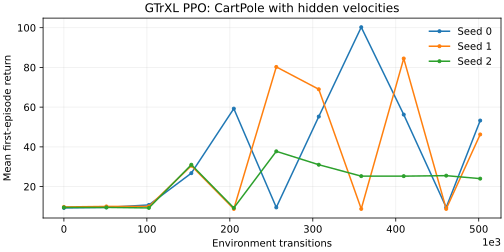

# GTrXL PPO and compact-window measurements

Measured on 11 September 2026 with implementation `5a482b92f`, PyTorch 2.11.0,
TensorDict `786fab0440d0476c1b6f9f5d558c3791614d5723`, macOS 26.6.2 and an Apple
M5 Max (64 GiB RAM). The implementation is based on the merged TransformerModule
API and the recurrent-state comparison stack. No CUDA results are claimed.

## Learning runs

The default configuration ran seeds 0, 1 and 2 for 501,760 transitions each
(the collector rounds 500,000 up to complete batches). Each evaluation measures
the first episode on four fresh seeded environments with deterministic actions.
Both cart and pole velocities are hidden. Two GTrXL layers have width 32 and
16 memory positions; PPO trains four epochs on 32-step windows.

| Seed | Initial return | Final return | Best measured return |
|---|---:|---:|---:|
| 0 | 9.25 | 53.25 | 100.25 |
| 1 | 9.75 | 46.25 | 84.50 |
| 2 | 9.50 | 24.00 | 37.75 |
| Mean | 9.50 | 41.17 | 74.17 |



These are preliminary integration runs. They show learning above the initial
policy, but returns fluctuate substantially and do not solve CartPole. They do
not establish a tuned GTrXL PPO baseline or reproduce the paper's benchmarks.
The figure shows every scheduled evaluation; best returns are not presented as
final performance. Losses and clipped gradients remained finite in all runs.

Reproduce from the repository root:

```bash
bash sota-check/run_gtrxl_ppo.sh
```

[Raw learning results](gtrxl-learning.json) include each configuration and all
evaluation points. These three runs executed concurrently; their recorded
training timings must not be interpreted as an isolated throughput benchmark.
No checkpoint, replay dataset or environment recording is included.

## Separate window-execution benchmark

Both paths below use the same **plain TensorDict** container, model weights,
input tensors and full initial history, with dropout disabled. They differ in
state layout and execution: the per-step path loops over time and returns every
carry, while the compact path uses parallel masked attention and returns one
final carry. Thus this measures execution/storage choices, not container overhead.
Container overhead is measured separately in the [comparison report](recurrent-state-comparison.md).

Each median includes cloning the input, forward and backward, with one CPU thread
and at least one second of timing samples. No optimizer, collector or environment
is timed. The benchmark first checks numerical agreement. Payload bytes count
only one root carry field, excluding validity, next-state duplicates, observations,
attention intermediates and autograd activations; they are **not peak RSS**.

| B | T | M | D | Path | Latency (ms) | Transitions/s | Carry payload (bytes) |
|---:|---:|---:|---:|---|---:|---:|---:|
| 1 | 8 | 8 | 16 | per_step | 12.88 | 621 | 8,192 |
| 1 | 8 | 8 | 16 | compact | 3.18 | 2,513 | 1,024 |
| 32 | 32 | 16 | 32 | per_step | 165.96 | 6,170 | 4,194,304 |
| 32 | 32 | 16 | 32 | compact | 7.79 | 131,492 | 131,072 |
| 32 | 64 | 64 | 64 | per_step | 195.37 | 10,483 | 67,108,864 |
| 32 | 64 | 64 | 64 | compact | 20.85 | 98,217 | 1,048,576 |

Reproduce the [raw benchmark results](gtrxl-windows-cpu.json):

```bash
python benchmarks/ad_hoc/bench_gtrxl_windows.py \
  --output benchmarks/results/gtrxl-windows-cpu.json
```

With the default rollout configuration, compact replay's root memory payload
is 256 KiB instead of 8 MiB, a 32-fold reduction. Sampling must select whole
stored windows to keep observations aligned with their initial carry. Standard
collection still creates per-step snapshots before packing, so this is a replay
and learner-state saving, not a claim about collector peak memory. Training also
retains its attention and differentiable activation costs.

## Validation

* 113 transformer tests passed, covering existing cache behavior, dense and typed
  recurrent states, serial/parallel environments, tensor/memmap replay, nested
  keys, multidimensional batches, resets, snapshot ownership, slice boundaries,
  compact step/window parity, detached initial memory and finite gradients.
* Compact windows passed eager and fullgraph `torch.compile` with `aot_eager`,
  including partial and full memory; float64, bfloat16 and CPU autocast passed.
* The SOTA CI smoke command passed with memmap storage and a padded final window.
* The transformer tutorial executed end to end, and all nine GTrXL doctest examples passed.
