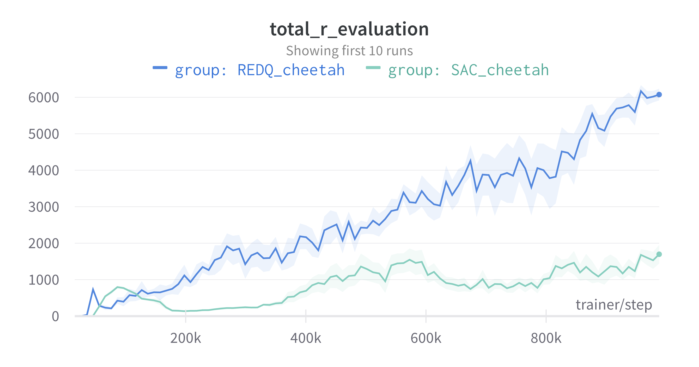
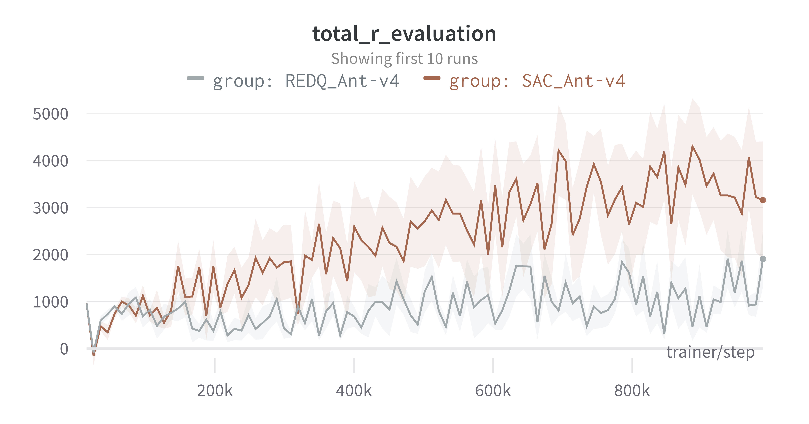
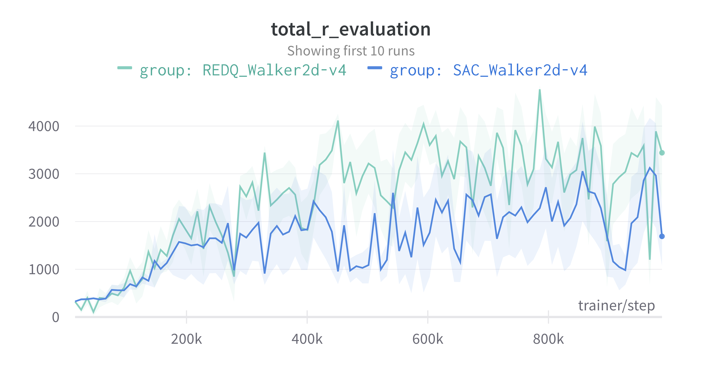

# Examples

We provide examples to train the following algorithms:
- [DQN](dqn/dqn.py)
- [DDPG](ddpg/ddpg.py)
- [SAC](sac/sac.py)
- [REDQ](redq/redq.py)
- [PPO](ppo/ppo.py)

To run these examples, make sure you have installed hydra:
```
pip install hydra-core
```

Scripts can be run from the directory of interest using:
```
python sac.py
```
or similar. Hyperparameters can be easily changed by providing the arguments to hydra:
```
python sac.py frames_per_batch=63
```
# Results

Here we can see some results for the SAC and REDQ algorithm.
We average the results over 5 different seeds and plot the standard error.
## Gym's HalfCheetah-v4

<p align="center">

</p>
To reproduce a single run:

```
python sac/sac.py env_name="HalfCheetah-v4" env_task="" env_library="gym"
```

``` 
python redq/redq.py env_name="HalfCheetah-v4" env_task="" env_library="gym"
```


## dm_control's cheetah-run

<p align="center">

</p>
To reproduce a single run:

```
python sac/sac.py env_name="cheetah" env_task="run" env_library="dm_control"
```

``` 
python redq/redq.py env_name="cheetah" env_task="run" env_library="dm_control"
```

## Gym's Ant-v4

<p align="center">

</p>
To reproduce a single run:

```
python sac/sac.py env_name="Ant-v4" env_task="" env_library="gym"
```

``` 
python redq/redq.py env_name="Ant-v4" env_task="" env_library="gym"
```

## Gym's Walker2D-v4

<p align="center">

</p>
To reproduce a single run:

```
python sac/sac.py env_name="Walker2D-v4" env_task="" env_library="gym"
```

``` 
python redq/redq.py env_name="Walker2D-v4" env_task="" env_library="gym"
```
