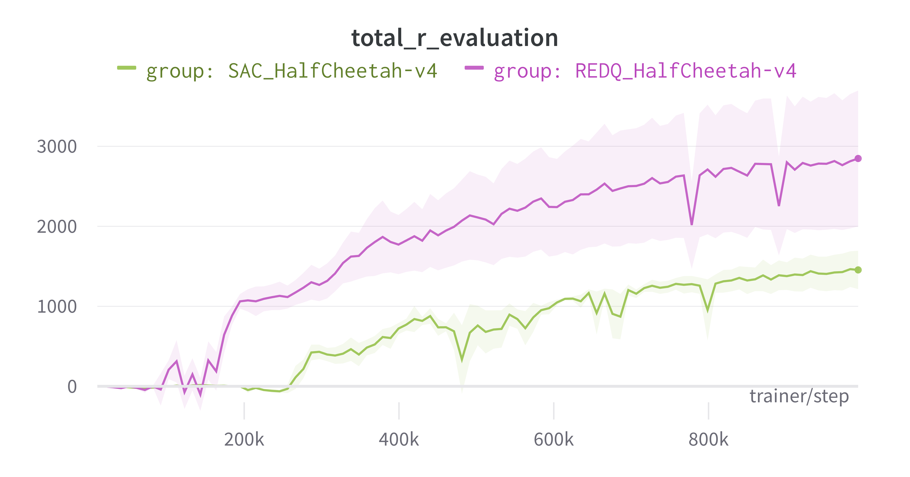

# Examples

We provide examples to train the following algorithms:
- [DQN](dqn/dqn.py)
- [DDPG](ddpg/ddpg.py)
- [SAC](sac/sac.py)
- [REDQ](redq/redq.py)
- [PPO](ppo/ppo.py)

To run these examples, make sure you have installed hydra:
```
pip install hydra-code
```

Then, go to the directory that interests you and run
```
python sac.py
```
or similar. Hyperparameters can be easily changed by providing the arguments to hydra:
```
python sac frames_per_batch=63
```

# Results

## Half Cheetah
Here we can see some results for the SAC and REDQ algorithm on the Half Cheetah environement.
We average the results over 5 different seeds and plot the standard error.
<p align="center">

</p>
To reproduce a single run:

```
python examples/sac/sac.py env_name="HalfCheetah-v4" env_task="" env_library="gym"
```

``` 
python examples/redq/redq.py env_name="HalfCheetah-v4" env_task="" env_library="gym"
```


## Cheetah

## CartPole

## Ant
