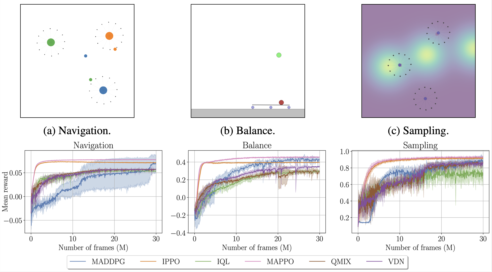

# Multi-agent examples

In this folder we provide a set of multi-agent example scripts using the [VMAS](https://github.com/proroklab/VectorizedMultiAgentSimulator) simulator.

<p align="center">

</p>

<center><i>The MARL algorithms contained in the scripts of this folder run on three multi-robot tasks in VMAS.</i></center>

For more details on the experiment setup and the environments please refer to the corresponding section of the appendix in the TorchRL paper.

## Using the scripts

### Install

First you need to install vmas and the dependencies of the scripts:
```bash
pip install vmas
pip installl wandb moviepy
```

### Run

To run the scripts just execute the corresponding python file after having modified the corresponding config according to your needs.

For example:
```bash
pyton multiagent/mappo_ippo.py
```

### Script structure

The scripts are self-contained.
This means that all the code you will need to look at is contained in the script file.
This includes configuration dictionaries. 
No helper functions are used.

The structure of scripts follows this order:
- Configuration dictionary for the script
- Environment creation
- Modules creation
- Collector instantiation
- Replay buffer instantiation
- Loss module creation
- Training loop (with inner minibatch loops)
- Evaluation run (at the desired frequency)

Logging is done to wandb.

All the scripts follow the same on-policy training structure so that results can be compared across different algorithms.
