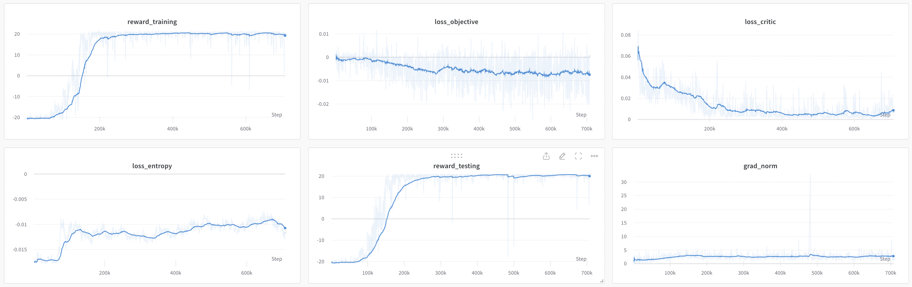
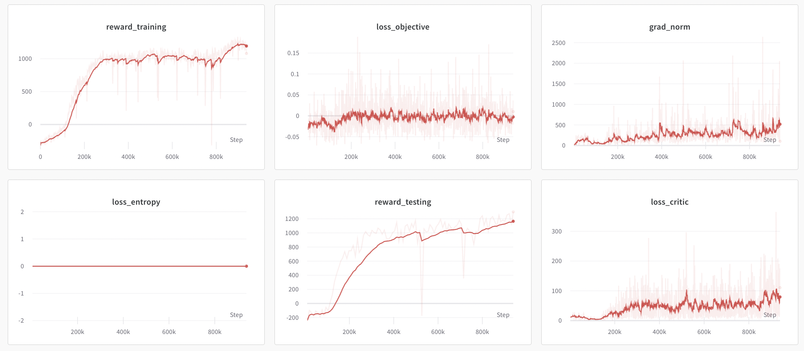

# PPO Example Results

## Atari Pong Environment

We tested the Proximal Policy Optimization (PPO) algorithm on the Atari Pong environment. The hyperparameters used for the training are specified in the config.yaml file and are the same as those used in the original PPO paper (https://arxiv.org/abs/1707.06347).

## MuJoCo HalfCheetah Environment

Additionally, we also tested the PPO algorithm on the MuJoCo HalfCheetah environment. The hyperparameters used for the training are specified in the config_example2.yaml file and are also the same as those used in the original PPO paper. However, this implementation uses a shared policy-value architecture.

