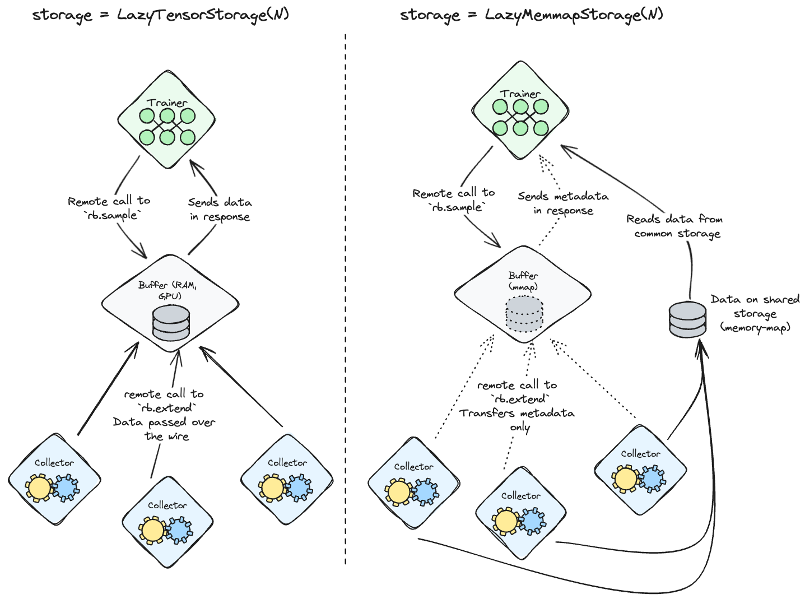
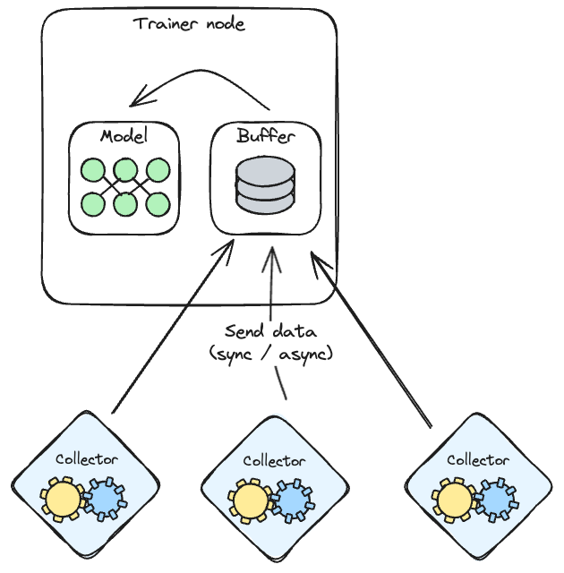

# Distributed replay buffers in TorchRL

This documents gives an overview of the various ways one can play with multiple nodes to collect
data in TorchRL.

## Sharing buffer between nodes using torch RPC

TorchRL provides an API to call replay buffer methods remotely on a dedicated node.
This can be used as described in the following drawing:

Three node categories are instantiated: a trainer, a buffer node and a set of collector nodes.

When all nodes are ready, the collector nodes start sending data to the buffer node by calling
`buffer.extend(tensordict)` remotely.

The buffer node passively receives these calls and writes the data it receives in the storage.

Once enough data has been written, the trainer node starts asking the buffer node for data to process.
The `buffer` sends that data over the wire.

In some cases, all nodes have access to a shared physical storage (check with your administrator if this
is the case and if they will allow you to do frequent read and writing operations). 
If this is the case, a `LazyMemmapStorage` can be instantiated with the shared path as `scratch_dir`.
In this case, node-to-node communications will be drastically reduced as each node will be able to directly
read and write on the storage. The only data passing over the wire from node to node will be the metadata
(shape, number of elements, size of the buffer etc.).

Have a look at the examples [here](https://github.com/pytorch/rl/tree/main/examples/replay-buffers/).

## Distributed collectors

### Backends

#### Ray

#### torch.distributed

#### RPC
