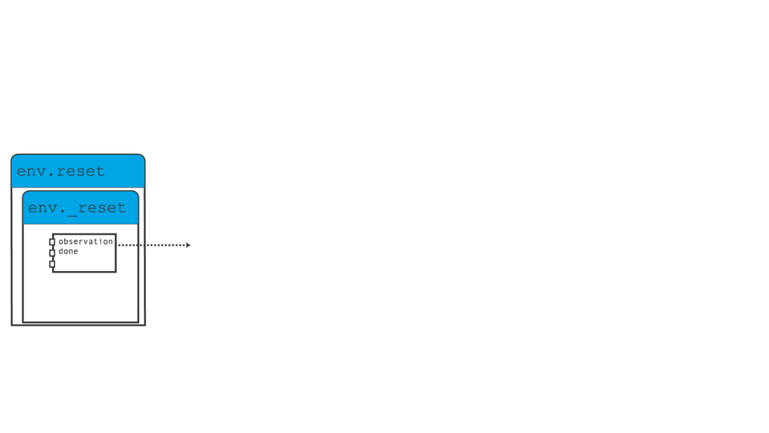

# Environment API

TorchRL offers an API to handle environments of different backends, such as gym,
dm-control, dm-lab, model-based environments as well as custom environments.
The goal is to be able to swap environments in an experiment with little or no effort,
even if these environments are simulated using different libraries.
TorchRL offers some out-of-the-box environment wrappers under `torchrl.envs.libs`,
which we hope can be easily imitated for other libraries.
The parent class [`EnvBase`](generated/torchrl.envs.EnvBase.html#torchrl.envs.EnvBase) is a [`torch.nn.Module`](https://docs.pytorch.org/docs/stable/generated/torch.nn.Module.html#torch.nn.Module) subclass that implements
some typical environment methods using [`tensordict.TensorDict`](https://docs.pytorch.org/tensordict/stable/reference/generated/tensordict.TensorDict.html#tensordict.TensorDict) as a data organiser. This allows this
class to be generic and to handle an arbitrary number of input and outputs, as well as
nested or batched data structures.

Each env will have the following attributes:

- `env.batch_size`: a [`torch.Size`](https://docs.pytorch.org/docs/stable/size.html#torch.Size) representing the number of envs
batched together.
- `env.device`: the device where the input and output tensordict are expected to live.
The environment device does not mean that the actual step operations will be computed on device
(this is the responsibility of the backend, with which TorchRL can do little). The device of
an environment just represents the device where the data is to be expected when input to the
environment or retrieved from it. TorchRL takes care of mapping the data to the desired device.
This is especially useful for transforms (see below). For parametric environments (e.g.
model-based environments), the device does represent the hardware that will be used to
compute the operations.
- `env.observation_spec`: a [`Composite`](generated/torchrl.data.Composite.html#torchrl.data.Composite) object
containing all the observation key-spec pairs.
- `env.state_spec`: a [`Composite`](generated/torchrl.data.Composite.html#torchrl.data.Composite) object
containing all the input key-spec pairs (except action). For most stateful
environments, this container will be empty.
- `env.action_spec`: a [`TensorSpec`](generated/torchrl.data.TensorSpec.html#torchrl.data.TensorSpec) object
representing the action spec.
- `env.reward_spec`: a [`TensorSpec`](generated/torchrl.data.TensorSpec.html#torchrl.data.TensorSpec) object representing
the reward spec.
- `env.done_spec`: a [`TensorSpec`](generated/torchrl.data.TensorSpec.html#torchrl.data.TensorSpec) object representing
the done-flag spec. See the section on trajectory termination below.
- `env.input_spec`: a [`Composite`](generated/torchrl.data.Composite.html#torchrl.data.Composite) object containing
all the input keys (`"full_action_spec"` and `"full_state_spec"`).
- `env.output_spec`: a [`Composite`](generated/torchrl.data.Composite.html#torchrl.data.Composite) object containing
all the output keys (`"full_observation_spec"`, `"full_reward_spec"` and `"full_done_spec"`).

If the environment carries non-tensor data, a [`NonTensor`](generated/torchrl.data.NonTensor.html#torchrl.data.NonTensor)
instance can be used.

## Env specs: locks and batch size

Environment specs are locked by default (through a `spec_locked` arg passed to the env constructor).
Locking specs means that any modification of the spec (or its children if it is a [`Composite`](generated/torchrl.data.Composite.html#torchrl.data.Composite)
instance) will require to unlock it. This can be done via the [`set_spec_lock_()`](generated/torchrl.envs.EnvBase.html#torchrl.envs.EnvBase.set_spec_lock_).
The reason specs are locked by default is that it makes it easy to cache values such as action or reset keys and the
likes.
Unlocking an env should only be done if it expected that the specs will be modified often (which, in principle, should
be avoided).
Modifications of the specs such as env.observation_spec = new_spec are allowed: under the hood, TorchRL will erase
the cache, unlock the specs, make the modification and relock the specs if the env was previously locked.

Importantly, the environment spec shapes should contain the batch size, e.g.
an environment with `env.batch_size` `== torch.Size([4])` should have
an `env.action_spec` with shape [`torch.Size`](https://docs.pytorch.org/docs/stable/size.html#torch.Size) `([4, action_size])`.
This is helpful when preallocation tensors, checking shape consistency etc.

## Auto-wrapping recurrent transforms via the `policy=` argument

Every concrete [`EnvBase`](generated/torchrl.envs.EnvBase.html#torchrl.envs.EnvBase) subclass -- [`GymEnv`](generated/torchrl.envs.GymEnv.html#torchrl.envs.GymEnv),
[`DMControlEnv`](generated/torchrl.envs.DMControlEnv.html#torchrl.envs.DMControlEnv), custom subclasses, etc. -- inherits a
`policy` keyword argument on its constructor. When provided, the
[`EnvBase`](generated/torchrl.envs.EnvBase.html#torchrl.envs.EnvBase) metaclass post-init hook walks the policy
looking for recurrent submodules (anything implementing
`make_tensordict_primer()`, e.g. [`LSTMModule`](generated/torchrl.modules.LSTMModule.html#torchrl.modules.LSTMModule),
[`GRUModule`](generated/torchrl.modules.GRUModule.html#torchrl.modules.GRUModule)) and appends what's missing to the env:

- an [`InitTracker`](generated/torchrl.envs.transforms.InitTracker.html#torchrl.envs.transforms.InitTracker) (so `is_init` is written
at every reset) if one is not already present in the env's
`full_observation_spec`;
- one [`TensorDictPrimer`](generated/torchrl.envs.transforms.TensorDictPrimer.html#torchrl.envs.transforms.TensorDictPrimer) per recurrent
submodule, providing the hidden-state primers the policy needs.

The hook is idempotent and *spec-based* -- it asks the env's
`full_observation_spec` / `full_state_spec` what's already there, so it
works correctly even when transforms live inside child envs of a
[`SerialEnv`](generated/torchrl.envs.SerialEnv.html#torchrl.envs.SerialEnv) or [`ParallelEnv`](generated/torchrl.envs.ParallelEnv.html#torchrl.envs.ParallelEnv).

Because the argument is injected by the metaclass, **it does not appear in
subclass** `__init__` **signatures** (just like `spec_locked` and
`auto_reset`). It is documented on [`EnvBase`](generated/torchrl.envs.EnvBase.html#torchrl.envs.EnvBase) and works
identically on every subclass. Pass it like any other keyword:

```
from torchrl.envs import GymEnv
from torchrl.modules import GRUModule

gru = GRUModule(input_size=4, hidden_size=8, num_layers=1,
 in_keys=["observation", "recurrent_state", "is_init"],
 out_keys=["features", ("next", "recurrent_state")])
# Single call: env now has InitTracker + TensorDictPrimer for the GRU.
env = GymEnv("CartPole-v1", policy=gru)
```

The same auto-wrap helper is applied a second time by
[`Collector`](generated/torchrl.collectors.Collector.html#torchrl.collectors.Collector) when an env is passed to it,
so users who construct a bare env first and only later hand it to a
collector with a recurrent policy still get the right transforms wired up.
Because the helper is idempotent, going through both paths does not produce
duplicates.

Limitations:

- If a custom [`InitTracker`](generated/torchrl.envs.transforms.InitTracker.html#torchrl.envs.transforms.InitTracker) was attached
with a renamed `init_key`, the helper won't recognise it and may add a
duplicate. Pass the same custom `init_key` (matched by leaf name in
multi-agent setups) to avoid this, or wire transforms manually.
- Policy factories -- `Callable[[], Callable]` objects -- cannot be
inspected without instantiation, so auto-wrapping is skipped for them.
Either build the policy once and pass it via `policy=`, or attach
transforms manually with
[`get_env_transforms_from_module()`](generated/torchrl.modules.get_env_transforms_from_module.html#torchrl.modules.get_env_transforms_from_module).

## Compiling envs via the `compile=` constructor argument

Every concrete [`EnvBase`](generated/torchrl.envs.EnvBase.html#torchrl.envs.EnvBase) subclass and
[`TransformedEnv`](generated/torchrl.envs.transforms.TransformedEnv.html#torchrl.envs.transforms.TransformedEnv) inherit a `compile` keyword argument
on their constructors. When provided, the [`EnvBase`](generated/torchrl.envs.EnvBase.html#torchrl.envs.EnvBase)
metaclass post-init hook calls [`compile()`](generated/torchrl.envs.EnvBase.html#torchrl.envs.EnvBase.compile) on the
fully-built env (after spec locking, after auto-reset wrapping if any, after
policy-driven transform appending if any). Accepted values:

- `False` or `None` (default): no compilation.
- `True`: `env.compile()` with default [`torch.compile()`](https://docs.pytorch.org/docs/stable/generated/torch.compile.html#torch.compile) settings.
- a `dict`: forwarded to [`compile()`](generated/torchrl.envs.EnvBase.html#torchrl.envs.EnvBase.compile).

Using a dict avoids name collisions between [`torch.compile()`](https://docs.pytorch.org/docs/stable/generated/torch.compile.html#torch.compile) kwargs
(`backend`, `mode`, `fullgraph`, `dynamic`, `warmup`, ...) and
constructor kwargs of specific envs. `warmup` is the number of eager calls
to `step_and_maybe_reset()` before tracing kicks in;
it stabilizes the input TensorDict layout (e.g. post-[`reset()`](generated/torchrl.envs.ModelBasedEnvBase.html#torchrl.envs.reset) vs.
steady-state post-`step_mdp`) so the compiled function does not recompile.

The same flag works equally well with collectors:

```
from functools import partial
from torchrl.collectors import Collector
from torchrl.envs import GymEnv, TransformedEnv
from torchrl.envs.transforms import Compose

# Plain env, compiled with a 4-call warmup.
collector = Collector(
 partial(
 GymEnv,
 "HalfCheetah-v4",
 compile={"warmup": 4, "fullgraph": True, "mode": "reduce-overhead"},
 ),
 ...,
)

# TransformedEnv: compile applies to the outermost env, which is what
# the collector calls step_and_maybe_reset on.
collector = Collector(
 lambda: TransformedEnv(
 GymEnv("HalfCheetah-v4"),
 Compose(...),
 compile={"warmup": 4, "fullgraph": True},
 ),
 ...,
)
```

See [`compile()`](generated/torchrl.envs.EnvBase.html#torchrl.envs.EnvBase.compile) and
[`eager()`](generated/torchrl.envs.EnvBase.html#torchrl.envs.EnvBase.eager) for the underlying methods.

## Env methods

With these, the following methods are implemented:

- `env.reset()`: a reset method that may (but not necessarily requires to) take
a [`tensordict.TensorDict`](https://docs.pytorch.org/tensordict/stable/reference/generated/tensordict.TensorDict.html#tensordict.TensorDict) input. It return the first tensordict of a rollout, usually
containing a `"done"` state and a set of observations. If not present,
a `"reward"` key will be instantiated with 0s and the appropriate shape.

To reset *deterministically* to a state contained in the input tensordict
(e.g. branch a rollout from a saved state, or replay a fixed initial
condition), pass `set_state=True`: `env.reset(td, set_state=True)`. For
stateless environments such as [`PendulumEnv`](generated/torchrl.envs.PendulumEnv.html#torchrl.envs.PendulumEnv) this honors
the state entries found in `td`; for stateful environments that support it,
the underlying set-state API is used; envs that cannot honor a provided state
raise `NotImplementedError`. `set_state` is a keyword argument (not a
tensordict key) so it never stacks/pads across a rollout. When `set_state` is
left unspecified but the tensordict carries state, the state is honored for
backwards compatibility and a `FutureWarning` is emitted: from v0.15 an
unspecified `set_state` will be treated as `False` (state ignored, fresh
reset).
- `env.step()`: a step method that takes a [`tensordict.TensorDict`](https://docs.pytorch.org/tensordict/stable/reference/generated/tensordict.TensorDict.html#tensordict.TensorDict) input
containing an input action as well as other inputs (for model-based or stateless
environments, for instance).
- `env.step_and_maybe_reset()`: executes a step, and (partially) resets the
environments if it needs to. It returns the updated input with a `"next"`
key containing the data of the next step, as well as a tensordict containing
the input data for the next step (ie, reset or result or
[`step_mdp()`](generated/torchrl.envs.step_mdp.html#torchrl.envs.step_mdp))
This is done by reading the `done_keys` and
assigning a `"_reset"` signal to each done state. This method allows
to code non-stopping rollout functions with little effort:

```
>>> data_ = env.reset()
>>> result = []
>>> for i in range(N):
... data, data_ = env.step_and_maybe_reset(data_)
... result.append(data)
...
>>> result = torch.stack(result)
```
- `env.set_seed()`: a seeding method that will return the next seed
to be used in a multi-env setting. This next seed is deterministically computed
from the preceding one, such that one can seed multiple environments with a different
seed without risking to overlap seeds in consecutive experiments, while still
having reproducible results.
- `env.rollout()`: executes a rollout in the environment for
a maximum number of steps (`max_steps=N`) and using a policy (`policy=model`).
The policy should be coded using a [`tensordict.nn.TensorDictModule`](https://docs.pytorch.org/tensordict/stable/reference/generated/tensordict.nn.TensorDictModule.html#tensordict.nn.TensorDictModule)
(or any other [`tensordict.TensorDict`](https://docs.pytorch.org/tensordict/stable/reference/generated/tensordict.TensorDict.html#tensordict.TensorDict)-compatible module).
The resulting [`tensordict.TensorDict`](https://docs.pytorch.org/tensordict/stable/reference/generated/tensordict.TensorDict.html#tensordict.TensorDict) instance will be marked with
a trailing `"time"` named dimension that can be used by other modules
to treat this batched dimension as it should.

The following figure summarizes how a rollout is executed in torchrl.



TorchRL rollouts using TensorDict.

In brief, a TensorDict is created by the [`reset()`](generated/torchrl.envs.EnvBase.html#id1) method,
then populated with an action by the policy before being passed to the
[`step()`](generated/torchrl.envs.EnvBase.html#id4) method which writes the observations, done flag(s) and
reward under the `"next"` entry. The result of this call is stored for
delivery and the `"next"` entry is gathered by the [`step_mdp()`](generated/torchrl.envs.step_mdp.html#torchrl.envs.step_mdp)
function.

Note

In general, all TorchRL environment have a `"done"` and `"terminated"`
entry in their output tensordict. If they are not present by design,
the [`EnvBase`](generated/torchrl.envs.EnvBase.html#torchrl.envs.EnvBase) metaclass will ensure that every done or terminated
is flanked with its dual.
In TorchRL, `"done"` strictly refers to the union of all the end-of-trajectory
signals and should be interpreted as "the last step of a trajectory" or
equivalently "a signal indicating the need to reset".
If the environment provides it (eg, Gymnasium), the truncation entry is also
written in the [`EnvBase.step()`](generated/torchrl.envs.EnvBase.html#id4) output under a `"truncated"` entry.
If the environment carries a single value, it will interpreted as a `"terminated"`
signal by default.
By default, TorchRL's collectors and rollout methods will be looking for the `"done"`
entry to assess if the environment should be reset.

Note

The [`split_trajectories()`](generated/torchrl.collectors.utils.split_trajectories.html#torchrl.collectors.utils.split_trajectories) function can be
used to slice adjacent trajectories. It relies on a `"traj_ids"` entry
in the input tensordict, or on the junction of `"done"` and
`"truncated"` if `"traj_ids"` is missing. The function emits an
`[N_traj, T_max]` zero-padded tensordict + `mask`; for new code
prefer the contiguous 1-D layout and
[`SliceSampler`](generated/torchrl.data.replay_buffers.SliceSampler.html#torchrl.data.replay_buffers.SliceSampler) instead -- see
[Data layout: contiguous trajectories](data_layout.html#data-layout).

Note

In some contexts, it can be useful to mark the first step of a trajectory.
TorchRL provides such functionality through the [`InitTracker`](generated/torchrl.envs.transforms.InitTracker.html#torchrl.envs.transforms.InitTracker)
transform.

Our environment [tutorial](../tutorials/pendulum.html#pendulum-tuto)
provides more information on how to design a custom environment from scratch.

## Base classes

| [`EnvBase`](generated/torchrl.envs.EnvBase.html#torchrl.envs.EnvBase)(*args, **kwargs) | Abstract environment parent class. |
| --- | --- |
| [`GymLikeEnv`](generated/torchrl.envs.GymLikeEnv.html#torchrl.envs.GymLikeEnv)(*args, **kwargs) | A gym-like env is an environment. |
| [`EnvMetaData`](generated/torchrl.envs.EnvMetaData.html#torchrl.envs.EnvMetaData)(*, tensordict, specs, ...[, ...]) | A class for environment meta-data storage and passing in multiprocessed settings. |

## Custom native TorchRL environments

TorchRL offers a series of custom built-in environments.

| [`ChessEnv`](generated/torchrl.envs.ChessEnv.html#torchrl.envs.ChessEnv)(*args, **kwargs) | A chess environment that follows the TorchRL API. |
| --- | --- |
| [`FinancialRegimeEnv`](generated/torchrl.envs.FinancialRegimeEnv.html#torchrl.envs.FinancialRegimeEnv)(*args, **kwargs) | A financial trading environment. |
| [`LLMHashingEnv`](generated/torchrl.envs.LLMHashingEnv.html#torchrl.envs.LLMHashingEnv)(*args, **kwargs) | A text generation environment that uses a hashing module to identify unique observations. |
| [`PendulumEnv`](generated/torchrl.envs.PendulumEnv.html#torchrl.envs.PendulumEnv)(*args, **kwargs) | A stateless Pendulum environment. |
| [`TicTacToeEnv`](generated/torchrl.envs.TicTacToeEnv.html#torchrl.envs.TicTacToeEnv)(*args, **kwargs) | A Tic-Tac-Toe implementation. |

## MuJoCo custom environments

A family of MuJoCo-backed envs sharing one base class
([`MujocoEnv`](generated/torchrl.envs.MujocoEnv.html#torchrl.envs.MujocoEnv)) with a swappable physics backend
(`"mujoco-torch"` - the default and `torch.compile`-friendly
native-torch engine, `"mjx"` - JAX-vectorized, or `"mujoco"` -
official C-bindings). For envs with a standalone XML asset, the XML can be a
local path or an `http(s)` URL, so users can point at remote models without
vendoring them. Subclasses describe the *task* by overriding
`_compute_reward()` and
`_compute_done()`.

The locomotion classes mirror the Gymnasium `-v4` reward and
termination semantics. [`SatelliteEnv`](generated/torchrl.envs.SatelliteEnv.html#torchrl.envs.SatelliteEnv) is an
attitude-control task with a 4- or 6-CMG cluster and a
manipulability-based singularity penalty driving the policy away from
internal singular configurations of the gimbal Jacobian.
[`CubeBowlEnv`](generated/torchrl.envs.CubeBowlEnv.html#torchrl.envs.CubeBowlEnv) is a compact
manipulation task for scripted MuJoCo macro-control examples. It composes a
local MuJoCo Menagerie UR5e + Robotiq 2F-85 scene.

| [`MujocoEnv`](generated/torchrl.envs.MujocoEnv.html#torchrl.envs.MujocoEnv)(*args[, num_workers, parallel]) | Base TorchRL environment backed by a swappable MuJoCo physics engine. |
| --- | --- |
| [`AntEnv`](generated/torchrl.envs.AntEnv.html#torchrl.envs.AntEnv)(*args[, num_workers, parallel]) | Quadruped locomotion (15-DoF, 8 actuators). |
| [`CubeBowlEnv`](generated/torchrl.envs.CubeBowlEnv.html#torchrl.envs.CubeBowlEnv)(*args[, num_workers, parallel]) | UR-style cube-to-bowl manipulation scene. |
| [`HopperEnv`](generated/torchrl.envs.HopperEnv.html#torchrl.envs.HopperEnv)(*args[, num_workers, parallel]) | Single-legged hopping task (6-DoF, 3 actuators). |
| [`HumanoidEnv`](generated/torchrl.envs.HumanoidEnv.html#torchrl.envs.HumanoidEnv)(*args[, num_workers, parallel]) | Bipedal humanoid locomotion task (28 DoF, 21 actuators). |
| [`SatelliteEnv`](generated/torchrl.envs.SatelliteEnv.html#torchrl.envs.SatelliteEnv)(*args[, num_workers, parallel]) | Attitude-control task with 4 or 6 CMGs. |
| [`Walker2dEnv`](generated/torchrl.envs.Walker2dEnv.html#torchrl.envs.Walker2dEnv)(*args[, num_workers, parallel]) | Planar bipedal walker (9-DoF, 6 actuators). |

## Domain-specific

| [`ModelBasedEnvBase`](generated/torchrl.envs.ModelBasedEnvBase.html#torchrl.envs.ModelBasedEnvBase)(*args, **kwargs) | Basic environment for Model Based RL sota-implementations. |
| --- | --- |
| [`model_based.dreamer.DreamerEnv`](generated/torchrl.envs.model_based.dreamer.DreamerEnv.html#torchrl.envs.model_based.dreamer.DreamerEnv)(*args, **kwargs) | Dreamer simulation environment. |
| [`model_based.dreamer.DreamerDecoder`](generated/torchrl.envs.model_based.dreamer.DreamerDecoder.html#torchrl.envs.model_based.dreamer.DreamerDecoder)([...]) | A transform to record the decoded observations in Dreamer. |
| [`model_based.imagined.ImaginedEnv`](generated/torchrl.envs.model_based.imagined.ImaginedEnv.html#torchrl.envs.model_based.imagined.ImaginedEnv)(*args, **kwargs) | Imagination environment for model-based policy search. |
| [`model_based.world_model_env.WorldModelEnv`](generated/torchrl.envs.model_based.world_model_env.WorldModelEnv.html#torchrl.envs.model_based.world_model_env.WorldModelEnv)(...) | A generic environment wrapper around a [`WorldModel`](generated/torchrl.modules.WorldModel.html#torchrl.modules.WorldModel). |

## Helpers

| [`check_env_specs`](generated/torchrl.envs.check_env_specs.html#torchrl.envs.check_env_specs)(env[, return_contiguous, ...]) | Tests an environment specs against the results of short rollout. |
| --- | --- |
| [`exploration_type`](generated/torchrl.envs.exploration_type.html#torchrl.envs.exploration_type)() | Returns the current sampling type. |
| [`get_available_libraries`](generated/torchrl.envs.get_available_libraries.html#torchrl.envs.get_available_libraries)() | Returns all the supported libraries. |
| [`make_composite_from_td`](generated/torchrl.envs.make_composite_from_td.html#torchrl.envs.make_composite_from_td)(data, *[, ...]) | Creates a Composite instance from a tensordict, assuming all values are unbounded. |
| [`set_exploration_type`](generated/torchrl.envs.set_exploration_type.html#torchrl.envs.set_exploration_type) | alias of [`set_interaction_type`](https://docs.pytorch.org/tensordict/stable/reference/generated/tensordict.nn.set_interaction_type.html#tensordict.nn.set_interaction_type) |
| [`step_mdp`](generated/torchrl.envs.step_mdp.html#torchrl.envs.step_mdp)(tensordict[, next_tensordict, ...]) | Creates a new tensordict that reflects a step in time of the input tensordict. |
| [`terminated_or_truncated`](generated/torchrl.envs.terminated_or_truncated.html#torchrl.envs.terminated_or_truncated)(data[, ...]) | Reads the done / terminated / truncated keys within a tensordict, and writes a new tensor where the values of both signals are aggregated. |