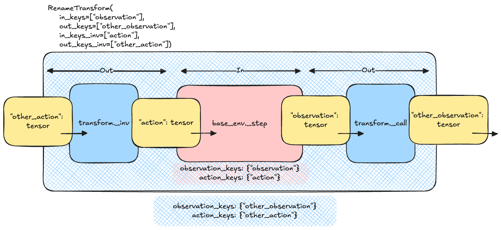

# Transforms

In most cases, the raw output of an environment must be treated before being passed to another object (such as a
policy or a value operator). To do this, TorchRL provides a set of transforms that aim at reproducing the transform
logic of torch.distributions.Transform and torchvision.transforms.
Our environment [tutorial](../tutorials/pendulum.html#pendulum-tuto)
provides more information on how to design a custom transform.

Transformed environments are build using the [`TransformedEnv`](generated/torchrl.envs.transforms.TransformedEnv.html#torchrl.envs.transforms.TransformedEnv) primitive.
Composed transforms are built using the [`Compose`](generated/torchrl.envs.transforms.Compose.html#torchrl.envs.transforms.Compose) class:

Transformed environment

```
>>> base_env = GymEnv("Pendulum-v1", from_pixels=True, device="cuda:0")
 >>> transform = Compose(ToTensorImage(in_keys=["pixels"]), Resize(64, 64, in_keys=["pixels"]))
 >>> env = TransformedEnv(base_env, transform)
```

Transforms are usually subclasses of [`Transform`](generated/torchrl.envs.transforms.Transform.html#torchrl.envs.transforms.Transform), although any
`Callable[[TensorDictBase], TensorDictBase]`.

By default, the transformed environment will inherit the device of the
`base_env` that is passed to it. The transforms will then be executed on that device.
It is now apparent that this can bring a significant speedup depending on the kind of
operations that is to be computed.

A great advantage of environment wrappers is that one can consult the environment up to that wrapper.
The same can be achieved with TorchRL transformed environments: the `parent` attribute will
return a new [`TransformedEnv`](generated/torchrl.envs.transforms.TransformedEnv.html#torchrl.envs.transforms.TransformedEnv) with all the transforms up to the transform of interest.
Reusing the example above:

Transform parent

```
>>> resize_parent = env.transform[-1].parent # returns the same as TransformedEnv(base_env, transform[:-1])
```

Transformed environment can be used with vectorized environments.
Since each transform uses a `"in_keys"`/`"out_keys"` set of keyword argument, it is
also easy to root the transform graph to each component of the observation data (e.g.
pixels or states etc).

## Forward and inverse transforms

Transforms also have an [`inv()`](generated/torchrl.envs.transforms.Transform.html#torchrl.envs.transforms.Transform.inv) method that is called before the action is applied in reverse
order over the composed transform chain. This allows applying transforms to data in the environment before the action is
taken in the environment. The keys to be included in this inverse transform are passed through the "in_keys_inv"
keyword argument, and the out-keys default to these values in most cases:

Inverse transform

```
>>> env.append_transform(DoubleToFloat(in_keys_inv=["action"])) # will map the action from float32 to float64 before calling the base_env.step
```

The following paragraphs detail how one can think about what is to be considered in_ or out_ features.

### Understanding Transform Keys

In transforms, in_keys and out_keys define the interaction between the base environment and the outside world
(e.g., your policy):

- in_keys refers to the base environment's perspective (inner = base_env of the
[`TransformedEnv`](generated/torchrl.envs.transforms.TransformedEnv.html#torchrl.envs.transforms.TransformedEnv)).
- out_keys refers to the outside world (outer = policy, agent, etc.).

For example, with in_keys=["obs"] and out_keys=["obs_standardized"], the policy will "see" a standardized
observation, while the base environment outputs a regular observation.

Similarly, for inverse keys:

- in_keys_inv refers to entries as seen by the base environment.
- out_keys_inv refers to entries as seen or produced by the policy.

The following figure illustrates this concept for the [`RenameTransform`](generated/torchrl.envs.transforms.RenameTransform.html#torchrl.envs.transforms.RenameTransform) class: the input
TensorDict of the step function must include the out_keys_inv as they are part of the outside world. The
transform changes these names to match the names of the inner, base environment using the in_keys_inv.
The inverse process is executed with the output tensordict, where the in_keys are mapped to the corresponding
out_keys.



Rename transform logic

Note

During a call to inv, the transforms are executed in reversed order (compared to the forward / step mode).

### Transforming Tensors and Specs

When transforming actual tensors (coming from the policy), the process is schematically represented as:

```
>>> for t in reversed(self.transform):
... td = t.inv(td)
```

This starts with the outermost transform to the innermost transform, ensuring the action value exposed to the policy
is properly transformed.

For transforming the action spec, the process should go from innermost to outermost (similar to observation specs):

```
>>> def transform_action_spec(self, action_spec):
... for t in self.transform:
... action_spec = t.transform_action_spec(action_spec)
... return action_spec
```

A pseudocode for a single transform_action_spec could be:

```
>>> def transform_action_spec(self, action_spec):
... return spec_from_random_values(self._apply_transform(action_spec.rand()))
```

This approach ensures that the "outside" spec is inferred from the "inside" spec. Note that we did not call
_inv_apply_transform but _apply_transform on purpose!

### Exposing Specs to the Outside World

TransformedEnv will expose the specs corresponding to the out_keys_inv for actions and states.
For example, with [`ActionDiscretizer`](generated/torchrl.envs.transforms.ActionDiscretizer.html#torchrl.envs.transforms.ActionDiscretizer), the environment's action (e.g., "action") is a float-valued
tensor that should not be generated when using [`rand_action()`](generated/torchrl.envs.EnvBase.html#torchrl.envs.EnvBase.rand_action) with the transformed
environment. Instead, "action_discrete" should be generated, and its continuous counterpart obtained from the
transform. Therefore, the user should see the "action_discrete" entry being exposed, but not "action".

## Designing your own Transform

To create a basic, custom transform, you need to subclass the Transform class and implement the
`_apply_transform()` method. Here's an example of a simple transform that adds 1 to the observation
tensor:

```
>>> class AddOneToObs(Transform):
... """A transform that adds 1 to the observation tensor."""
...
... def __init__(self):
... super().__init__(in_keys=["observation"], out_keys=["observation"])
...
... def _apply_transform(self, obs: torch.Tensor) -> torch.Tensor:
... return obs + 1
```

### Tips for subclassing Transform

There are various ways of subclassing a transform. The things to take into considerations are:

- Is the transform identical for each tensor / item being transformed? Use
`_apply_transform()` and `_inv_apply_transform()`.
- The transform needs access to the input data to env.step as well as output? Rewrite
`_step()`.
Otherwise, rewrite `_call()` (or `_inv_call()`).
- Is the transform to be used within a replay buffer? Overwrite [`forward()`](generated/torchrl.envs.transforms.Transform.html#torchrl.envs.transforms.Transform.forward),
[`inv()`](generated/torchrl.envs.transforms.Transform.html#torchrl.envs.transforms.Transform.inv), `_apply_transform()` or
`_inv_apply_transform()`.
- Within a transform, you can access (and make calls to) the parent environment using
[`parent`](generated/torchrl.envs.transforms.Transform.html#torchrl.envs.transforms.Transform.parent) (the base env + all transforms till this one) or
[`container()`](generated/torchrl.envs.transforms.Transform.html#torchrl.envs.transforms.Transform.container) (The object that encapsulates the transform).
- Don't forget to edits the specs if needed: top level: [`transform_output_spec()`](generated/torchrl.envs.transforms.Transform.html#torchrl.envs.transforms.Transform.transform_output_spec),
[`transform_input_spec()`](generated/torchrl.envs.transforms.Transform.html#torchrl.envs.transforms.Transform.transform_input_spec).
Leaf level: [`transform_observation_spec()`](generated/torchrl.envs.transforms.Transform.html#torchrl.envs.transforms.Transform.transform_observation_spec),
[`transform_action_spec()`](generated/torchrl.envs.transforms.Transform.html#torchrl.envs.transforms.Transform.transform_action_spec), [`transform_state_spec()`](generated/torchrl.envs.transforms.Transform.html#torchrl.envs.transforms.Transform.transform_state_spec),
[`transform_reward_spec()`](generated/torchrl.envs.transforms.Transform.html#torchrl.envs.transforms.Transform.transform_reward_spec) and
[`transform_reward_spec()`](generated/torchrl.envs.transforms.Transform.html#torchrl.envs.transforms.Transform.transform_reward_spec).

For practical examples, see the methods listed above.

You can use a transform in an environment by passing it to the TransformedEnv constructor:

```
>>> env = TransformedEnv(GymEnv("Pendulum-v1"), AddOneToObs())
```

You can compose multiple transforms together using the Compose class:

```
>>> transform = Compose(AddOneToObs(), RewardSum())
>>> env = TransformedEnv(GymEnv("Pendulum-v1"), transform)
```

### Inverse Transforms

Some transforms have an inverse transform that can be used to undo the transformation. For example, the AddOneToAction
transform has an inverse transform that subtracts 1 from the action tensor:

```
>>> class AddOneToAction(Transform):
... """A transform that adds 1 to the action tensor."""
... def __init__(self):
... super().__init__(in_keys=[], out_keys=[], in_keys_inv=["action"], out_keys_inv=["action"])
... def _inv_apply_transform(self, action: torch.Tensor) -> torch.Tensor:
... return action + 1
```

### Using a Transform with a Replay Buffer

You can use a transform with a replay buffer by passing it to the ReplayBuffer constructor:

### Cloning transforms

Because transforms appended to an environment are "registered" to this environment
through the `transform.parent` property, when manipulating transforms we should keep
in mind that the parent may come and go following what is being done with the transform.
Here are some examples: if we get a single transform from a [`Compose`](generated/torchrl.envs.transforms.Compose.html#torchrl.envs.transforms.Compose) object,
this transform will keep its parent:

```
>>> third_transform = env.transform[2]
>>> assert third_transform.parent is not None
```

This means that using this transform for another environment is prohibited, as
the other environment would replace the parent and this may lead to unexpected
behaviours. Fortunately, the [`Transform`](generated/torchrl.envs.transforms.Transform.html#torchrl.envs.transforms.Transform) class comes with a `clone()`
method that will erase the parent while keeping the identity of all the
registered buffers:

```
>>> TransformedEnv(base_env, third_transform) # raises an Exception as third_transform already has a parent
>>> TransformedEnv(base_env, third_transform.clone()) # works
```

On a single process or if the buffers are placed in shared memory, this will
result in all the clone transforms to keep the same behavior even if the
buffers are changed in place (which is what will happen with the [`CatFrames`](generated/torchrl.envs.transforms.CatFrames.html#torchrl.envs.transforms.CatFrames)
transform, for instance). In distributed settings, this may not hold and one
should be careful about the expected behavior of the cloned transforms in this
context.
Finally, notice that indexing multiple transforms from a [`Compose`](generated/torchrl.envs.transforms.Compose.html#torchrl.envs.transforms.Compose) transform
may also result in loss of parenthood for these transforms: the reason is that
indexing a [`Compose`](generated/torchrl.envs.transforms.Compose.html#torchrl.envs.transforms.Compose) transform results in another [`Compose`](generated/torchrl.envs.transforms.Compose.html#torchrl.envs.transforms.Compose) transform
that does not have a parent environment. Hence, we have to clone the sub-transforms
to be able to create this other composition:

```
>>> env = TransformedEnv(base_env, Compose(transform1, transform2, transform3))
>>> last_two = env.transform[-2:]
>>> assert isinstance(last_two, Compose)
>>> assert last_two.parent is None
>>> assert last_two[0] is not transform2
>>> assert isinstance(last_two[0], type(transform2)) # and the buffers will match
>>> assert last_two[1] is not transform3
>>> assert isinstance(last_two[1], type(transform3)) # and the buffers will match
```

## Available Transforms

| [`Transform`](generated/torchrl.envs.transforms.Transform.html#torchrl.envs.transforms.Transform)([in_keys, out_keys, in_keys_inv, ...]) | Base class for environment transforms, which modify or create new data in a tensordict. |
| --- | --- |
| [`TransformedEnv`](generated/torchrl.envs.transforms.TransformedEnv.html#torchrl.envs.transforms.TransformedEnv)(*args, **kwargs) | A transformed environment. |
| [`ActionChunkTransform`](generated/torchrl.envs.transforms.ActionChunkTransform.html#torchrl.envs.transforms.ActionChunkTransform)(chunk_size, *[, ...]) | Build fixed-length action chunks from a trajectory window. |
| [`ActionDiscretizer`](generated/torchrl.envs.transforms.ActionDiscretizer.html#torchrl.envs.transforms.ActionDiscretizer)(num_intervals[, ...]) | A transform to discretize a continuous action space. |
| [`ActionMask`](generated/torchrl.envs.transforms.ActionMask.html#torchrl.envs.transforms.ActionMask)([action_key, mask_key]) | An adaptive action masker. |
| [`ActionScaling`](generated/torchrl.envs.transforms.ActionScaling.html#torchrl.envs.transforms.ActionScaling)([in_keys_inv, out_keys_inv, ...]) | Affine-scale a continuous action using the bounds of the action spec. |
| [`ActionTokenizerTransform`](generated/torchrl.envs.transforms.ActionTokenizerTransform.html#torchrl.envs.transforms.ActionTokenizerTransform)(tokenizer, *[, ...]) | Encode and decode actions with an [`ActionTokenizerBase`](generated/torchrl.data.vla.ActionTokenizerBase.html#torchrl.data.vla.ActionTokenizerBase). |
| [`AutoResetEnv`](generated/torchrl.envs.transforms.AutoResetEnv.html#torchrl.envs.transforms.AutoResetEnv)(*args, **kwargs) | A subclass for auto-resetting envs. |
| [`AutoResetTransform`](generated/torchrl.envs.transforms.AutoResetTransform.html#torchrl.envs.transforms.AutoResetTransform)(*[, replace, fill_float, ...]) | A transform for auto-resetting environments. |
| [`BatchSizeTransform`](generated/torchrl.envs.transforms.BatchSizeTransform.html#torchrl.envs.transforms.BatchSizeTransform)(*[, batch_size, ...]) | A transform to modify the batch-size of an environment. |
| [`BinarizeReward`](generated/torchrl.envs.transforms.BinarizeReward.html#torchrl.envs.transforms.BinarizeReward)([in_keys, out_keys]) | Maps the reward to a binary value (0 or 1) if the reward is null or non-null, respectively. |
| [`BurnInTransform`](generated/torchrl.envs.transforms.BurnInTransform.html#torchrl.envs.transforms.BurnInTransform)(modules, burn_in[, out_keys]) | Transform to partially burn-in data sequences. |
| [`CatFrames`](generated/torchrl.envs.transforms.CatFrames.html#torchrl.envs.transforms.CatFrames)(N, dim[, in_keys, out_keys, ...]) | Concatenates successive observation frames into a single tensor. |
| [`CatTensors`](generated/torchrl.envs.transforms.CatTensors.html#torchrl.envs.transforms.CatTensors)([in_keys, out_key, dim, ...]) | Concatenates several keys in a single tensor. |
| [`CenterCrop`](generated/torchrl.envs.transforms.CenterCrop.html#torchrl.envs.transforms.CenterCrop)(w[, h, in_keys, out_keys]) | Crops the center of an image. |
| [`ClipTransform`](generated/torchrl.envs.transforms.ClipTransform.html#torchrl.envs.transforms.ClipTransform)([in_keys, out_keys, ...]) | A transform to clip input (state, action) or output (observation, reward) values. |
| [`Compose`](generated/torchrl.envs.transforms.Compose.html#torchrl.envs.transforms.Compose)(transforms) | Composes a chain of transforms. |
| [`ConditionalPolicySwitch`](generated/torchrl.envs.transforms.ConditionalPolicySwitch.html#torchrl.envs.transforms.ConditionalPolicySwitch)(policy, condition) | A transform that conditionally switches between policies based on a specified condition. |
| [`ConditionalSkip`](generated/torchrl.envs.transforms.ConditionalSkip.html#torchrl.envs.transforms.ConditionalSkip)(cond) | A transform that skips steps in the env if certain conditions are met. |
| [`Crop`](generated/torchrl.envs.transforms.Crop.html#torchrl.envs.transforms.Crop)(w[, h, top, left, in_keys, out_keys]) | Crops the input image at the specified location and output size. |
| [`DTypeCastTransform`](generated/torchrl.envs.transforms.DTypeCastTransform.html#torchrl.envs.transforms.DTypeCastTransform)(dtype_in, dtype_out[, ...]) | Casts one dtype to another for selected keys. |
| [`DecodeVideoTransform`](generated/torchrl.envs.transforms.DecodeVideoTransform.html#torchrl.envs.transforms.DecodeVideoTransform)(*, in_keys[, out_keys, ...]) | Decodes [`VideoClipRef`](generated/torchrl.data.VideoClipRef.html#torchrl.data.VideoClipRef) leaves to dense frame tensors. |
| [`DeviceCastTransform`](generated/torchrl.envs.transforms.DeviceCastTransform.html#torchrl.envs.transforms.DeviceCastTransform)(device[, orig_device, ...]) | Moves data from one device to another. |
| [`DiscreteActionProjection`](generated/torchrl.envs.transforms.DiscreteActionProjection.html#torchrl.envs.transforms.DiscreteActionProjection)(...[, action_key, ...]) | Projects discrete actions from a high dimensional space to a low dimensional space. |
| [`DoubleToFloat`](generated/torchrl.envs.transforms.DoubleToFloat.html#torchrl.envs.transforms.DoubleToFloat)([in_keys, out_keys, ...]) | Casts one dtype to another for selected keys. |
| [`EndOfLifeTransform`](generated/torchrl.envs.transforms.EndOfLifeTransform.html#torchrl.envs.transforms.EndOfLifeTransform)([eol_key, lives_key, ...]) | Registers the end-of-life signal from a Gym env with a lives method. |
| [`ExcludeTransform`](generated/torchrl.envs.transforms.ExcludeTransform.html#torchrl.envs.transforms.ExcludeTransform)(*excluded_keys[, inverse]) | Excludes keys from the data. |
| [`ExpandAs`](generated/torchrl.envs.transforms.ExpandAs.html#torchrl.envs.transforms.ExpandAs)(in_key, ref_key[, out_key]) | Expands one entry to the right to match a reference entry shape. |
| [`FiniteTensorDictCheck`](generated/torchrl.envs.transforms.FiniteTensorDictCheck.html#torchrl.envs.transforms.FiniteTensorDictCheck)() | This transform will check that all the items of the tensordict are finite, and raise an exception if they are not. |
| [`FlattenAction`](generated/torchrl.envs.transforms.FlattenAction.html#torchrl.envs.transforms.FlattenAction)([first_dim, last_dim, ...]) | Flatten adjacent dimensions of an action. |
| [`FlattenObservation`](generated/torchrl.envs.transforms.FlattenObservation.html#torchrl.envs.transforms.FlattenObservation)(first_dim, last_dim[, ...]) | Flatten adjacent dimensions of a tensor. |
| [`FrameSkipTransform`](generated/torchrl.envs.transforms.FrameSkipTransform.html#torchrl.envs.transforms.FrameSkipTransform)([frame_skip]) | A frame-skip transform. |
| [`GrayScale`](generated/torchrl.envs.transforms.GrayScale.html#torchrl.envs.transforms.GrayScale)([in_keys, out_keys]) | Turns a pixel observation to grayscale. |
| [`Hash`](generated/torchrl.envs.transforms.Hash.html#torchrl.envs.transforms.Hash)(in_keys, out_keys[, in_keys_inv, ...]) | Adds a hash value to a tensordict. |
| [`HumanoidMacroAction`](generated/torchrl.envs.transforms.HumanoidMacroAction.html#torchrl.envs.transforms.HumanoidMacroAction)(mode, steps, ...[, ...]) | |
| [`InitTracker`](generated/torchrl.envs.transforms.InitTracker.html#torchrl.envs.transforms.InitTracker)([init_key]) | Reset tracker. |
| [`LineariseRewards`](generated/torchrl.envs.transforms.LineariseRewards.html#torchrl.envs.transforms.LineariseRewards)(in_keys[, out_keys, weights]) | Transforms a multi-objective reward signal to a single-objective one via a weighted sum. |
| [`MacroAction`](generated/torchrl.envs.transforms.MacroAction.html#torchrl.envs.transforms.MacroAction)(mode, steps, settle_steps, *, ...) | |
| [`MacroPrimitive`](generated/torchrl.envs.transforms.MacroPrimitive.html#torchrl.envs.transforms.MacroPrimitive)(value[, names, module, ...]) | Generic primitive ids understood by [`MacroPrimitiveTransform`](generated/torchrl.envs.transforms.MacroPrimitiveTransform.html#torchrl.envs.transforms.MacroPrimitiveTransform). |
| [`MacroPrimitiveTransform`](generated/torchrl.envs.transforms.MacroPrimitiveTransform.html#torchrl.envs.transforms.MacroPrimitiveTransform)(*args[, execute, ...]) | Expand a high-level macro action into a low-level action sequence. |
| [`TargetMacroAction`](generated/torchrl.envs.transforms.TargetMacroAction.html#torchrl.envs.transforms.TargetMacroAction)(mode, steps, settle_steps, ...) | |
| [`CartesianSolver`](generated/torchrl.envs.transforms.CartesianSolver.html#torchrl.envs.transforms.CartesianSolver)(*args, **kwargs) | Contract of the Cartesian inverse-kinematics hook used by `movel`. |
| [`RobotMacroAction`](generated/torchrl.envs.transforms.RobotMacroAction.html#torchrl.envs.transforms.RobotMacroAction)(mode, steps, settle_steps, ...) | |
| [`RobotMacroActionMode`](generated/torchrl.envs.transforms.RobotMacroActionMode.html#torchrl.envs.transforms.RobotMacroActionMode)(value[, names, module, ...]) | Readable modes for [`RobotMacroAction`](generated/torchrl.envs.transforms.RobotMacroAction.html#torchrl.envs.transforms.RobotMacroAction). |
| [`SatelliteMacroAction`](generated/torchrl.envs.transforms.SatelliteMacroAction.html#torchrl.envs.transforms.SatelliteMacroAction)(mode, steps, ...[, ...]) | |
| [`SatelliteAttitudeTransform`](generated/torchrl.envs.transforms.SatelliteAttitudeTransform.html#torchrl.envs.transforms.SatelliteAttitudeTransform)(*args[, execute, ...]) | Expand desired satellite attitudes into CMG gimbal-rate sequences. |
| [`URScriptPrimitive`](generated/torchrl.envs.transforms.URScriptPrimitive.html#torchrl.envs.transforms.URScriptPrimitive)(value[, names, module, ...]) | Integer ids for URScript-style robot primitives. |
| [`MeanActionSelector`](generated/torchrl.envs.transforms.MeanActionSelector.html#torchrl.envs.transforms.MeanActionSelector)([observation_key, action_key]) | Bridges Gaussian belief-space policies with standard environments. |
| [`ModuleTransform`](generated/torchrl.envs.transforms.ModuleTransform.html#torchrl.envs.transforms.ModuleTransform)(*args[, use_ray_service]) | A transform that wraps a module. |
| [`MultiAction`](generated/torchrl.envs.transforms.MultiAction.html#torchrl.envs.transforms.MultiAction)(*[, dim, stack_rewards, ...]) | A transform to execute multiple actions in the parent environment. |
| [`NextObservationDelta`](generated/torchrl.envs.transforms.NextObservationDelta.html#torchrl.envs.transforms.NextObservationDelta)([in_keys, delta_dtype, ...]) | Stores `("next", obs)` as a low-precision delta in a sibling key. |
| [`NextStateReconstructor`](generated/torchrl.envs.transforms.NextStateReconstructor.html#torchrl.envs.transforms.NextStateReconstructor)([keys, traj_key, ...]) | Re-hydrate `("next", obs)` keys at sampling time by shifting along the batch. |
| [`PolicyAgeFilter`](generated/torchrl.envs.transforms.PolicyAgeFilter.html#torchrl.envs.transforms.PolicyAgeFilter)(current_version, ...[, ...]) | Filter out data produced by a behavior policy that is too old. |
| [`NoopResetEnv`](generated/torchrl.envs.transforms.NoopResetEnv.html#torchrl.envs.transforms.NoopResetEnv)([noops, random]) | Runs a series of random actions when an environment is reset. |
| [`ObservationNorm`](generated/torchrl.envs.transforms.ObservationNorm.html#torchrl.envs.transforms.ObservationNorm)([loc, scale, in_keys, ...]) | Observation affine transformation layer. |
| [`ObservationTransform`](generated/torchrl.envs.transforms.ObservationTransform.html#torchrl.envs.transforms.ObservationTransform)([in_keys, out_keys, ...]) | Abstract class for transformations of the observations. |
| [`PermuteTransform`](generated/torchrl.envs.transforms.PermuteTransform.html#torchrl.envs.transforms.PermuteTransform)(dims[, in_keys, out_keys, ...]) | Permutation transform. |
| [`PinMemoryTransform`](generated/torchrl.envs.transforms.PinMemoryTransform.html#torchrl.envs.transforms.PinMemoryTransform)() | Calls pin_memory on the tensordict to facilitate writing on CUDA devices. |
| [`R3MTransform`](generated/torchrl.envs.transforms.R3MTransform.html#torchrl.envs.transforms.R3MTransform)(*args, **kwargs) | R3M Transform class. |
| [`RandomCropTensorDict`](generated/torchrl.envs.transforms.RandomCropTensorDict.html#torchrl.envs.transforms.RandomCropTensorDict)(sub_seq_len[, ...]) | A trajectory sub-sampler for ReplayBuffer and modules. |
| [`RandomTruncationTransform`](generated/torchrl.envs.transforms.RandomTruncationTransform.html#torchrl.envs.transforms.RandomTruncationTransform)(min_horizon, ...) | Randomly truncate episodes to decorrelate synchronized batched envs. |
| [`RemoveEmptySpecs`](generated/torchrl.envs.transforms.RemoveEmptySpecs.html#torchrl.envs.transforms.RemoveEmptySpecs)([in_keys, out_keys, ...]) | Removes empty specs and content from an environment. |
| [`RenameTransform`](generated/torchrl.envs.transforms.RenameTransform.html#torchrl.envs.transforms.RenameTransform)(in_keys, out_keys[, ...]) | A transform to rename entries in the output tensordict (or input tensordict via the inverse keys). |
| [`Resize`](generated/torchrl.envs.transforms.Resize.html#torchrl.envs.transforms.Resize)(w[, h, interpolation, in_keys, out_keys]) | Resizes a pixel observation. |
| [`RNDTransform`](generated/torchrl.envs.transforms.RNDTransform.html#torchrl.envs.transforms.RNDTransform)(target_network, predictor_network) | Random Network Distillation transform that computes an intrinsic reward. |
| [`Reward2GoTransform`](generated/torchrl.envs.transforms.Reward2GoTransform.html#torchrl.envs.transforms.Reward2GoTransform)([gamma, in_keys, ...]) | Calculates the reward to go based on the episode reward and a discount factor. |
| [`RewardClipping`](generated/torchrl.envs.transforms.RewardClipping.html#torchrl.envs.transforms.RewardClipping)([clamp_min, clamp_max, ...]) | Clips the reward between clamp_min and clamp_max. |
| [`RewardScaling`](generated/torchrl.envs.transforms.RewardScaling.html#torchrl.envs.transforms.RewardScaling)(loc, scale[, in_keys, ...]) | Affine transform of the reward. |
| [`RewardSum`](generated/torchrl.envs.transforms.RewardSum.html#torchrl.envs.transforms.RewardSum)([in_keys, out_keys, reset_keys, ...]) | Tracks episode cumulative rewards. |
| [`RunningMeanStd`](generated/torchrl.envs.transforms.RunningMeanStd.html#torchrl.envs.transforms.RunningMeanStd)([shape, epsilon]) | Tracks running mean and variance using Welford's parallel algorithm. |
| [`SelectTransform`](generated/torchrl.envs.transforms.SelectTransform.html#torchrl.envs.transforms.SelectTransform)(*selected_keys[, ...]) | Select keys from the input tensordict. |
| [`SignTransform`](generated/torchrl.envs.transforms.SignTransform.html#torchrl.envs.transforms.SignTransform)([in_keys, out_keys, ...]) | A transform to compute the signs of TensorDict values. |
| [`SqueezeTransform`](generated/torchrl.envs.transforms.SqueezeTransform.html#torchrl.envs.transforms.SqueezeTransform)(*args, **kwargs) | Removes a dimension of size one at the specified position. |
| [`Stack`](generated/torchrl.envs.transforms.Stack.html#torchrl.envs.transforms.Stack)(in_keys, out_key[, in_key_inv, ...]) | Stacks tensors and tensordicts. |
| [`StepCounter`](generated/torchrl.envs.transforms.StepCounter.html#torchrl.envs.transforms.StepCounter)([max_steps, truncated_key, ...]) | Counts the steps from a reset and optionally sets the truncated state to `True` after a certain number of steps. |
| [`SuccessReward`](generated/torchrl.envs.transforms.SuccessReward.html#torchrl.envs.transforms.SuccessReward)([success_key, reward_key, scale]) | Sparse reward from a binary success signal. |
| [`TargetReturn`](generated/torchrl.envs.transforms.TargetReturn.html#torchrl.envs.transforms.TargetReturn)(target_return[, mode, in_keys, ...]) | Sets a target return for the agent to achieve in the environment. |
| [`TensorDictPrimer`](generated/torchrl.envs.transforms.TensorDictPrimer.html#torchrl.envs.transforms.TensorDictPrimer)([primers, random, ...]) | A primer for TensorDict initialization at reset time. |
| [`TerminateTransform`](generated/torchrl.envs.transforms.TerminateTransform.html#torchrl.envs.transforms.TerminateTransform)(stop, *[, write_done]) | Terminate a rollout when a user-supplied predicate becomes true. |
| [`TimeMaxPool`](generated/torchrl.envs.transforms.TimeMaxPool.html#torchrl.envs.transforms.TimeMaxPool)([in_keys, out_keys, T, reset_key]) | Take the maximum value in each position over the last T observations. |
| [`Timer`](generated/torchrl.envs.transforms.Timer.html#torchrl.envs.transforms.Timer)([out_keys, time_key]) | A transform that measures the time intervals between inv and call operations in an environment. |
| [`Tokenizer`](generated/torchrl.envs.transforms.Tokenizer.html#torchrl.envs.transforms.Tokenizer)([in_keys, out_keys, in_keys_inv, ...]) | Applies a tokenization operation on the specified inputs. |
| [`ToTensorImage`](generated/torchrl.envs.transforms.ToTensorImage.html#torchrl.envs.transforms.ToTensorImage)([from_int, unsqueeze, dtype, ...]) | Transforms a numpy-like image (W x H x C) to a pytorch image (C x W x H). |
| [`TrajCounter`](generated/torchrl.envs.transforms.TrajCounter.html#torchrl.envs.transforms.TrajCounter)([out_key, repeats]) | Global trajectory counter transform. |
| [`URScriptPrimitiveTransform`](generated/torchrl.envs.transforms.URScriptPrimitiveTransform.html#torchrl.envs.transforms.URScriptPrimitiveTransform)(*args[, execute, ...]) | URScript-style preset of [`MacroPrimitiveTransform`](generated/torchrl.envs.transforms.MacroPrimitiveTransform.html#torchrl.envs.transforms.MacroPrimitiveTransform). |
| [`UnaryTransform`](generated/torchrl.envs.transforms.UnaryTransform.html#torchrl.envs.transforms.UnaryTransform)(in_keys, out_keys[, ...]) | Applies a unary operation on the specified inputs. |
| [`UnsqueezeTransform`](generated/torchrl.envs.transforms.UnsqueezeTransform.html#torchrl.envs.transforms.UnsqueezeTransform)(*args, **kwargs) | Inserts a dimension of size one at the specified position. |
| [`VC1Transform`](generated/torchrl.envs.transforms.VC1Transform.html#torchrl.envs.transforms.VC1Transform)(in_keys, out_keys, model_name) | VC1 Transform class. |
| [`VIPRewardTransform`](generated/torchrl.envs.transforms.VIPRewardTransform.html#torchrl.envs.transforms.VIPRewardTransform)(*args, **kwargs) | A VIP transform to compute rewards based on embedded similarity. |
| [`VIPTransform`](generated/torchrl.envs.transforms.VIPTransform.html#torchrl.envs.transforms.VIPTransform)(*args, **kwargs) | VIP Transform class. |
| [`VecGymEnvTransform`](generated/torchrl.envs.transforms.VecGymEnvTransform.html#torchrl.envs.transforms.VecGymEnvTransform)([final_name, ...]) | A transform for GymWrapper subclasses that handles the auto-reset in a consistent way. |
| [`VecNorm`](generated/torchrl.envs.transforms.VecNorm.html#torchrl.envs.transforms.VecNorm)(*args, **kwargs) | Moving average normalization layer for torchrl environments. |
| [`VecNormV2`](generated/torchrl.envs.transforms.VecNormV2.html#torchrl.envs.transforms.VecNormV2)(in_keys[, out_keys, lock, ...]) | A class for normalizing vectorized observations and rewards in reinforcement learning environments. |
| [`gSDENoise`](generated/torchrl.envs.transforms.gSDENoise.html#torchrl.envs.transforms.gSDENoise)([state_dim, action_dim, shape]) | A gSDE noise initializer. |

## Functional transforms

Some transforms expose a pure, stateless functional core (the PyTorch
`torch.nn.functional` / `torch.nn.Module` split) that can be reused directly
on plain tensors, outside the transform machinery. The stateful transform
delegates to the functional so that the two stay equivalent.

| [`cat_frames`](generated/torchrl.envs.transforms.functional.cat_frames.html#torchrl.envs.transforms.functional.cat_frames)(tensor, N, dim, *[, padding, ...]) | Stacks a sliding window of `N` successive frames along `dim`. |
| --- | --- |

## Environments with masked actions

In some environments with discrete actions, the actions available to the agent might change throughout execution.
In such cases the environments will output an action mask (under the `"action_mask"` key by default).
This mask needs to be used to filter out unavailable actions for that step.

If you are using a custom policy you can pass this mask to your probability distribution like so:

Categorical policy with action mask

```
>>> from tensordict.nn import TensorDictModule, ProbabilisticTensorDictModule, TensorDictSequential
 >>> import torch.nn as nn
 >>> from torchrl.modules import MaskedCategorical
 >>> module = TensorDictModule(
 >>> nn.Linear(in_feats, out_feats),
 >>> in_keys=["observation"],
 >>> out_keys=["logits"],
 >>> )
 >>> dist = ProbabilisticTensorDictModule(
 >>> in_keys={"logits": "logits", "mask": "action_mask"},
 >>> out_keys=["action"],
 >>> distribution_class=MaskedCategorical,
 >>> )
 >>> actor = TensorDictSequential(module, dist)
```

If you want to use a default policy, you will need to wrap your environment in the [`ActionMask`](generated/torchrl.envs.transforms.ActionMask.html#torchrl.envs.transforms.ActionMask)
transform. This transform can take care of updating the action mask in the action spec in order for the default policy
to always know what the latest available actions are. You can do this like so:

How to use the action mask transform

```
>>> from tensordict.nn import TensorDictModule, ProbabilisticTensorDictModule, TensorDictSequential
 >>> import torch.nn as nn
 >>> from torchrl.envs.transforms import TransformedEnv, ActionMask
 >>> env = TransformedEnv(
 >>> your_base_env
 >>> ActionMask(action_key="action", mask_key="action_mask"),
 >>> )
```

Note

In case you are using a parallel environment it is important to add the transform to the parallel environment itself
and not to its sub-environments.