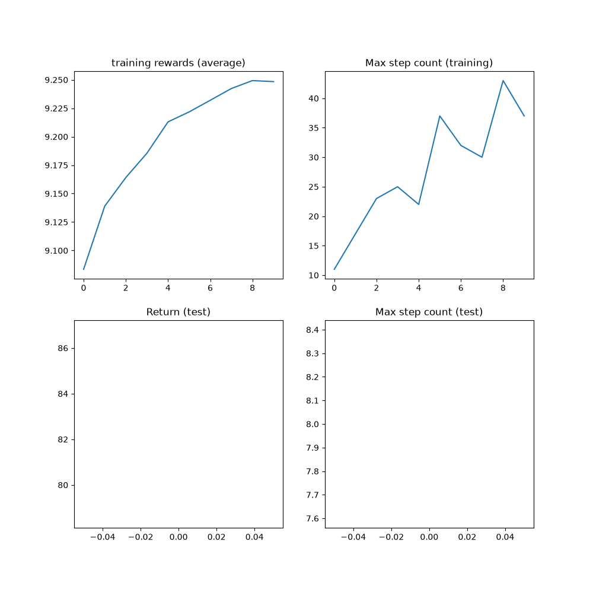

Note

Go to the end
to download the full example code.

# Reinforcement Learning (PPO) with TorchRL Tutorial

**Author**: [Vincent Moens](https://github.com/vmoens)

This tutorial demonstrates how to use PyTorch and `torchrl` to train a parametric policy
network to solve the Inverted Pendulum task from the [OpenAI-Gym/Farama-Gymnasium
control library](https://github.com/Farama-Foundation/Gymnasium).


Inverted pendulum

Key learnings:

- How to create an environment in TorchRL, transform its outputs, and collect data from this environment;
- How to make your classes talk to each other using [`TensorDict`](https://docs.pytorch.org/tensordict/stable/reference/generated/tensordict.TensorDict.html#tensordict.TensorDict);
- The basics of building your training loop with TorchRL:

- How to compute the advantage signal for policy gradient methods;
- How to create a stochastic policy using a probabilistic neural network;
- How to create a dynamic replay buffer and sample from it without repetition.

We will cover six crucial components of TorchRL:

- [environments](../reference/envs_api.html#environment-api)
- [transforms](../reference/envs_transforms.html#transforms)
- [models](../reference/modules.html#ref-modules)
- [loss modules](../reference/objectives.html#ref-objectives)
- [data collectors](../reference/collectors_basics.html#ref-collectors)
- [replay buffers](../reference/data_replaybuffers.html#ref-buffers)

If you are running this in Google Colab, make sure you install the following dependencies:

```
!pip3 install torchrl
!pip3 install gym[mujoco]
!pip3 install tqdm
```

Proximal Policy Optimization (PPO) is a policy-gradient algorithm where a
batch of data is being collected and directly consumed to train the policy to maximise
the expected return given some proximality constraints. You can think of it
as a sophisticated version of [REINFORCE](https://link.springer.com/content/pdf/10.1007/BF00992696.pdf),
the foundational policy-optimization algorithm. For more information, see the
[Proximal Policy Optimization Algorithms](https://arxiv.org/abs/1707.06347) paper.

PPO is usually regarded as a fast and efficient method for online, on-policy
reinforcement algorithm. TorchRL provides a loss-module that does all the work
for you, so that you can rely on this implementation and focus on solving your
problem rather than re-inventing the wheel every time you want to train a policy.

For completeness, here is a brief overview of what the loss computes, even though
this is taken care of by our [`ClipPPOLoss`](../reference/generated/torchrl.objectives.ClipPPOLoss.html#torchrl.objectives.ClipPPOLoss) module--the algorithm works as follows:
1. we will sample a batch of data by playing the
policy in the environment for a given number of steps.
2. Then, we will perform a given number of optimization steps with random sub-samples of this batch using
a clipped version of the REINFORCE loss.
3. The clipping will put a pessimistic bound on our loss: lower return estimates will
be favored compared to higher ones.
The precise formula of the loss is:

\[L(s,a,\theta_k,\theta) = \min\left(
\frac{\pi_{\theta}(a|s)}{\pi_{\theta_k}(a|s)} A^{\pi_{\theta_k}}(s,a), \;\;
g(\epsilon, A^{\pi_{\theta_k}}(s,a))
\right),\]

There are two components in that loss: in the first part of the minimum operator,
we simply compute an importance-weighted version of the REINFORCE loss (for example, a
REINFORCE loss that we have corrected for the fact that the current policy
configuration lags the one that was used for the data collection).
The second part of that minimum operator is a similar loss where we have clipped
the ratios when they exceeded or were below a given pair of thresholds.

This loss ensures that whether the advantage is positive or negative, policy
updates that would produce significant shifts from the previous configuration
are being discouraged.

This tutorial is structured as follows:

1. First, we will define a set of hyperparameters we will be using for training.
2. Next, we will focus on creating our environment, or simulator, using TorchRL's
wrappers and transforms.
3. Next, we will design the policy network and the value model,
which is indispensable to the loss function. These modules will be used
to configure our loss module.
4. Next, we will create the replay buffer and data loader.
5. Finally, we will run our training loop and analyze the results.

Throughout this tutorial, we'll be using the `tensordict` library.
[`TensorDict`](https://docs.pytorch.org/tensordict/stable/reference/generated/tensordict.TensorDict.html#tensordict.TensorDict) is the lingua franca of TorchRL: it helps us abstract
what a module reads and writes and care less about the specific data
description and more about the algorithm itself.

```
from collections import defaultdict

import matplotlib.pyplot as plt
import torch
from tensordict.nn import TensorDictModule
from tensordict.nn.distributions import NormalParamExtractor
from torch import multiprocessing, nn

from torchrl.collectors import Collector
from torchrl.data.replay_buffers import ReplayBuffer
from torchrl.data.replay_buffers.samplers import SamplerWithoutReplacement
from torchrl.data.replay_buffers.storages import LazyTensorStorage
from torchrl.envs import (
 Compose,
 DoubleToFloat,
 ObservationNorm,
 StepCounter,
 TransformedEnv,
)
from torchrl.envs.libs.gym import GymEnv
from torchrl.envs.utils import check_env_specs, ExplorationType, set_exploration_type
from torchrl.modules import ProbabilisticActor, TanhNormal, ValueOperator
from torchrl.objectives import ClipPPOLoss
from torchrl.objectives.value import GAE
from tqdm import tqdm
```

## Define Hyperparameters

We set the hyperparameters for our algorithm. Depending on the resources
available, one may choose to execute the policy on GPU or on another
device.

```
is_fork = multiprocessing.get_start_method() == "fork"
device = (
 torch.device(0)
 if torch.cuda.is_available() and not is_fork
 else torch.device("cpu")
)
num_cells = 256 # number of cells in each layer i.e. output dim.
lr = 3e-4
max_grad_norm = 1.0
```

### Data collection parameters

When collecting data, we will be able to choose how big each batch will be
by defining a `frames_per_batch` parameter. We will also define how many
frames (such as the number of interactions with the simulator) we will allow ourselves to
use. In general, the goal of an RL algorithm is to learn to solve the task
as fast as it can in terms of environment interactions: the lower the `total_frames`
the better.

```
frames_per_batch = 1000
# For a complete training, bring the number of frames up to 1M
total_frames = 10_000
```

### PPO parameters

At each data collection (or batch collection) we will run the optimization
over a certain number of *epochs*, each time-consuming the entire data we just
acquired in a nested training loop. Here, the `sub_batch_size` is different from the
`frames_per_batch` here above: recall that we are working with a "batch of data"
coming from our collector, which size is defined by `frames_per_batch`, and that
we will further split in smaller sub-batches during the inner training loop.
The size of these sub-batches is controlled by `sub_batch_size`.

```
sub_batch_size = 64 # cardinality of the sub-samples gathered from the current data in the inner loop
num_epochs = 10 # optimization steps per batch of data collected
clip_epsilon = (
 0.2 # clip value for PPO loss: see the equation in the intro for more context.
)
gamma = 0.99
lmbda = 0.95
entropy_eps = 1e-4
```

## Define an environment

In RL, an *environment* is usually the way we refer to a simulator or a
control system. Various libraries provide simulation environments for reinforcement
learning, including Gymnasium (previously OpenAI Gym), DeepMind control suite, and
many others.
As a general library, TorchRL's goal is to provide an interchangeable interface
to a large panel of RL simulators, allowing you to easily swap one environment
with another. For example, creating a wrapped gym environment can be achieved with few characters:

```
base_env = GymEnv("InvertedDoublePendulum-v4", device=device)
```

There are a few things to notice in this code: first, we created
the environment by calling the `GymEnv` wrapper. If extra keyword arguments
are passed, they will be transmitted to the `gym.make` method, hence covering
the most common environment construction commands.
Alternatively, one could also directly create a gym environment using `gym.make(env_name, **kwargs)`
and wrap it in a GymWrapper class.

Also the `device` argument: for gym, this only controls the device where
input action and observed states will be stored, but the execution will always
be done on CPU. The reason for this is simply that gym does not support on-device
execution, unless specified otherwise. For other libraries, we have control over
the execution device and, as much as we can, we try to stay consistent in terms of
storing and execution backends.

### Transforms

We will append some transforms to our environments to prepare the data for
the policy. In Gym, this is usually achieved via wrappers. TorchRL takes a different
approach, more similar to other pytorch domain libraries, through the use of transforms.
To add transforms to an environment, one should simply wrap it in a [`TransformedEnv`](../reference/generated/torchrl.envs.transforms.TransformedEnv.html#torchrl.envs.transforms.TransformedEnv)
instance and append the sequence of transforms to it. The transformed environment will inherit
the device and meta-data of the wrapped environment, and transform these depending on the sequence
of transforms it contains.

### Normalization

The first to encode is a normalization transform.
As a rule of thumbs, it is preferable to have data that loosely
match a unit Gaussian distribution: to obtain this, we will
run a certain number of random steps in the environment and compute
the summary statistics of these observations.

We'll append two other transforms: the [`DoubleToFloat`](../reference/generated/torchrl.envs.transforms.DoubleToFloat.html#torchrl.envs.transforms.DoubleToFloat) transform will
convert double entries to single-precision numbers, ready to be read by the
policy. The [`StepCounter`](../reference/generated/torchrl.envs.transforms.StepCounter.html#torchrl.envs.transforms.StepCounter) transform will be used to count the steps before
the environment is terminated. We will use this measure as a supplementary measure
of performance.

As we will see later, many of the TorchRL's classes rely on [`TensorDict`](https://docs.pytorch.org/tensordict/stable/reference/generated/tensordict.TensorDict.html#tensordict.TensorDict)
to communicate. You could think of it as a python dictionary with some extra
tensor features. In practice, this means that many modules we will be working
with need to be told what key to read (`in_keys`) and what key to write
(`out_keys`) in the `tensordict` they will receive. Usually, if `out_keys`
is omitted, it is assumed that the `in_keys` entries will be updated
in-place. For our transforms, the only entry we are interested in is referred
to as `"observation"` and our transform layers will be told to modify this
entry and this entry only:

```
env = TransformedEnv(
 base_env,
 Compose(
 # normalize observations
 ObservationNorm(in_keys=["observation"]),
 DoubleToFloat(),
 StepCounter(),
 ),
)
```

As you may have noticed, we have created a normalization layer but we did not
set its normalization parameters. To do this, [`ObservationNorm`](../reference/generated/torchrl.envs.transforms.ObservationNorm.html#torchrl.envs.transforms.ObservationNorm) can
automatically gather the summary statistics of our environment:

```
env.transform[0].init_stats(num_iter=1000, reduce_dim=0, cat_dim=0)
```

The [`ObservationNorm`](../reference/generated/torchrl.envs.transforms.ObservationNorm.html#torchrl.envs.transforms.ObservationNorm) transform has now been populated with a
location and a scale that will be used to normalize the data.

Let us do a little sanity check for the shape of our summary stats:

```
print("normalization constant shape:", env.transform[0].loc.shape)
```

```
normalization constant shape: torch.Size([11])
```

An environment is not only defined by its simulator and transforms, but also
by a series of metadata that describe what can be expected during its
execution.
For efficiency purposes, TorchRL is quite stringent when it comes to
environment specs, but you can easily check that your environment specs are
adequate.
In our example, the [`GymWrapper`](../reference/generated/torchrl.envs.GymWrapper.html#torchrl.envs.GymWrapper) and
[`GymEnv`](../reference/generated/torchrl.envs.GymEnv.html#torchrl.envs.GymEnv) that inherits
from it already take care of setting the proper specs for your environment so
you should not have to care about this.

Nevertheless, let's see a concrete example using our transformed
environment by looking at its specs.
There are three specs to look at: `observation_spec` which defines what
is to be expected when executing an action in the environment,
`reward_spec` which indicates the reward domain and finally the
`input_spec` (which contains the `action_spec`) and which represents
everything an environment requires to execute a single step.

```
print("observation_spec:", env.observation_spec)
print("reward_spec:", env.reward_spec)
print("input_spec:", env.input_spec)
print("action_spec (as defined by input_spec):", env.action_spec)
```

```
observation_spec: Composite(
 observation: UnboundedContinuous(
 shape=torch.Size([11]),
 space=ContinuousBox(
 low=Tensor(shape=torch.Size([11]), device=cpu, dtype=torch.float32, contiguous=True),
 high=Tensor(shape=torch.Size([11]), device=cpu, dtype=torch.float32, contiguous=True)),
 device=cpu,
 dtype=torch.float32,
 domain=continuous),
 step_count: BoundedDiscrete(
 shape=torch.Size([1]),
 space=ContinuousBox(
 low=Tensor(shape=torch.Size([1]), device=cpu, dtype=torch.int64, contiguous=True),
 high=Tensor(shape=torch.Size([1]), device=cpu, dtype=torch.int64, contiguous=True)),
 device=cpu,
 dtype=torch.int64,
 domain=discrete),
 device=cpu,
 shape=torch.Size([]),
 data_cls=None)
reward_spec: UnboundedContinuous(
 shape=torch.Size([1]),
 space=ContinuousBox(
 low=Tensor(shape=torch.Size([1]), device=cpu, dtype=torch.float32, contiguous=True),
 high=Tensor(shape=torch.Size([1]), device=cpu, dtype=torch.float32, contiguous=True)),
 device=cpu,
 dtype=torch.float32,
 domain=continuous)
input_spec: Composite(
 full_state_spec: Composite(
 step_count: BoundedDiscrete(
 shape=torch.Size([1]),
 space=ContinuousBox(
 low=Tensor(shape=torch.Size([1]), device=cpu, dtype=torch.int64, contiguous=True),
 high=Tensor(shape=torch.Size([1]), device=cpu, dtype=torch.int64, contiguous=True)),
 device=cpu,
 dtype=torch.int64,
 domain=discrete),
 device=cpu,
 shape=torch.Size([]),
 data_cls=None),
 full_action_spec: Composite(
 action: BoundedContinuous(
 shape=torch.Size([1]),
 space=ContinuousBox(
 low=Tensor(shape=torch.Size([1]), device=cpu, dtype=torch.float32, contiguous=True),
 high=Tensor(shape=torch.Size([1]), device=cpu, dtype=torch.float32, contiguous=True)),
 device=cpu,
 dtype=torch.float32,
 domain=continuous),
 device=cpu,
 shape=torch.Size([]),
 data_cls=None),
 device=cpu,
 shape=torch.Size([]),
 data_cls=None)
action_spec (as defined by input_spec): BoundedContinuous(
 shape=torch.Size([1]),
 space=ContinuousBox(
 low=Tensor(shape=torch.Size([1]), device=cpu, dtype=torch.float32, contiguous=True),
 high=Tensor(shape=torch.Size([1]), device=cpu, dtype=torch.float32, contiguous=True)),
 device=cpu,
 dtype=torch.float32,
 domain=continuous)
```

the [`check_env_specs()`](../reference/generated/torchrl.envs.check_env_specs.html#torchrl.envs.check_env_specs) function runs a small rollout and compares its output against the environment
specs. If no error is raised, we can be confident that the specs are properly defined:

```
check_env_specs(env)
```

For fun, let's see what a simple random rollout looks like. You can
call env.rollout(n_steps) and get an overview of what the environment inputs
and outputs look like. Actions will automatically be drawn from the action spec
domain, so you don't need to care about designing a random sampler.

Typically, at each step, an RL environment receives an
action as input, and outputs an observation, a reward and a done state. The
observation may be composite, meaning that it could be composed of more than one
tensor. This is not a problem for TorchRL, since the whole set of observations
is automatically packed in the output [`TensorDict`](https://docs.pytorch.org/tensordict/stable/reference/generated/tensordict.TensorDict.html#tensordict.TensorDict). After executing a rollout
(for example, a sequence of environment steps and random action generations) over a given
number of steps, we will retrieve a [`TensorDict`](https://docs.pytorch.org/tensordict/stable/reference/generated/tensordict.TensorDict.html#tensordict.TensorDict) instance with a shape
that matches this trajectory length:

```
rollout = env.rollout(3)
print("rollout of three steps:", rollout)
print("Shape of the rollout TensorDict:", rollout.batch_size)
```

```
rollout of three steps: TensorDict(
 fields={
 action: Tensor(shape=torch.Size([3, 1]), device=cpu, dtype=torch.float32, is_shared=False),
 done: Tensor(shape=torch.Size([3, 1]), device=cpu, dtype=torch.bool, is_shared=False),
 next: TensorDict(
 fields={
 done: Tensor(shape=torch.Size([3, 1]), device=cpu, dtype=torch.bool, is_shared=False),
 observation: Tensor(shape=torch.Size([3, 11]), device=cpu, dtype=torch.float32, is_shared=False),
 reward: Tensor(shape=torch.Size([3, 1]), device=cpu, dtype=torch.float32, is_shared=False),
 step_count: Tensor(shape=torch.Size([3, 1]), device=cpu, dtype=torch.int64, is_shared=False),
 terminated: Tensor(shape=torch.Size([3, 1]), device=cpu, dtype=torch.bool, is_shared=False),
 truncated: Tensor(shape=torch.Size([3, 1]), device=cpu, dtype=torch.bool, is_shared=False)},
 batch_size=torch.Size([3]),
 device=cpu,
 is_shared=False),
 observation: Tensor(shape=torch.Size([3, 11]), device=cpu, dtype=torch.float32, is_shared=False),
 step_count: Tensor(shape=torch.Size([3, 1]), device=cpu, dtype=torch.int64, is_shared=False),
 terminated: Tensor(shape=torch.Size([3, 1]), device=cpu, dtype=torch.bool, is_shared=False),
 truncated: Tensor(shape=torch.Size([3, 1]), device=cpu, dtype=torch.bool, is_shared=False)},
 batch_size=torch.Size([3]),
 device=cpu,
 is_shared=False)
Shape of the rollout TensorDict: torch.Size([3])
```

Our rollout data has a shape of `torch.Size([3])`, which matches the number of steps
we ran it for. The `"next"` entry points to the data coming after the current step.
In most cases, the `"next"` data at time t matches the data at `t+1`, but this
may not be the case if we are using some specific transformations (for example, multi-step).

## Policy

PPO utilizes a stochastic policy to handle exploration. This means that our
neural network will have to output the parameters of a distribution, rather
than a single value corresponding to the action taken.

As the data is continuous, we use a Tanh-Normal distribution to respect the
action space boundaries. TorchRL provides such distribution, and the only
thing we need to care about is to build a neural network that outputs the
right number of parameters for the policy to work with (a location, or mean,
and a scale):

\[f_{\theta}(\text{observation}) = \mu_{\theta}(\text{observation}), \sigma^{+}_{\theta}(\text{observation})\]

The only extra-difficulty that is brought up here is to split our output in two
equal parts and map the second to a strictly positive space.

We design the policy in three steps:

1. Define a neural network `D_obs` -> `2 * D_action`. Indeed, our `loc` (mu) and `scale` (sigma) both have dimension `D_action`.
2. Append a [`NormalParamExtractor`](https://docs.pytorch.org/tensordict/stable/reference/generated/tensordict.nn.distributions.NormalParamExtractor.html#tensordict.nn.distributions.NormalParamExtractor) to extract a location and a scale (for example, splits the input in two equal parts and applies a positive transformation to the scale parameter).
3. Create a probabilistic [`TensorDictModule`](https://docs.pytorch.org/tensordict/stable/reference/generated/tensordict.nn.TensorDictModule.html#tensordict.nn.TensorDictModule) that can generate this distribution and sample from it.

```
actor_net = nn.Sequential(
 nn.LazyLinear(num_cells, device=device),
 nn.Tanh(),
 nn.LazyLinear(num_cells, device=device),
 nn.Tanh(),
 nn.LazyLinear(num_cells, device=device),
 nn.Tanh(),
 nn.LazyLinear(2 * env.action_spec.shape[-1], device=device),
 NormalParamExtractor(),
)
```

To enable the policy to "talk" with the environment through the `tensordict`
data carrier, we wrap the `nn.Module` in a [`TensorDictModule`](https://docs.pytorch.org/tensordict/stable/reference/generated/tensordict.nn.TensorDictModule.html#tensordict.nn.TensorDictModule). This
class will simply ready the `in_keys` it is provided with and write the
outputs in-place at the registered `out_keys`.

```
policy_module = TensorDictModule(
 actor_net, in_keys=["observation"], out_keys=["loc", "scale"]
)
```

We now need to build a distribution out of the location and scale of our
normal distribution. To do so, we instruct the
[`ProbabilisticActor`](../reference/generated/torchrl.modules.tensordict_module.ProbabilisticActor.html#torchrl.modules.tensordict_module.ProbabilisticActor)
class to build a [`TanhNormal`](../reference/generated/torchrl.modules.TanhNormal.html#torchrl.modules.TanhNormal) out of the location and scale
parameters. We also provide the minimum and maximum values of this
distribution, which we gather from the environment specs.

The name of the `in_keys` (and hence the name of the `out_keys` from
the [`TensorDictModule`](https://docs.pytorch.org/tensordict/stable/reference/generated/tensordict.nn.TensorDictModule.html#tensordict.nn.TensorDictModule) above) cannot be set to any value one may
like, as the [`TanhNormal`](../reference/generated/torchrl.modules.TanhNormal.html#torchrl.modules.TanhNormal) distribution constructor will expect the
`loc` and `scale` keyword arguments. That being said,
[`ProbabilisticActor`](../reference/generated/torchrl.modules.tensordict_module.ProbabilisticActor.html#torchrl.modules.tensordict_module.ProbabilisticActor) also accepts
`Dict[str, str]` typed `in_keys` where the key-value pair indicates
what `in_key` string should be used for every keyword argument that is to be used.

```
policy_module = ProbabilisticActor(
 module=policy_module,
 spec=env.action_spec,
 in_keys=["loc", "scale"],
 distribution_class=TanhNormal,
 distribution_kwargs={
 "low": env.action_spec_unbatched.space.low,
 "high": env.action_spec_unbatched.space.high,
 },
 return_log_prob=True,
 # we'll need the log-prob for the numerator of the importance weights
)
```

## Value network

The value network is a crucial component of the PPO algorithm, even though it
won't be used at inference time. This module will read the observations and
return an estimation of the discounted return for the following trajectory.
This allows us to amortize learning by relying on the some utility estimation
that is learned on-the-fly during training. Our value network share the same
structure as the policy, but for simplicity we assign it its own set of
parameters.

```
value_net = nn.Sequential(
 nn.LazyLinear(num_cells, device=device),
 nn.Tanh(),
 nn.LazyLinear(num_cells, device=device),
 nn.Tanh(),
 nn.LazyLinear(num_cells, device=device),
 nn.Tanh(),
 nn.LazyLinear(1, device=device),
)

value_module = ValueOperator(
 module=value_net,
 in_keys=["observation"],
)
```

let's try our policy and value modules. As we said earlier, the usage of
[`TensorDictModule`](https://docs.pytorch.org/tensordict/stable/reference/generated/tensordict.nn.TensorDictModule.html#tensordict.nn.TensorDictModule) makes it possible to directly read the output
of the environment to run these modules, as they know what information to read
and where to write it:

```
print("Running policy:", policy_module(env.reset()))
print("Running value:", value_module(env.reset()))
```

```
Running policy: TensorDict(
 fields={
 action: Tensor(shape=torch.Size([1]), device=cpu, dtype=torch.float32, is_shared=False),
 action_log_prob: Tensor(shape=torch.Size([]), device=cpu, dtype=torch.float32, is_shared=False),
 done: Tensor(shape=torch.Size([1]), device=cpu, dtype=torch.bool, is_shared=False),
 loc: Tensor(shape=torch.Size([1]), device=cpu, dtype=torch.float32, is_shared=False),
 observation: Tensor(shape=torch.Size([11]), device=cpu, dtype=torch.float32, is_shared=False),
 scale: Tensor(shape=torch.Size([1]), device=cpu, dtype=torch.float32, is_shared=False),
 step_count: Tensor(shape=torch.Size([1]), device=cpu, dtype=torch.int64, is_shared=False),
 terminated: Tensor(shape=torch.Size([1]), device=cpu, dtype=torch.bool, is_shared=False),
 truncated: Tensor(shape=torch.Size([1]), device=cpu, dtype=torch.bool, is_shared=False)},
 batch_size=torch.Size([]),
 device=cpu,
 is_shared=False)
Running value: TensorDict(
 fields={
 done: Tensor(shape=torch.Size([1]), device=cpu, dtype=torch.bool, is_shared=False),
 observation: Tensor(shape=torch.Size([11]), device=cpu, dtype=torch.float32, is_shared=False),
 state_value: Tensor(shape=torch.Size([1]), device=cpu, dtype=torch.float32, is_shared=False),
 step_count: Tensor(shape=torch.Size([1]), device=cpu, dtype=torch.int64, is_shared=False),
 terminated: Tensor(shape=torch.Size([1]), device=cpu, dtype=torch.bool, is_shared=False),
 truncated: Tensor(shape=torch.Size([1]), device=cpu, dtype=torch.bool, is_shared=False)},
 batch_size=torch.Size([]),
 device=cpu,
 is_shared=False)
```

## Model mode

We keep the policy and value modules in `eval` mode during PPO training.
This controls PyTorch module behavior, such as dropout and batch
normalization, but it is independent from TorchRL's exploration/interaction
mode and from autograd context managers such as `torch.no_grad()`. See
[Execution modes and context managers](getting-started-2.html#rl-execution-modes) for details.

Set the mode before constructing the collector: some collectors may wrap,
move, or copy the policy during initialization.

```
policy_module.eval()
value_module.eval()
```

```
ValueOperator(
 module=Sequential(
 (0): Linear(in_features=11, out_features=256, bias=True)
 (1): Tanh()
 (2): Linear(in_features=256, out_features=256, bias=True)
 (3): Tanh()
 (4): Linear(in_features=256, out_features=256, bias=True)
 (5): Tanh()
 (6): Linear(in_features=256, out_features=1, bias=True)
 ),
 device=cpu,
 in_keys=['observation'],
 out_keys=['state_value'])
```

## Data collector

TorchRL provides a set of [DataCollector classes](../reference/collectors_basics.html#ref-collectors).
Briefly, these classes execute three operations: reset an environment,
compute an action given the latest observation, execute a step in the environment,
and repeat the last two steps until the environment signals a stop (or reaches
a done state).

They allow you to control how many frames to collect at each iteration
(through the `frames_per_batch` parameter),
when to reset the environment (through the `max_frames_per_traj` argument),
on which `device` the policy should be executed, etc. They are also
designed to work efficiently with batched and multiprocessed environments.

The simplest data collector is the [`Collector`](../reference/generated/torchrl.collectors.Collector.html#torchrl.collectors.Collector):
it is an iterator that you can use to get batches of data of a given length, and
that will stop once a total number of frames (`total_frames`) have been
collected.
Other data collectors ([`MultiSyncCollector`](../reference/generated/torchrl.collectors.MultiSyncCollector.html#torchrl.collectors.MultiSyncCollector) and
[`MultiAsyncCollector`](../reference/generated/torchrl.collectors.MultiAsyncCollector.html#torchrl.collectors.MultiAsyncCollector)) will execute
the same operations in synchronous and asynchronous manner over a
set of multiprocessed workers.

As for the policy and environment before, the data collector will return
[`TensorDict`](https://docs.pytorch.org/tensordict/stable/reference/generated/tensordict.TensorDict.html#tensordict.TensorDict) instances with a total number of elements that will
match `frames_per_batch`. Using [`TensorDict`](https://docs.pytorch.org/tensordict/stable/reference/generated/tensordict.TensorDict.html#tensordict.TensorDict) to pass data to the
training loop allows you to write data loading pipelines
that are 100% oblivious to the actual specificities of the rollout content.

```
collector = Collector(
 env,
 policy_module,
 frames_per_batch=frames_per_batch,
 total_frames=total_frames,
 split_trajs=False,
 device=device,
)
```

## Replay buffer

Replay buffers are a common building piece of off-policy RL algorithms.
In on-policy contexts, a replay buffer is refilled every time a batch of
data is collected, and its data is repeatedly consumed for a certain number
of epochs.

TorchRL's replay buffers are built using a common container
[`ReplayBuffer`](../reference/generated/torchrl.data.ReplayBuffer.html#torchrl.data.ReplayBuffer) which takes as argument the components
of the buffer: a storage, a writer, a sampler and possibly some transforms.
Only the storage (which indicates the replay buffer capacity) is mandatory.
We also specify a sampler without repetition to avoid sampling multiple times
the same item in one epoch.
Using a replay buffer for PPO is not mandatory and we could simply
sample the sub-batches from the collected batch, but using these classes
make it easy for us to build the inner training loop in a reproducible way.

```
replay_buffer = ReplayBuffer(
 storage=LazyTensorStorage(max_size=frames_per_batch),
 sampler=SamplerWithoutReplacement(),
)
```

## Loss function

The PPO loss can be directly imported from TorchRL for convenience using the
[`ClipPPOLoss`](../reference/generated/torchrl.objectives.ClipPPOLoss.html#torchrl.objectives.ClipPPOLoss) class. This is the easiest way of utilizing PPO:
it hides away the mathematical operations of PPO and the control flow that
goes with it.

PPO requires some "advantage estimation" to be computed. In short, an advantage
is a value that reflects an expectancy over the return value while dealing with
the bias / variance tradeoff.
To compute the advantage, one just needs to (1) build the advantage module, which
utilizes our value operator, and (2) pass each batch of data through it before each
epoch.
The GAE module will update the input `tensordict` with new `"advantage"` and
`"value_target"` entries.
The `"value_target"` is a gradient-free tensor that represents the empirical
value that the value network should represent with the input observation.
Both of these will be used by [`ClipPPOLoss`](../reference/generated/torchrl.objectives.ClipPPOLoss.html#torchrl.objectives.ClipPPOLoss) to
return the policy and value losses.

```
advantage_module = GAE(
 gamma=gamma, lmbda=lmbda, value_network=value_module, average_gae=True
)

loss_module = ClipPPOLoss(
 actor_network=policy_module,
 critic_network=value_module,
 clip_epsilon=clip_epsilon,
 entropy_bonus=bool(entropy_eps),
 entropy_coeff=entropy_eps,
 # these keys match by default but we set this for completeness
 critic_coeff=1.0,
 loss_critic_type="smooth_l1",
)

optim = torch.optim.Adam(loss_module.parameters(), lr)
scheduler = torch.optim.lr_scheduler.CosineAnnealingLR(
 optim, total_frames // frames_per_batch, 0.0
)
```

## Training loop

We now have all the pieces needed to code our training loop.
The steps include:

- Collect data

- Compute advantage

- Loop over the collected to compute loss values
- Back propagate
- Optimize
- Repeat
- Repeat
- Repeat

Note

This tutorial keeps the policy and value networks in `eval` mode during
both data collection and optimization. The collector's exploration mode
still controls whether actions are sampled randomly during collection.

```
logs = defaultdict(list)
pbar = tqdm(total=total_frames)
eval_str = ""

# We iterate over the collector until it reaches the total number of frames it was
# designed to collect:
for i, tensordict_data in enumerate(collector):
 # we now have a batch of data to work with. Let's learn something from it.
 for _ in range(num_epochs):
 # We'll need an "advantage" signal to make PPO work.
 # We re-compute it at each epoch as its value depends on the value
 # network which is updated in the inner loop.
 advantage_module(tensordict_data)
 data_view = tensordict_data.reshape(-1)
 replay_buffer.extend(data_view.cpu())
 for _ in range(frames_per_batch // sub_batch_size):
 subdata = replay_buffer.sample(sub_batch_size)
 loss_vals = loss_module(subdata.to(device))
 loss_value = (
 loss_vals["loss_objective"]
 + loss_vals["loss_critic"]
 + loss_vals["loss_entropy"]
 )

 # Optimization: backward, grad clipping and optimization step
 loss_value.backward()
 # this is not strictly mandatory but it's good practice to keep
 # your gradient norm bounded
 torch.nn.utils.clip_grad_norm_(loss_module.parameters(), max_grad_norm)
 optim.step()
 optim.zero_grad()

 logs["reward"].append(tensordict_data["next", "reward"].mean().item())
 pbar.update(tensordict_data.numel())
 cum_reward_str = (
 f"average reward={logs['reward'][-1]: 4.4f} (init={logs['reward'][0]: 4.4f})"
 )
 logs["step_count"].append(tensordict_data["step_count"].max().item())
 stepcount_str = f"step count (max): {logs['step_count'][-1]}"
 logs["lr"].append(optim.param_groups[0]["lr"])
 lr_str = f"lr policy: {logs['lr'][-1]: 4.4f}"
 if i % 10 == 0:
 # We evaluate the policy once every 10 batches of data.
 # Evaluation is rather simple: execute the policy without exploration
 # (take the expected value of the action distribution) for a given
 # number of steps (1000, which is our ``env`` horizon).
 # The ``rollout`` method of the ``env`` can take a policy as argument:
 # it will then execute this policy at each step.
 # The context manager below changes the action-selection mode only; it
 # does not switch the module between train and eval modes.
 with set_exploration_type(ExplorationType.DETERMINISTIC), torch.no_grad():
 # execute a rollout with the trained policy
 eval_rollout = env.rollout(1000, policy_module)
 logs["eval reward"].append(eval_rollout["next", "reward"].mean().item())
 logs["eval reward (sum)"].append(eval_rollout["next", "reward"].sum().item())
 logs["eval step_count"].append(eval_rollout["step_count"].max().item())
 eval_str = (
 f"eval cumulative reward: {logs['eval reward (sum)'][-1]: 4.4f} "
 f"(init: {logs['eval reward (sum)'][0]: 4.4f}), "
 f"eval step-count: {logs['eval step_count'][-1]}"
 )
 del eval_rollout
 pbar.set_description(", ".join([eval_str, cum_reward_str, stepcount_str, lr_str]))

 # We're also using a learning rate scheduler. Like the gradient clipping,
 # this is a nice-to-have but nothing necessary for PPO to work.
 scheduler.step()
```

```
0%| | 0/10000 [00:00<?, ?it/s]
 10%|█ | 1000/10000 [00:02<00:25, 351.45it/s]
eval cumulative reward: 82.6702 (init: 82.6702), eval step-count: 8, average reward= 9.0835 (init= 9.0835), step count (max): 11, lr policy: 0.0003: 10%|█ | 1000/10000 [00:02<00:25, 351.45it/s]
eval cumulative reward: 82.6702 (init: 82.6702), eval step-count: 8, average reward= 9.0835 (init= 9.0835), step count (max): 11, lr policy: 0.0003: 20%|██ | 2000/10000 [00:05<00:22, 353.06it/s]
eval cumulative reward: 82.6702 (init: 82.6702), eval step-count: 8, average reward= 9.1390 (init= 9.0835), step count (max): 17, lr policy: 0.0003: 20%|██ | 2000/10000 [00:05<00:22, 353.06it/s]
eval cumulative reward: 82.6702 (init: 82.6702), eval step-count: 8, average reward= 9.1390 (init= 9.0835), step count (max): 17, lr policy: 0.0003: 30%|███ | 3000/10000 [00:08<00:19, 356.01it/s]
eval cumulative reward: 82.6702 (init: 82.6702), eval step-count: 8, average reward= 9.1641 (init= 9.0835), step count (max): 23, lr policy: 0.0003: 30%|███ | 3000/10000 [00:08<00:19, 356.01it/s]
eval cumulative reward: 82.6702 (init: 82.6702), eval step-count: 8, average reward= 9.1641 (init= 9.0835), step count (max): 23, lr policy: 0.0003: 40%|████ | 4000/10000 [00:11<00:16, 358.51it/s]
eval cumulative reward: 82.6702 (init: 82.6702), eval step-count: 8, average reward= 9.1855 (init= 9.0835), step count (max): 25, lr policy: 0.0002: 40%|████ | 4000/10000 [00:11<00:16, 358.51it/s]
eval cumulative reward: 82.6702 (init: 82.6702), eval step-count: 8, average reward= 9.1855 (init= 9.0835), step count (max): 25, lr policy: 0.0002: 50%|█████ | 5000/10000 [00:13<00:13, 360.72it/s]
eval cumulative reward: 82.6702 (init: 82.6702), eval step-count: 8, average reward= 9.2130 (init= 9.0835), step count (max): 22, lr policy: 0.0002: 50%|█████ | 5000/10000 [00:13<00:13, 360.72it/s]
eval cumulative reward: 82.6702 (init: 82.6702), eval step-count: 8, average reward= 9.2130 (init= 9.0835), step count (max): 22, lr policy: 0.0002: 60%|██████ | 6000/10000 [00:16<00:11, 361.19it/s]
eval cumulative reward: 82.6702 (init: 82.6702), eval step-count: 8, average reward= 9.2218 (init= 9.0835), step count (max): 37, lr policy: 0.0001: 60%|██████ | 6000/10000 [00:16<00:11, 361.19it/s]
eval cumulative reward: 82.6702 (init: 82.6702), eval step-count: 8, average reward= 9.2218 (init= 9.0835), step count (max): 37, lr policy: 0.0001: 70%|███████ | 7000/10000 [00:19<00:08, 361.98it/s]
eval cumulative reward: 82.6702 (init: 82.6702), eval step-count: 8, average reward= 9.2320 (init= 9.0835), step count (max): 32, lr policy: 0.0001: 70%|███████ | 7000/10000 [00:19<00:08, 361.98it/s]
eval cumulative reward: 82.6702 (init: 82.6702), eval step-count: 8, average reward= 9.2320 (init= 9.0835), step count (max): 32, lr policy: 0.0001: 80%|████████ | 8000/10000 [00:22<00:05, 362.08it/s]
eval cumulative reward: 82.6702 (init: 82.6702), eval step-count: 8, average reward= 9.2423 (init= 9.0835), step count (max): 30, lr policy: 0.0001: 80%|████████ | 8000/10000 [00:22<00:05, 362.08it/s]
eval cumulative reward: 82.6702 (init: 82.6702), eval step-count: 8, average reward= 9.2423 (init= 9.0835), step count (max): 30, lr policy: 0.0001: 90%|█████████ | 9000/10000 [00:24<00:02, 362.52it/s]
eval cumulative reward: 82.6702 (init: 82.6702), eval step-count: 8, average reward= 9.2493 (init= 9.0835), step count (max): 43, lr policy: 0.0000: 90%|█████████ | 9000/10000 [00:24<00:02, 362.52it/s]
eval cumulative reward: 82.6702 (init: 82.6702), eval step-count: 8, average reward= 9.2493 (init= 9.0835), step count (max): 43, lr policy: 0.0000: 100%|██████████| 10000/10000 [00:27<00:00, 362.75it/s]
eval cumulative reward: 82.6702 (init: 82.6702), eval step-count: 8, average reward= 9.2484 (init= 9.0835), step count (max): 37, lr policy: 0.0000: 100%|██████████| 10000/10000 [00:27<00:00, 362.75it/s]
```

## Results

Before the 1M step cap is reached, the algorithm should have reached a max
step count of 1000 steps, which is the maximum number of steps before the
trajectory is truncated.

```
plt.figure(figsize=(10, 10))
plt.subplot(2, 2, 1)
plt.plot(logs["reward"])
plt.title("training rewards (average)")
plt.subplot(2, 2, 2)
plt.plot(logs["step_count"])
plt.title("Max step count (training)")
plt.subplot(2, 2, 3)
plt.plot(logs["eval reward (sum)"])
plt.title("Return (test)")
plt.subplot(2, 2, 4)
plt.plot(logs["eval step_count"])
plt.title("Max step count (test)")
plt.show()
```



## Conclusion and next steps

In this tutorial, we have learned:

1. How to create and customize an environment with `torchrl`;
2. How to write a model and a loss function;
3. How to set up a typical training loop.

If you want to experiment with this tutorial a bit more, you can apply the following modifications:

- From an efficiency perspective,
we could run several simulations in parallel to speed up data collection.
Check [`ParallelEnv`](../reference/generated/torchrl.envs.ParallelEnv.html#torchrl.envs.ParallelEnv) for further information.
- From a logging perspective, one could add a [`torchrl.record.VideoRecorder`](../reference/generated/torchrl.record.VideoRecorder.html#torchrl.record.VideoRecorder) transform to
the environment after asking for rendering to get a visual rendering of the
inverted pendulum in action. Check `torchrl.record` to
know more.

**Total running time of the script:** (0 minutes 28.886 seconds)

[`Download Jupyter notebook: coding_ppo.ipynb`](../_downloads/e2a5193e019585d9cfa26d3eebfd8be3/coding_ppo.ipynb)

[`Download Python source code: coding_ppo.py`](../_downloads/c4cc1ccac40ca535b79628b7eb0bbe18/coding_ppo.py)

[`Download zipped: coding_ppo.zip`](../_downloads/04340de0748216c2f40fec722b0c537a/coding_ppo.zip)

[Gallery generated by Sphinx-Gallery](https://sphinx-gallery.github.io)