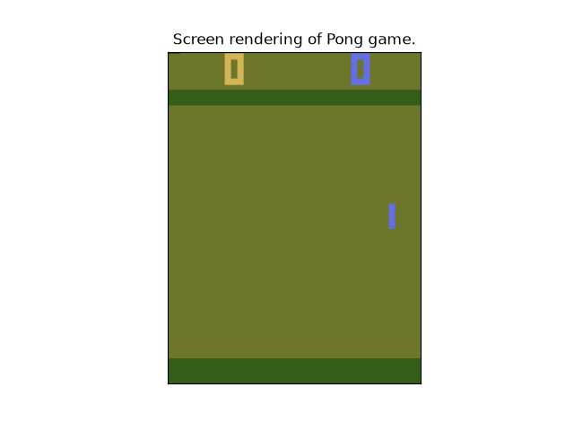

Note

Go to the end
to download the full example code.

# Exporting TorchRL modules

**Author**: [Vincent Moens](https://github.com/vmoens)

Note

To run this tutorial in a notebook, add an installation cell
at the beginning containing:

> ```
> !pip install tensordict
> !pip install torchrl
> !pip install "gymnasium[atari]"
> ```

## Introduction

Learning a policy has little value if that policy cannot be deployed in real-world settings.
As shown in other tutorials, TorchRL has a strong focus on modularity and composability: thanks to `tensordict`,
the components of the library can be written in the most generic way there is by abstracting their signature to a
mere set of operations on an input `TensorDict`.
This may give the impression that the library is bound to be used only for training, as typical low-level execution
hardwares (edge devices, robots, arduino, Raspberry Pi) do not execute python code, let alone with pytorch, tensordict
or torchrl installed.

Fortunately, PyTorch provides a full ecosystem of solutions to export code and trained models to devices and
hardwares, and TorchRL is fully equipped to interact with it.
It is possible to choose from a varied set of backends, including ONNX or AOTInductor examplified in this tutorial.
This tutorial gives a quick overview of how a trained model can be isolated and shipped as a standalone executable
to be exported on hardware.

Key learnings:

- Export any TorchRL module after training;
- Using various backends;
- Testing your exported model.

## Fast recap: a simple TorchRL training loop

In this section, we reproduce the training loop from the last Getting Started tutorial, slightly adapted to be used
with Atari games as they are rendered by the gymnasium library.
We will stick to the DQN example, and show how a policy that outputs a distribution over values can be used instead
later.

```
import time
from pathlib import Path

import numpy as np

import torch

from tensordict.nn import (
 TensorDictModule as Mod,
 TensorDictSequential,
 TensorDictSequential as Seq,
)

from torch.optim import Adam

from torchrl._utils import timeit
from torchrl.collectors import Collector
from torchrl.data import LazyTensorStorage, ReplayBuffer

from torchrl.envs import (
 Compose,
 GrayScale,
 GymEnv,
 Resize,
 set_exploration_type,
 StepCounter,
 ToTensorImage,
 TransformedEnv,
)

from torchrl.modules import ConvNet, EGreedyModule, QValueModule

from torchrl.objectives import DQNLoss, SoftUpdate

torch.manual_seed(0)

env = TransformedEnv(
 GymEnv("ALE/Pong-v5", categorical_action_encoding=True),
 Compose(
 ToTensorImage(), Resize(84, interpolation="nearest"), GrayScale(), StepCounter()
 ),
)
env.set_seed(0)

value_mlp = ConvNet.default_atari_dqn(num_actions=env.action_spec.space.n)
value_net = Mod(value_mlp, in_keys=["pixels"], out_keys=["action_value"])
policy = Seq(value_net, QValueModule(spec=env.action_spec))
exploration_module = EGreedyModule(
 env.action_spec, annealing_num_steps=100_000, eps_init=0.5
)
policy_explore = Seq(policy, exploration_module)

init_rand_steps = 5000
frames_per_batch = 100
optim_steps = 10
collector = Collector(
 env,
 policy_explore,
 frames_per_batch=frames_per_batch,
 total_frames=-1,
 init_random_frames=init_rand_steps,
)
rb = ReplayBuffer(storage=LazyTensorStorage(100_000))

loss = DQNLoss(value_network=policy, action_space=env.action_spec, delay_value=True)
optim = Adam(loss.parameters())
updater = SoftUpdate(loss, eps=0.99)

total_count = 0
total_episodes = 0
t0 = time.time()
for data in collector:
 # Write data in replay buffer
 rb.extend(data)
 max_length = rb[:]["next", "step_count"].max()
 if len(rb) > init_rand_steps:
 # Optim loop (we do several optim steps
 # per batch collected for efficiency)
 for _ in range(optim_steps):
 sample = rb.sample(128)
 loss_vals = loss(sample)
 loss_vals["loss"].backward()
 optim.step()
 optim.zero_grad()
 # Update exploration factor
 exploration_module.step(data.numel())
 # Update target params
 updater.step()
 total_count += data.numel()
 total_episodes += data["next", "done"].sum()
 if max_length > 200:
 break
```

## Exporting a TensorDictModule-based policy

`TensorDict` allowed us to build a policy with a great flexibility: from a regular [`Module`](https://docs.pytorch.org/docs/stable/generated/torch.nn.Module.html#torch.nn.Module) that
outputs action values from an observation, we added a [`QValueModule`](../reference/generated/torchrl.modules.QValueModule.html#torchrl.modules.QValueModule) module that
read these values and computed an action using some heuristic (e.g., an argmax call).

However, there's a small technical catch in our case: the environment (the actual Atari game) doesn't return
grayscale, 84x84 images but raw screen-size color ones. The transforms we appended to the environment make sure that
the images can be read by the model. We can see that, from the training perspective, the boundary between environment
and model is blurry, but at execution time things are much clearer: the model should take care of transforming
the input data (images) to the format that can be processed by our CNN.

Here again, the magic of tensordict will unblock us: it happens that most of local (non-recursive) TorchRL's
transforms can be used both as environment transforms or preprocessing blocks within a [`Module`](https://docs.pytorch.org/docs/stable/generated/torch.nn.Module.html#torch.nn.Module)
instance. Let's see how we can prepend them to our policy:

```
policy_transform = TensorDictSequential(
 env.transform[
 :-1
 ], # the last transform is a step counter which we don't need for preproc
 policy_explore.requires_grad_(
 False
 ), # Using the explorative version of the policy for didactic purposes, see below.
)
```

We create a fake input, and pass it to [`export()`](https://docs.pytorch.org/docs/stable/user_guide/torch_compiler/export/api_reference.html#torch.export.export) with the policy. This will give a "raw" python
function that will read our input tensor and output an action without any reference to TorchRL or tensordict modules.

A good practice is to call [`select_out_keys()`](https://docs.pytorch.org/tensordict/stable/reference/generated/tensordict.nn.TensorDictSequential.html#tensordict.nn.TensorDictSequential.select_out_keys) to let the model know that
we only want a certain set of outputs (in case the policy returns more than one tensor).

```
fake_td = env.base_env.fake_tensordict()
pixels = fake_td["pixels"]
with set_exploration_type("DETERMINISTIC"):
 exported_policy = torch.export.export(
 # Select only the "action" output key
 policy_transform.select_out_keys("action"),
 args=(),
 kwargs={"pixels": pixels},
 strict=False,
 )
```

Representing the policy can be quite insightful: we can see that the first operations are a permute, a div, unsqueeze,
resize followed by the convolutional and MLP layers.

```
print("Deterministic policy")
exported_policy.graph_module.print_readable()
```

```
Deterministic policy
class GraphModule(torch.nn.Module):
 def forward(self, p_module_1_module_0_module_0_module_0_0_weight: "f32[32, 1, 8, 8]", p_module_1_module_0_module_0_module_0_0_bias: "f32[32]", p_module_1_module_0_module_0_module_0_2_weight: "f32[64, 32, 4, 4]", p_module_1_module_0_module_0_module_0_2_bias: "f32[64]", p_module_1_module_0_module_0_module_0_4_weight: "f32[64, 64, 3, 3]", p_module_1_module_0_module_0_module_0_4_bias: "f32[64]", p_module_1_module_0_module_0_module_1_0_weight: "f32[512, 3136]", p_module_1_module_0_module_0_module_1_0_bias: "f32[512]", p_module_1_module_0_module_0_module_1_2_weight: "f32[6, 512]", p_module_1_module_0_module_0_module_1_2_bias: "f32[6]", b_module_1_module_1_eps_init: "f32[]", b_module_1_module_1_eps_end: "f32[]", b_module_1_module_1_eps: "f32[]", pixels: "u8[210, 160, 3]"):
 # File: /pytorch/rl/torchrl/envs/transforms/_base.py:571 in forward, code: data = self._apply_transform(data)
 permute: "u8[3, 210, 160]" = torch.ops.aten.permute.default(pixels, [-1, -3, -2]); pixels = None
 div: "f32[3, 210, 160]" = torch.ops.aten.div.Tensor(permute, 255); permute = None
 _assert_tensor_metadata_default = torch.ops.aten._assert_tensor_metadata.default(div, dtype = torch.float32, device = device(type='cpu'), layout = torch.strided); _assert_tensor_metadata_default = None
 to: "f32[3, 210, 160]" = torch.ops.aten.to.dtype(div, torch.float32); div = None
 unsqueeze: "f32[1, 3, 210, 160]" = torch.ops.aten.unsqueeze.default(to, 0); to = None
 upsample_nearest2d: "f32[1, 3, 84, 84]" = torch.ops.aten.upsample_nearest2d.vec(unsqueeze, [84, 84], None); unsqueeze = None
 squeeze: "f32[3, 84, 84]" = torch.ops.aten.squeeze.dim(upsample_nearest2d, 0); upsample_nearest2d = None
 unbind = torch.ops.aten.unbind.int(squeeze, -3); squeeze = None
 getitem: "f32[84, 84]" = unbind[0]
 getitem_1: "f32[84, 84]" = unbind[1]
 getitem_2: "f32[84, 84]" = unbind[2]; unbind = None
 mul: "f32[84, 84]" = torch.ops.aten.mul.Tensor(getitem, 0.2989); getitem = None
 mul_1: "f32[84, 84]" = torch.ops.aten.mul.Tensor(getitem_1, 0.587); getitem_1 = None
 add: "f32[84, 84]" = torch.ops.aten.add.Tensor(mul, mul_1); mul = mul_1 = None
 mul_2: "f32[84, 84]" = torch.ops.aten.mul.Tensor(getitem_2, 0.114); getitem_2 = None
 add_1: "f32[84, 84]" = torch.ops.aten.add.Tensor(add, mul_2); add = mul_2 = None
 _assert_tensor_metadata_default_1 = torch.ops.aten._assert_tensor_metadata.default(add_1, dtype = torch.float32, device = device(type='cpu'), layout = torch.strided); _assert_tensor_metadata_default_1 = None
 to_1: "f32[84, 84]" = torch.ops.aten.to.dtype(add_1, torch.float32); add_1 = None
 unsqueeze_1: "f32[1, 84, 84]" = torch.ops.aten.unsqueeze.default(to_1, -3); to_1 = None

 # File: /opt/conda/lib/python3.11/site-packages/torch/nn/modules/conv.py:565 in forward, code: return self._conv_forward(input, self.weight, self.bias)
 conv2d: "f32[32, 20, 20]" = torch.ops.aten.conv2d.default(unsqueeze_1, p_module_1_module_0_module_0_module_0_0_weight, p_module_1_module_0_module_0_module_0_0_bias, [4, 4]); unsqueeze_1 = p_module_1_module_0_module_0_module_0_0_weight = p_module_1_module_0_module_0_module_0_0_bias = None

 # File: /opt/conda/lib/python3.11/site-packages/torch/nn/modules/activation.py:143 in forward, code: return F.relu(input, inplace=self.inplace)
 relu: "f32[32, 20, 20]" = torch.ops.aten.relu.default(conv2d); conv2d = None

 # File: /opt/conda/lib/python3.11/site-packages/torch/nn/modules/conv.py:565 in forward, code: return self._conv_forward(input, self.weight, self.bias)
 conv2d_1: "f32[64, 9, 9]" = torch.ops.aten.conv2d.default(relu, p_module_1_module_0_module_0_module_0_2_weight, p_module_1_module_0_module_0_module_0_2_bias, [2, 2]); relu = p_module_1_module_0_module_0_module_0_2_weight = p_module_1_module_0_module_0_module_0_2_bias = None

 # File: /opt/conda/lib/python3.11/site-packages/torch/nn/modules/activation.py:143 in forward, code: return F.relu(input, inplace=self.inplace)
 relu_1: "f32[64, 9, 9]" = torch.ops.aten.relu.default(conv2d_1); conv2d_1 = None

 # File: /opt/conda/lib/python3.11/site-packages/torch/nn/modules/conv.py:565 in forward, code: return self._conv_forward(input, self.weight, self.bias)
 conv2d_2: "f32[64, 7, 7]" = torch.ops.aten.conv2d.default(relu_1, p_module_1_module_0_module_0_module_0_4_weight, p_module_1_module_0_module_0_module_0_4_bias); relu_1 = p_module_1_module_0_module_0_module_0_4_weight = p_module_1_module_0_module_0_module_0_4_bias = None

 # File: /opt/conda/lib/python3.11/site-packages/torch/nn/modules/activation.py:143 in forward, code: return F.relu(input, inplace=self.inplace)
 relu_2: "f32[64, 7, 7]" = torch.ops.aten.relu.default(conv2d_2); conv2d_2 = None

 # File: /pytorch/rl/torchrl/modules/models/utils.py:84 in forward, code: value = value.flatten(-self.ndims_in, -1)
 flatten: "f32[3136]" = torch.ops.aten.flatten.using_ints(relu_2, -3); relu_2 = None

 # File: /opt/conda/lib/python3.11/site-packages/torch/nn/modules/linear.py:134 in forward, code: return F.linear(input, self.weight, self.bias)
 linear: "f32[512]" = torch.ops.aten.linear.default(flatten, p_module_1_module_0_module_0_module_1_0_weight, p_module_1_module_0_module_0_module_1_0_bias); flatten = p_module_1_module_0_module_0_module_1_0_weight = p_module_1_module_0_module_0_module_1_0_bias = None

 # File: /opt/conda/lib/python3.11/site-packages/torch/nn/modules/activation.py:143 in forward, code: return F.relu(input, inplace=self.inplace)
 relu_3: "f32[512]" = torch.ops.aten.relu.default(linear); linear = None

 # File: /opt/conda/lib/python3.11/site-packages/torch/nn/modules/linear.py:134 in forward, code: return F.linear(input, self.weight, self.bias)
 linear_1: "f32[6]" = torch.ops.aten.linear.default(relu_3, p_module_1_module_0_module_0_module_1_2_weight, p_module_1_module_0_module_0_module_1_2_bias); relu_3 = p_module_1_module_0_module_0_module_1_2_weight = p_module_1_module_0_module_0_module_1_2_bias = None

 # File: /pytorch/rl/torchrl/modules/tensordict_module/actors.py:649 in forward, code: action = self.action_func_mapping[self.action_space](action_values)
 argmax: "i64[]" = torch.ops.aten.argmax.default(linear_1, -1)
 _assert_tensor_metadata_default_2 = torch.ops.aten._assert_tensor_metadata.default(argmax, dtype = torch.int64, device = device(type='cpu'), layout = torch.strided); _assert_tensor_metadata_default_2 = None
 to_2: "i64[]" = torch.ops.aten.to.dtype(argmax, torch.int64); argmax = None

 # File: /pytorch/rl/torchrl/modules/tensordict_module/actors.py:654 in forward, code: chosen_action_value = action_value_func(action_values, action)
 unsqueeze_2: "i64[1]" = torch.ops.aten.unsqueeze.default(to_2, -1)
 gather: "f32[1]" = torch.ops.aten.gather.default(linear_1, -1, unsqueeze_2); linear_1 = unsqueeze_2 = gather = None
 return (to_2,)

'class GraphModule(torch.nn.Module):\n def forward(self, p_module_1_module_0_module_0_module_0_0_weight: "f32[32, 1, 8, 8]", p_module_1_module_0_module_0_module_0_0_bias: "f32[32]", p_module_1_module_0_module_0_module_0_2_weight: "f32[64, 32, 4, 4]", p_module_1_module_0_module_0_module_0_2_bias: "f32[64]", p_module_1_module_0_module_0_module_0_4_weight: "f32[64, 64, 3, 3]", p_module_1_module_0_module_0_module_0_4_bias: "f32[64]", p_module_1_module_0_module_0_module_1_0_weight: "f32[512, 3136]", p_module_1_module_0_module_0_module_1_0_bias: "f32[512]", p_module_1_module_0_module_0_module_1_2_weight: "f32[6, 512]", p_module_1_module_0_module_0_module_1_2_bias: "f32[6]", b_module_1_module_1_eps_init: "f32[]", b_module_1_module_1_eps_end: "f32[]", b_module_1_module_1_eps: "f32[]", pixels: "u8[210, 160, 3]"):\n # File: /pytorch/rl/torchrl/envs/transforms/_base.py:571 in forward, code: data = self._apply_transform(data)\n permute: "u8[3, 210, 160]" = torch.ops.aten.permute.default(pixels, [-1, -3, -2]); pixels = None\n div: "f32[3, 210, 160]" = torch.ops.aten.div.Tensor(permute, 255); permute = None\n _assert_tensor_metadata_default = torch.ops.aten._assert_tensor_metadata.default(div, dtype = torch.float32, device = device(type=\'cpu\'), layout = torch.strided); _assert_tensor_metadata_default = None\n to: "f32[3, 210, 160]" = torch.ops.aten.to.dtype(div, torch.float32); div = None\n unsqueeze: "f32[1, 3, 210, 160]" = torch.ops.aten.unsqueeze.default(to, 0); to = None\n upsample_nearest2d: "f32[1, 3, 84, 84]" = torch.ops.aten.upsample_nearest2d.vec(unsqueeze, [84, 84], None); unsqueeze = None\n squeeze: "f32[3, 84, 84]" = torch.ops.aten.squeeze.dim(upsample_nearest2d, 0); upsample_nearest2d = None\n unbind = torch.ops.aten.unbind.int(squeeze, -3); squeeze = None\n getitem: "f32[84, 84]" = unbind[0]\n getitem_1: "f32[84, 84]" = unbind[1]\n getitem_2: "f32[84, 84]" = unbind[2]; unbind = None\n mul: "f32[84, 84]" = torch.ops.aten.mul.Tensor(getitem, 0.2989); getitem = None\n mul_1: "f32[84, 84]" = torch.ops.aten.mul.Tensor(getitem_1, 0.587); getitem_1 = None\n add: "f32[84, 84]" = torch.ops.aten.add.Tensor(mul, mul_1); mul = mul_1 = None\n mul_2: "f32[84, 84]" = torch.ops.aten.mul.Tensor(getitem_2, 0.114); getitem_2 = None\n add_1: "f32[84, 84]" = torch.ops.aten.add.Tensor(add, mul_2); add = mul_2 = None\n _assert_tensor_metadata_default_1 = torch.ops.aten._assert_tensor_metadata.default(add_1, dtype = torch.float32, device = device(type=\'cpu\'), layout = torch.strided); _assert_tensor_metadata_default_1 = None\n to_1: "f32[84, 84]" = torch.ops.aten.to.dtype(add_1, torch.float32); add_1 = None\n unsqueeze_1: "f32[1, 84, 84]" = torch.ops.aten.unsqueeze.default(to_1, -3); to_1 = None\n\n # File: /opt/conda/lib/python3.11/site-packages/torch/nn/modules/conv.py:565 in forward, code: return self._conv_forward(input, self.weight, self.bias)\n conv2d: "f32[32, 20, 20]" = torch.ops.aten.conv2d.default(unsqueeze_1, p_module_1_module_0_module_0_module_0_0_weight, p_module_1_module_0_module_0_module_0_0_bias, [4, 4]); unsqueeze_1 = p_module_1_module_0_module_0_module_0_0_weight = p_module_1_module_0_module_0_module_0_0_bias = None\n\n # File: /opt/conda/lib/python3.11/site-packages/torch/nn/modules/activation.py:143 in forward, code: return F.relu(input, inplace=self.inplace)\n relu: "f32[32, 20, 20]" = torch.ops.aten.relu.default(conv2d); conv2d = None\n\n # File: /opt/conda/lib/python3.11/site-packages/torch/nn/modules/conv.py:565 in forward, code: return self._conv_forward(input, self.weight, self.bias)\n conv2d_1: "f32[64, 9, 9]" = torch.ops.aten.conv2d.default(relu, p_module_1_module_0_module_0_module_0_2_weight, p_module_1_module_0_module_0_module_0_2_bias, [2, 2]); relu = p_module_1_module_0_module_0_module_0_2_weight = p_module_1_module_0_module_0_module_0_2_bias = None\n\n # File: /opt/conda/lib/python3.11/site-packages/torch/nn/modules/activation.py:143 in forward, code: return F.relu(input, inplace=self.inplace)\n relu_1: "f32[64, 9, 9]" = torch.ops.aten.relu.default(conv2d_1); conv2d_1 = None\n\n # File: /opt/conda/lib/python3.11/site-packages/torch/nn/modules/conv.py:565 in forward, code: return self._conv_forward(input, self.weight, self.bias)\n conv2d_2: "f32[64, 7, 7]" = torch.ops.aten.conv2d.default(relu_1, p_module_1_module_0_module_0_module_0_4_weight, p_module_1_module_0_module_0_module_0_4_bias); relu_1 = p_module_1_module_0_module_0_module_0_4_weight = p_module_1_module_0_module_0_module_0_4_bias = None\n\n # File: /opt/conda/lib/python3.11/site-packages/torch/nn/modules/activation.py:143 in forward, code: return F.relu(input, inplace=self.inplace)\n relu_2: "f32[64, 7, 7]" = torch.ops.aten.relu.default(conv2d_2); conv2d_2 = None\n\n # File: /pytorch/rl/torchrl/modules/models/utils.py:84 in forward, code: value = value.flatten(-self.ndims_in, -1)\n flatten: "f32[3136]" = torch.ops.aten.flatten.using_ints(relu_2, -3); relu_2 = None\n\n # File: /opt/conda/lib/python3.11/site-packages/torch/nn/modules/linear.py:134 in forward, code: return F.linear(input, self.weight, self.bias)\n linear: "f32[512]" = torch.ops.aten.linear.default(flatten, p_module_1_module_0_module_0_module_1_0_weight, p_module_1_module_0_module_0_module_1_0_bias); flatten = p_module_1_module_0_module_0_module_1_0_weight = p_module_1_module_0_module_0_module_1_0_bias = None\n\n # File: /opt/conda/lib/python3.11/site-packages/torch/nn/modules/activation.py:143 in forward, code: return F.relu(input, inplace=self.inplace)\n relu_3: "f32[512]" = torch.ops.aten.relu.default(linear); linear = None\n\n # File: /opt/conda/lib/python3.11/site-packages/torch/nn/modules/linear.py:134 in forward, code: return F.linear(input, self.weight, self.bias)\n linear_1: "f32[6]" = torch.ops.aten.linear.default(relu_3, p_module_1_module_0_module_0_module_1_2_weight, p_module_1_module_0_module_0_module_1_2_bias); relu_3 = p_module_1_module_0_module_0_module_1_2_weight = p_module_1_module_0_module_0_module_1_2_bias = None\n\n # File: /pytorch/rl/torchrl/modules/tensordict_module/actors.py:649 in forward, code: action = self.action_func_mapping[self.action_space](action_values)\n argmax: "i64[]" = torch.ops.aten.argmax.default(linear_1, -1)\n _assert_tensor_metadata_default_2 = torch.ops.aten._assert_tensor_metadata.default(argmax, dtype = torch.int64, device = device(type=\'cpu\'), layout = torch.strided); _assert_tensor_metadata_default_2 = None\n to_2: "i64[]" = torch.ops.aten.to.dtype(argmax, torch.int64); argmax = None\n\n # File: /pytorch/rl/torchrl/modules/tensordict_module/actors.py:654 in forward, code: chosen_action_value = action_value_func(action_values, action)\n unsqueeze_2: "i64[1]" = torch.ops.aten.unsqueeze.default(to_2, -1)\n gather: "f32[1]" = torch.ops.aten.gather.default(linear_1, -1, unsqueeze_2); linear_1 = unsqueeze_2 = gather = None\n return (to_2,)\n'
```

As a final check, we can execute the policy with a dummy input. The output (for a single image) should be an integer
from 0 to 6 representing the action to be executed in the game.

```
output = exported_policy.module()(pixels=pixels)
print("Exported module output", output)
```

```
Exported module output tensor(1)
```

Further details on exporting [`TensorDictModule`](https://docs.pytorch.org/tensordict/stable/reference/generated/tensordict.nn.TensorDictModule.html#tensordict.nn.TensorDictModule) instances can be found in the tensordict
[documentation](https://pytorch.org/tensordict/stable/tutorials/export.html).

Note

Exporting modules that take and output nested keys is perfectly fine.
The corresponding kwargs will be the "_".join(key) version of the key, i.e., the ("group0", "agent0", "obs")
key will correspond to the "group0_agent0_obs" keyword argument. Colliding keys (e.g., ("group0_agent0", "obs")
and ("group0", "agent0_obs") may lead to undefined behaviours and should be avoided at all cost.
Obviously, key names should also always produce valid keyword arguments, i.e., they should not contain special
characters such as spaces or commas.

`torch.export` has many other features that we will explore further below. Before this, let us just do a small
digression on exploration and stochastic policies in the context of test-time inference, as well as recurrent
policies.

## Working with stochastic policies

As you probably noted, above we used the [`set_exploration_type`](../reference/generated/torchrl.envs.set_exploration_type.html#torchrl.envs.set_exploration_type) context manager to control
the behaviour of the policy. If the policy is stochastic (e.g., the policy outputs a distribution over the action
space like it is the case in PPO or other similar on-policy algorithms) or explorative (with an exploration module
appended like E-Greedy, additive gaussian or Ornstein-Uhlenbeck) we may want or not want to use that exploration
strategy in its exported version.
Fortunately, export utils can understand that context manager and as long as the exportation occurs within the right
context manager, the behaviour of the policy should match what is indicated. To demonstrate this, let us try with
another exploration type:

```
with set_exploration_type("RANDOM"):
 exported_stochastic_policy = torch.export.export(
 policy_transform.select_out_keys("action"),
 args=(),
 kwargs={"pixels": pixels},
 strict=False,
 )
```

Our exported policy should now have a random module at the end of the call stack, unlike the previous version.
Indeed, the last three operations are: generate a random integer between 0 and 6, use a random mask and select
the network output or the random action based on the value in the mask.

```
print("Stochastic policy")
exported_stochastic_policy.graph_module.print_readable()
```

```
Stochastic policy
class GraphModule(torch.nn.Module):
 def forward(self, p_module_1_module_0_module_0_module_0_0_weight: "f32[32, 1, 8, 8]", p_module_1_module_0_module_0_module_0_0_bias: "f32[32]", p_module_1_module_0_module_0_module_0_2_weight: "f32[64, 32, 4, 4]", p_module_1_module_0_module_0_module_0_2_bias: "f32[64]", p_module_1_module_0_module_0_module_0_4_weight: "f32[64, 64, 3, 3]", p_module_1_module_0_module_0_module_0_4_bias: "f32[64]", p_module_1_module_0_module_0_module_1_0_weight: "f32[512, 3136]", p_module_1_module_0_module_0_module_1_0_bias: "f32[512]", p_module_1_module_0_module_0_module_1_2_weight: "f32[6, 512]", p_module_1_module_0_module_0_module_1_2_bias: "f32[6]", b_module_1_module_1_eps_init: "f32[]", b_module_1_module_1_eps_end: "f32[]", b_module_1_module_1_eps: "f32[]", pixels: "u8[210, 160, 3]"):
 # File: /pytorch/rl/torchrl/envs/transforms/_base.py:571 in forward, code: data = self._apply_transform(data)
 permute: "u8[3, 210, 160]" = torch.ops.aten.permute.default(pixels, [-1, -3, -2]); pixels = None
 div: "f32[3, 210, 160]" = torch.ops.aten.div.Tensor(permute, 255); permute = None
 _assert_tensor_metadata_default = torch.ops.aten._assert_tensor_metadata.default(div, dtype = torch.float32, device = device(type='cpu'), layout = torch.strided); _assert_tensor_metadata_default = None
 to: "f32[3, 210, 160]" = torch.ops.aten.to.dtype(div, torch.float32); div = None
 unsqueeze: "f32[1, 3, 210, 160]" = torch.ops.aten.unsqueeze.default(to, 0); to = None
 upsample_nearest2d: "f32[1, 3, 84, 84]" = torch.ops.aten.upsample_nearest2d.vec(unsqueeze, [84, 84], None); unsqueeze = None
 squeeze: "f32[3, 84, 84]" = torch.ops.aten.squeeze.dim(upsample_nearest2d, 0); upsample_nearest2d = None
 unbind = torch.ops.aten.unbind.int(squeeze, -3); squeeze = None
 getitem: "f32[84, 84]" = unbind[0]
 getitem_1: "f32[84, 84]" = unbind[1]
 getitem_2: "f32[84, 84]" = unbind[2]; unbind = None
 mul: "f32[84, 84]" = torch.ops.aten.mul.Tensor(getitem, 0.2989); getitem = None
 mul_1: "f32[84, 84]" = torch.ops.aten.mul.Tensor(getitem_1, 0.587); getitem_1 = None
 add: "f32[84, 84]" = torch.ops.aten.add.Tensor(mul, mul_1); mul = mul_1 = None
 mul_2: "f32[84, 84]" = torch.ops.aten.mul.Tensor(getitem_2, 0.114); getitem_2 = None
 add_1: "f32[84, 84]" = torch.ops.aten.add.Tensor(add, mul_2); add = mul_2 = None
 _assert_tensor_metadata_default_1 = torch.ops.aten._assert_tensor_metadata.default(add_1, dtype = torch.float32, device = device(type='cpu'), layout = torch.strided); _assert_tensor_metadata_default_1 = None
 to_1: "f32[84, 84]" = torch.ops.aten.to.dtype(add_1, torch.float32); add_1 = None
 unsqueeze_1: "f32[1, 84, 84]" = torch.ops.aten.unsqueeze.default(to_1, -3); to_1 = None

 # File: /opt/conda/lib/python3.11/site-packages/torch/nn/modules/conv.py:565 in forward, code: return self._conv_forward(input, self.weight, self.bias)
 conv2d: "f32[32, 20, 20]" = torch.ops.aten.conv2d.default(unsqueeze_1, p_module_1_module_0_module_0_module_0_0_weight, p_module_1_module_0_module_0_module_0_0_bias, [4, 4]); unsqueeze_1 = p_module_1_module_0_module_0_module_0_0_weight = p_module_1_module_0_module_0_module_0_0_bias = None

 # File: /opt/conda/lib/python3.11/site-packages/torch/nn/modules/activation.py:143 in forward, code: return F.relu(input, inplace=self.inplace)
 relu: "f32[32, 20, 20]" = torch.ops.aten.relu.default(conv2d); conv2d = None

 # File: /opt/conda/lib/python3.11/site-packages/torch/nn/modules/conv.py:565 in forward, code: return self._conv_forward(input, self.weight, self.bias)
 conv2d_1: "f32[64, 9, 9]" = torch.ops.aten.conv2d.default(relu, p_module_1_module_0_module_0_module_0_2_weight, p_module_1_module_0_module_0_module_0_2_bias, [2, 2]); relu = p_module_1_module_0_module_0_module_0_2_weight = p_module_1_module_0_module_0_module_0_2_bias = None

 # File: /opt/conda/lib/python3.11/site-packages/torch/nn/modules/activation.py:143 in forward, code: return F.relu(input, inplace=self.inplace)
 relu_1: "f32[64, 9, 9]" = torch.ops.aten.relu.default(conv2d_1); conv2d_1 = None

 # File: /opt/conda/lib/python3.11/site-packages/torch/nn/modules/conv.py:565 in forward, code: return self._conv_forward(input, self.weight, self.bias)
 conv2d_2: "f32[64, 7, 7]" = torch.ops.aten.conv2d.default(relu_1, p_module_1_module_0_module_0_module_0_4_weight, p_module_1_module_0_module_0_module_0_4_bias); relu_1 = p_module_1_module_0_module_0_module_0_4_weight = p_module_1_module_0_module_0_module_0_4_bias = None

 # File: /opt/conda/lib/python3.11/site-packages/torch/nn/modules/activation.py:143 in forward, code: return F.relu(input, inplace=self.inplace)
 relu_2: "f32[64, 7, 7]" = torch.ops.aten.relu.default(conv2d_2); conv2d_2 = None

 # File: /pytorch/rl/torchrl/modules/models/utils.py:84 in forward, code: value = value.flatten(-self.ndims_in, -1)
 flatten: "f32[3136]" = torch.ops.aten.flatten.using_ints(relu_2, -3); relu_2 = None

 # File: /opt/conda/lib/python3.11/site-packages/torch/nn/modules/linear.py:134 in forward, code: return F.linear(input, self.weight, self.bias)
 linear: "f32[512]" = torch.ops.aten.linear.default(flatten, p_module_1_module_0_module_0_module_1_0_weight, p_module_1_module_0_module_0_module_1_0_bias); flatten = p_module_1_module_0_module_0_module_1_0_weight = p_module_1_module_0_module_0_module_1_0_bias = None

 # File: /opt/conda/lib/python3.11/site-packages/torch/nn/modules/activation.py:143 in forward, code: return F.relu(input, inplace=self.inplace)
 relu_3: "f32[512]" = torch.ops.aten.relu.default(linear); linear = None

 # File: /opt/conda/lib/python3.11/site-packages/torch/nn/modules/linear.py:134 in forward, code: return F.linear(input, self.weight, self.bias)
 linear_1: "f32[6]" = torch.ops.aten.linear.default(relu_3, p_module_1_module_0_module_0_module_1_2_weight, p_module_1_module_0_module_0_module_1_2_bias); relu_3 = p_module_1_module_0_module_0_module_1_2_weight = p_module_1_module_0_module_0_module_1_2_bias = None

 # File: /pytorch/rl/torchrl/modules/tensordict_module/actors.py:649 in forward, code: action = self.action_func_mapping[self.action_space](action_values)
 argmax: "i64[]" = torch.ops.aten.argmax.default(linear_1, -1)
 _assert_tensor_metadata_default_2 = torch.ops.aten._assert_tensor_metadata.default(argmax, dtype = torch.int64, device = device(type='cpu'), layout = torch.strided); _assert_tensor_metadata_default_2 = None
 to_2: "i64[]" = torch.ops.aten.to.dtype(argmax, torch.int64); argmax = None

 # File: /pytorch/rl/torchrl/modules/tensordict_module/actors.py:654 in forward, code: chosen_action_value = action_value_func(action_values, action)
 unsqueeze_2: "i64[1]" = torch.ops.aten.unsqueeze.default(to_2, -1)
 gather: "f32[1]" = torch.ops.aten.gather.default(linear_1, -1, unsqueeze_2); linear_1 = unsqueeze_2 = gather = None

 # File: /pytorch/rl/torchrl/modules/tensordict_module/exploration.py:175 in forward, code: cond = torch.rand(action_tensordict.shape, device=device) < eps
 rand: "f32[]" = torch.ops.aten.rand.default([], device = device(type='cpu'), pin_memory = False)
 lt: "b8[]" = torch.ops.aten.lt.Tensor(rand, b_module_1_module_1_eps); rand = b_module_1_module_1_eps = None

 # File: /pytorch/rl/torchrl/modules/tensordict_module/exploration.py:177 in forward, code: cond = expand_as_right(cond, action)
 expand: "b8[]" = torch.ops.aten.expand.default(lt, []); lt = None

 # File: /pytorch/rl/torchrl/modules/tensordict_module/exploration.py:201 in forward, code: r = spec.rand()
 randint: "i64[]" = torch.ops.aten.randint.low(0, 6, [], device = device(type='cpu'), pin_memory = False)

 # File: /pytorch/rl/torchrl/modules/tensordict_module/exploration.py:204 in forward, code: action = torch.where(cond, r, action)
 where: "i64[]" = torch.ops.aten.where.self(expand, randint, to_2); expand = randint = to_2 = None
 return (where,)

'class GraphModule(torch.nn.Module):\n def forward(self, p_module_1_module_0_module_0_module_0_0_weight: "f32[32, 1, 8, 8]", p_module_1_module_0_module_0_module_0_0_bias: "f32[32]", p_module_1_module_0_module_0_module_0_2_weight: "f32[64, 32, 4, 4]", p_module_1_module_0_module_0_module_0_2_bias: "f32[64]", p_module_1_module_0_module_0_module_0_4_weight: "f32[64, 64, 3, 3]", p_module_1_module_0_module_0_module_0_4_bias: "f32[64]", p_module_1_module_0_module_0_module_1_0_weight: "f32[512, 3136]", p_module_1_module_0_module_0_module_1_0_bias: "f32[512]", p_module_1_module_0_module_0_module_1_2_weight: "f32[6, 512]", p_module_1_module_0_module_0_module_1_2_bias: "f32[6]", b_module_1_module_1_eps_init: "f32[]", b_module_1_module_1_eps_end: "f32[]", b_module_1_module_1_eps: "f32[]", pixels: "u8[210, 160, 3]"):\n # File: /pytorch/rl/torchrl/envs/transforms/_base.py:571 in forward, code: data = self._apply_transform(data)\n permute: "u8[3, 210, 160]" = torch.ops.aten.permute.default(pixels, [-1, -3, -2]); pixels = None\n div: "f32[3, 210, 160]" = torch.ops.aten.div.Tensor(permute, 255); permute = None\n _assert_tensor_metadata_default = torch.ops.aten._assert_tensor_metadata.default(div, dtype = torch.float32, device = device(type=\'cpu\'), layout = torch.strided); _assert_tensor_metadata_default = None\n to: "f32[3, 210, 160]" = torch.ops.aten.to.dtype(div, torch.float32); div = None\n unsqueeze: "f32[1, 3, 210, 160]" = torch.ops.aten.unsqueeze.default(to, 0); to = None\n upsample_nearest2d: "f32[1, 3, 84, 84]" = torch.ops.aten.upsample_nearest2d.vec(unsqueeze, [84, 84], None); unsqueeze = None\n squeeze: "f32[3, 84, 84]" = torch.ops.aten.squeeze.dim(upsample_nearest2d, 0); upsample_nearest2d = None\n unbind = torch.ops.aten.unbind.int(squeeze, -3); squeeze = None\n getitem: "f32[84, 84]" = unbind[0]\n getitem_1: "f32[84, 84]" = unbind[1]\n getitem_2: "f32[84, 84]" = unbind[2]; unbind = None\n mul: "f32[84, 84]" = torch.ops.aten.mul.Tensor(getitem, 0.2989); getitem = None\n mul_1: "f32[84, 84]" = torch.ops.aten.mul.Tensor(getitem_1, 0.587); getitem_1 = None\n add: "f32[84, 84]" = torch.ops.aten.add.Tensor(mul, mul_1); mul = mul_1 = None\n mul_2: "f32[84, 84]" = torch.ops.aten.mul.Tensor(getitem_2, 0.114); getitem_2 = None\n add_1: "f32[84, 84]" = torch.ops.aten.add.Tensor(add, mul_2); add = mul_2 = None\n _assert_tensor_metadata_default_1 = torch.ops.aten._assert_tensor_metadata.default(add_1, dtype = torch.float32, device = device(type=\'cpu\'), layout = torch.strided); _assert_tensor_metadata_default_1 = None\n to_1: "f32[84, 84]" = torch.ops.aten.to.dtype(add_1, torch.float32); add_1 = None\n unsqueeze_1: "f32[1, 84, 84]" = torch.ops.aten.unsqueeze.default(to_1, -3); to_1 = None\n\n # File: /opt/conda/lib/python3.11/site-packages/torch/nn/modules/conv.py:565 in forward, code: return self._conv_forward(input, self.weight, self.bias)\n conv2d: "f32[32, 20, 20]" = torch.ops.aten.conv2d.default(unsqueeze_1, p_module_1_module_0_module_0_module_0_0_weight, p_module_1_module_0_module_0_module_0_0_bias, [4, 4]); unsqueeze_1 = p_module_1_module_0_module_0_module_0_0_weight = p_module_1_module_0_module_0_module_0_0_bias = None\n\n # File: /opt/conda/lib/python3.11/site-packages/torch/nn/modules/activation.py:143 in forward, code: return F.relu(input, inplace=self.inplace)\n relu: "f32[32, 20, 20]" = torch.ops.aten.relu.default(conv2d); conv2d = None\n\n # File: /opt/conda/lib/python3.11/site-packages/torch/nn/modules/conv.py:565 in forward, code: return self._conv_forward(input, self.weight, self.bias)\n conv2d_1: "f32[64, 9, 9]" = torch.ops.aten.conv2d.default(relu, p_module_1_module_0_module_0_module_0_2_weight, p_module_1_module_0_module_0_module_0_2_bias, [2, 2]); relu = p_module_1_module_0_module_0_module_0_2_weight = p_module_1_module_0_module_0_module_0_2_bias = None\n\n # File: /opt/conda/lib/python3.11/site-packages/torch/nn/modules/activation.py:143 in forward, code: return F.relu(input, inplace=self.inplace)\n relu_1: "f32[64, 9, 9]" = torch.ops.aten.relu.default(conv2d_1); conv2d_1 = None\n\n # File: /opt/conda/lib/python3.11/site-packages/torch/nn/modules/conv.py:565 in forward, code: return self._conv_forward(input, self.weight, self.bias)\n conv2d_2: "f32[64, 7, 7]" = torch.ops.aten.conv2d.default(relu_1, p_module_1_module_0_module_0_module_0_4_weight, p_module_1_module_0_module_0_module_0_4_bias); relu_1 = p_module_1_module_0_module_0_module_0_4_weight = p_module_1_module_0_module_0_module_0_4_bias = None\n\n # File: /opt/conda/lib/python3.11/site-packages/torch/nn/modules/activation.py:143 in forward, code: return F.relu(input, inplace=self.inplace)\n relu_2: "f32[64, 7, 7]" = torch.ops.aten.relu.default(conv2d_2); conv2d_2 = None\n\n # File: /pytorch/rl/torchrl/modules/models/utils.py:84 in forward, code: value = value.flatten(-self.ndims_in, -1)\n flatten: "f32[3136]" = torch.ops.aten.flatten.using_ints(relu_2, -3); relu_2 = None\n\n # File: /opt/conda/lib/python3.11/site-packages/torch/nn/modules/linear.py:134 in forward, code: return F.linear(input, self.weight, self.bias)\n linear: "f32[512]" = torch.ops.aten.linear.default(flatten, p_module_1_module_0_module_0_module_1_0_weight, p_module_1_module_0_module_0_module_1_0_bias); flatten = p_module_1_module_0_module_0_module_1_0_weight = p_module_1_module_0_module_0_module_1_0_bias = None\n\n # File: /opt/conda/lib/python3.11/site-packages/torch/nn/modules/activation.py:143 in forward, code: return F.relu(input, inplace=self.inplace)\n relu_3: "f32[512]" = torch.ops.aten.relu.default(linear); linear = None\n\n # File: /opt/conda/lib/python3.11/site-packages/torch/nn/modules/linear.py:134 in forward, code: return F.linear(input, self.weight, self.bias)\n linear_1: "f32[6]" = torch.ops.aten.linear.default(relu_3, p_module_1_module_0_module_0_module_1_2_weight, p_module_1_module_0_module_0_module_1_2_bias); relu_3 = p_module_1_module_0_module_0_module_1_2_weight = p_module_1_module_0_module_0_module_1_2_bias = None\n\n # File: /pytorch/rl/torchrl/modules/tensordict_module/actors.py:649 in forward, code: action = self.action_func_mapping[self.action_space](action_values)\n argmax: "i64[]" = torch.ops.aten.argmax.default(linear_1, -1)\n _assert_tensor_metadata_default_2 = torch.ops.aten._assert_tensor_metadata.default(argmax, dtype = torch.int64, device = device(type=\'cpu\'), layout = torch.strided); _assert_tensor_metadata_default_2 = None\n to_2: "i64[]" = torch.ops.aten.to.dtype(argmax, torch.int64); argmax = None\n\n # File: /pytorch/rl/torchrl/modules/tensordict_module/actors.py:654 in forward, code: chosen_action_value = action_value_func(action_values, action)\n unsqueeze_2: "i64[1]" = torch.ops.aten.unsqueeze.default(to_2, -1)\n gather: "f32[1]" = torch.ops.aten.gather.default(linear_1, -1, unsqueeze_2); linear_1 = unsqueeze_2 = gather = None\n\n # File: /pytorch/rl/torchrl/modules/tensordict_module/exploration.py:175 in forward, code: cond = torch.rand(action_tensordict.shape, device=device) < eps\n rand: "f32[]" = torch.ops.aten.rand.default([], device = device(type=\'cpu\'), pin_memory = False)\n lt: "b8[]" = torch.ops.aten.lt.Tensor(rand, b_module_1_module_1_eps); rand = b_module_1_module_1_eps = None\n\n # File: /pytorch/rl/torchrl/modules/tensordict_module/exploration.py:177 in forward, code: cond = expand_as_right(cond, action)\n expand: "b8[]" = torch.ops.aten.expand.default(lt, []); lt = None\n\n # File: /pytorch/rl/torchrl/modules/tensordict_module/exploration.py:201 in forward, code: r = spec.rand()\n randint: "i64[]" = torch.ops.aten.randint.low(0, 6, [], device = device(type=\'cpu\'), pin_memory = False)\n\n # File: /pytorch/rl/torchrl/modules/tensordict_module/exploration.py:204 in forward, code: action = torch.where(cond, r, action)\n where: "i64[]" = torch.ops.aten.where.self(expand, randint, to_2); expand = randint = to_2 = None\n return (where,)\n'
```

## Working with recurrent policies

Another typical use case is a recurrent policy that will output an action as well as a one or more recurrent state.
LSTM and GRU are CuDNN-based modules, which means that they will behave differently than regular
[`Module`](https://docs.pytorch.org/docs/stable/generated/torch.nn.Module.html#torch.nn.Module) instances (export utils may not trace them well). Fortunately, TorchRL provides a python
implementation of these modules that can be swapped with the CuDNN version when desired.

To show this, let us write a prototypical policy that relies on an RNN:

```
from tensordict.nn import TensorDictModule
from torchrl.envs import BatchSizeTransform
from torchrl.modules import LSTMModule, MLP

lstm = LSTMModule(
 input_size=32,
 num_layers=2,
 hidden_size=256,
 in_keys=["observation", "hidden0", "hidden1"],
 out_keys=["intermediate", "hidden0", "hidden1"],
)
```

If the LSTM module is not python based but CuDNN ([`LSTM`](https://docs.pytorch.org/docs/stable/generated/torch.nn.LSTM.html#torch.nn.LSTM)), the [`make_python_based()`](../reference/generated/torchrl.modules.LSTMModule.html#torchrl.modules.LSTMModule.make_python_based)
method can be used to use the python version.

```
lstm = lstm.make_python_based()
```

Let's now create the policy. We combine two layers that modify the shape of the input (unsqueeze/squeeze operations)
with the LSTM and an MLP.

```
recurrent_policy = TensorDictSequential(
 # Unsqueeze the first dim of all tensors to make LSTMCell happy
 BatchSizeTransform(reshape_fn=lambda x: x.unsqueeze(0)),
 lstm,
 TensorDictModule(
 MLP(in_features=256, out_features=5, num_cells=[64, 64]),
 in_keys=["intermediate"],
 out_keys=["action"],
 ),
 # Squeeze the first dim of all tensors to get the original shape back
 BatchSizeTransform(reshape_fn=lambda x: x.squeeze(0)),
)
```

As before, we select the relevant keys:

```
recurrent_policy.select_out_keys("action", "hidden0", "hidden1")
print("recurrent policy input keys:", recurrent_policy.in_keys)
print("recurrent policy output keys:", recurrent_policy.out_keys)
```

```
recurrent policy input keys: ['observation', 'hidden0', 'hidden1', 'is_init']
recurrent policy output keys: ['action', 'hidden0', 'hidden1']
```

We are now ready to export. To do this, we build fake inputs and pass them to [`export()`](https://docs.pytorch.org/docs/stable/user_guide/torch_compiler/export/api_reference.html#torch.export.export):

```
fake_obs = torch.randn(32)
fake_hidden0 = torch.randn(2, 256)
fake_hidden1 = torch.randn(2, 256)

# Tensor indicating whether the state is the first of a sequence
fake_is_init = torch.zeros((), dtype=torch.bool)

exported_recurrent_policy = torch.export.export(
 recurrent_policy,
 args=(),
 kwargs={
 "observation": fake_obs,
 "hidden0": fake_hidden0,
 "hidden1": fake_hidden1,
 "is_init": fake_is_init,
 },
 strict=False,
)
print("Recurrent policy graph:")
exported_recurrent_policy.graph_module.print_readable()
```

```
Recurrent policy graph:
class GraphModule(torch.nn.Module):
 def forward(self, p_module_1_lstm_weight_ih_l0: "f32[1024, 32]", p_module_1_lstm_weight_hh_l0: "f32[1024, 256]", p_module_1_lstm_bias_ih_l0: "f32[1024]", p_module_1_lstm_bias_hh_l0: "f32[1024]", p_module_1_lstm_weight_ih_l1: "f32[1024, 256]", p_module_1_lstm_weight_hh_l1: "f32[1024, 256]", p_module_1_lstm_bias_ih_l1: "f32[1024]", p_module_1_lstm_bias_hh_l1: "f32[1024]", p_module_2_module_0_weight: "f32[64, 256]", p_module_2_module_0_bias: "f32[64]", p_module_2_module_2_weight: "f32[64, 64]", p_module_2_module_2_bias: "f32[64]", p_module_2_module_4_weight: "f32[5, 64]", p_module_2_module_4_bias: "f32[5]", observation: "f32[32]", hidden0: "f32[2, 256]", hidden1: "f32[2, 256]", is_init: "b8[]"):
 # File: /opt/conda/lib/python3.11/site-packages/tensordict/nn/sequence.py:642 in forward, code: tensordict_exec = self._run_module(
 unsqueeze: "f32[1, 32]" = torch.ops.aten.unsqueeze.default(observation, 0); observation = None
 unsqueeze_1: "f32[1, 2, 256]" = torch.ops.aten.unsqueeze.default(hidden0, 0); hidden0 = None
 unsqueeze_2: "f32[1, 2, 256]" = torch.ops.aten.unsqueeze.default(hidden1, 0); hidden1 = None
 unsqueeze_3: "b8[1]" = torch.ops.aten.unsqueeze.default(is_init, 0); is_init = None

 # File: /pytorch/rl/torchrl/modules/tensordict_module/rnn.py:1206 in forward, code: tensordict_shaped = tensordict.reshape(-1).unsqueeze(-1)
 unsqueeze_4: "f32[1, 1, 32]" = torch.ops.aten.unsqueeze.default(unsqueeze, 1); unsqueeze = None
 unsqueeze_5: "f32[1, 1, 2, 256]" = torch.ops.aten.unsqueeze.default(unsqueeze_1, 1); unsqueeze_1 = None
 unsqueeze_6: "f32[1, 1, 2, 256]" = torch.ops.aten.unsqueeze.default(unsqueeze_2, 1); unsqueeze_2 = None
 unsqueeze_7: "b8[1, 1]" = torch.ops.aten.unsqueeze.default(unsqueeze_3, 1); unsqueeze_3 = None

 # File: /pytorch/rl/torchrl/modules/tensordict_module/rnn.py:1208 in forward, code: is_init = tensordict_shaped["is_init"].squeeze(-1)
 squeeze: "b8[1]" = torch.ops.aten.squeeze.dim(unsqueeze_7, -1)

 # File: /pytorch/rl/torchrl/modules/tensordict_module/rnn.py:1246 in forward, code: is_init_expand = expand_as_right(is_init, hidden0)
 unsqueeze_8: "b8[1, 1]" = torch.ops.aten.unsqueeze.default(squeeze, -1); squeeze = None
 unsqueeze_9: "b8[1, 1, 1]" = torch.ops.aten.unsqueeze.default(unsqueeze_8, -1); unsqueeze_8 = None
 unsqueeze_10: "b8[1, 1, 1, 1]" = torch.ops.aten.unsqueeze.default(unsqueeze_9, -1); unsqueeze_9 = None
 expand: "b8[1, 1, 2, 256]" = torch.ops.aten.expand.default(unsqueeze_10, [1, 1, 2, 256]); unsqueeze_10 = None

 # File: /pytorch/rl/torchrl/modules/tensordict_module/rnn.py:1247 in forward, code: zeros = torch.zeros_like(hidden0)
 zeros_like: "f32[1, 1, 2, 256]" = torch.ops.aten.zeros_like.default(unsqueeze_5, pin_memory = False)

 # File: /pytorch/rl/torchrl/modules/tensordict_module/rnn.py:1248 in forward, code: hidden0 = torch.where(is_init_expand, zeros, hidden0)
 where: "f32[1, 1, 2, 256]" = torch.ops.aten.where.self(expand, zeros_like, unsqueeze_5); unsqueeze_5 = None

 # File: /pytorch/rl/torchrl/modules/tensordict_module/rnn.py:1249 in forward, code: hidden1 = torch.where(is_init_expand, zeros, hidden1)
 where_1: "f32[1, 1, 2, 256]" = torch.ops.aten.where.self(expand, zeros_like, unsqueeze_6); expand = zeros_like = unsqueeze_6 = None

 # File: /pytorch/rl/torchrl/modules/tensordict_module/rnn.py:1255 in forward, code: val, hidden0, hidden1 = self._lstm(
 select: "f32[1, 2, 256]" = torch.ops.aten.select.int(where, 1, 0); where = None
 select_1: "f32[1, 2, 256]" = torch.ops.aten.select.int(where_1, 1, 0); where_1 = None
 transpose: "f32[2, 1, 256]" = torch.ops.aten.transpose.int(select, -3, -2); select = None
 empty_like: "f32[2, 1, 256]" = torch.ops.aten.empty_like.default(transpose, pin_memory = False, memory_format = torch.contiguous_format)
 copy_: "f32[2, 1, 256]" = torch.ops.aten.copy_.default(empty_like, transpose); empty_like = transpose = None
 transpose_1: "f32[2, 1, 256]" = torch.ops.aten.transpose.int(select_1, -3, -2); select_1 = None
 empty_like_1: "f32[2, 1, 256]" = torch.ops.aten.empty_like.default(transpose_1, pin_memory = False, memory_format = torch.contiguous_format)
 copy__1: "f32[2, 1, 256]" = torch.ops.aten.copy_.default(empty_like_1, transpose_1); empty_like_1 = transpose_1 = None

 # File: /pytorch/rl/torchrl/modules/tensordict_module/rnn.py:647 in forward, code: return self._lstm(input, hx, mask)
 unbind = torch.ops.aten.unbind.int(copy_); copy_ = None
 getitem: "f32[1, 256]" = unbind[0]
 getitem_1: "f32[1, 256]" = unbind[1]; unbind = None
 unbind_1 = torch.ops.aten.unbind.int(copy__1); copy__1 = None
 getitem_2: "f32[1, 256]" = unbind_1[0]
 getitem_3: "f32[1, 256]" = unbind_1[1]; unbind_1 = None
 unbind_2 = torch.ops.aten.unbind.int(unsqueeze_4, 1)
 getitem_4: "f32[1, 32]" = unbind_2[0]; unbind_2 = None
 linear: "f32[1, 1024]" = torch.ops.aten.linear.default(getitem_4, p_module_1_lstm_weight_ih_l0, p_module_1_lstm_bias_ih_l0); getitem_4 = p_module_1_lstm_weight_ih_l0 = p_module_1_lstm_bias_ih_l0 = None
 linear_1: "f32[1, 1024]" = torch.ops.aten.linear.default(getitem, p_module_1_lstm_weight_hh_l0, p_module_1_lstm_bias_hh_l0); getitem = p_module_1_lstm_weight_hh_l0 = p_module_1_lstm_bias_hh_l0 = None
 add: "f32[1, 1024]" = torch.ops.aten.add.Tensor(linear, linear_1); linear = linear_1 = None
 chunk = torch.ops.aten.chunk.default(add, 4, 1); add = None
 getitem_5: "f32[1, 256]" = chunk[0]
 getitem_6: "f32[1, 256]" = chunk[1]
 getitem_7: "f32[1, 256]" = chunk[2]
 getitem_8: "f32[1, 256]" = chunk[3]; chunk = None
 sigmoid: "f32[1, 256]" = torch.ops.aten.sigmoid.default(getitem_5); getitem_5 = None
 sigmoid_1: "f32[1, 256]" = torch.ops.aten.sigmoid.default(getitem_6); getitem_6 = None
 tanh: "f32[1, 256]" = torch.ops.aten.tanh.default(getitem_7); getitem_7 = None
 sigmoid_2: "f32[1, 256]" = torch.ops.aten.sigmoid.default(getitem_8); getitem_8 = None
 mul: "f32[1, 256]" = torch.ops.aten.mul.Tensor(getitem_2, sigmoid_1); getitem_2 = sigmoid_1 = None
 mul_1: "f32[1, 256]" = torch.ops.aten.mul.Tensor(sigmoid, tanh); sigmoid = tanh = None
 add_1: "f32[1, 256]" = torch.ops.aten.add.Tensor(mul, mul_1); mul = mul_1 = None
 tanh_1: "f32[1, 256]" = torch.ops.aten.tanh.default(add_1)
 mul_2: "f32[1, 256]" = torch.ops.aten.mul.Tensor(sigmoid_2, tanh_1); sigmoid_2 = tanh_1 = None
 linear_2: "f32[1, 1024]" = torch.ops.aten.linear.default(mul_2, p_module_1_lstm_weight_ih_l1, p_module_1_lstm_bias_ih_l1); p_module_1_lstm_weight_ih_l1 = p_module_1_lstm_bias_ih_l1 = None
 linear_3: "f32[1, 1024]" = torch.ops.aten.linear.default(getitem_1, p_module_1_lstm_weight_hh_l1, p_module_1_lstm_bias_hh_l1); getitem_1 = p_module_1_lstm_weight_hh_l1 = p_module_1_lstm_bias_hh_l1 = None
 add_2: "f32[1, 1024]" = torch.ops.aten.add.Tensor(linear_2, linear_3); linear_2 = linear_3 = None
 chunk_1 = torch.ops.aten.chunk.default(add_2, 4, 1); add_2 = None
 getitem_9: "f32[1, 256]" = chunk_1[0]
 getitem_10: "f32[1, 256]" = chunk_1[1]
 getitem_11: "f32[1, 256]" = chunk_1[2]
 getitem_12: "f32[1, 256]" = chunk_1[3]; chunk_1 = None
 sigmoid_3: "f32[1, 256]" = torch.ops.aten.sigmoid.default(getitem_9); getitem_9 = None
 sigmoid_4: "f32[1, 256]" = torch.ops.aten.sigmoid.default(getitem_10); getitem_10 = None
 tanh_2: "f32[1, 256]" = torch.ops.aten.tanh.default(getitem_11); getitem_11 = None
 sigmoid_5: "f32[1, 256]" = torch.ops.aten.sigmoid.default(getitem_12); getitem_12 = None
 mul_3: "f32[1, 256]" = torch.ops.aten.mul.Tensor(getitem_3, sigmoid_4); getitem_3 = sigmoid_4 = None
 mul_4: "f32[1, 256]" = torch.ops.aten.mul.Tensor(sigmoid_3, tanh_2); sigmoid_3 = tanh_2 = None
 add_3: "f32[1, 256]" = torch.ops.aten.add.Tensor(mul_3, mul_4); mul_3 = mul_4 = None
 tanh_3: "f32[1, 256]" = torch.ops.aten.tanh.default(add_3)
 mul_5: "f32[1, 256]" = torch.ops.aten.mul.Tensor(sigmoid_5, tanh_3); sigmoid_5 = tanh_3 = None
 stack: "f32[1, 1, 256]" = torch.ops.aten.stack.default([mul_5], 1)
 stack_1: "f32[2, 1, 256]" = torch.ops.aten.stack.default([mul_2, mul_5]); mul_2 = mul_5 = None
 stack_2: "f32[2, 1, 256]" = torch.ops.aten.stack.default([add_1, add_3]); add_1 = add_3 = None

 # File: /pytorch/rl/torchrl/modules/tensordict_module/rnn.py:1255 in forward, code: val, hidden0, hidden1 = self._lstm(
 transpose_2: "f32[1, 2, 256]" = torch.ops.aten.transpose.int(stack_1, 0, 1); stack_1 = None
 transpose_3: "f32[1, 2, 256]" = torch.ops.aten.transpose.int(stack_2, 0, 1); stack_2 = None
 stack_3: "f32[1, 1, 2, 256]" = torch.ops.aten.stack.default([transpose_2], 1); transpose_2 = None
 stack_4: "f32[1, 1, 2, 256]" = torch.ops.aten.stack.default([transpose_3], 1); transpose_3 = None

 # File: /pytorch/rl/torchrl/modules/tensordict_module/rnn.py:1276 in forward, code: tensordict.update(tensordict_shaped.reshape(shape))
 reshape: "f32[1, 32]" = torch.ops.aten.reshape.default(unsqueeze_4, [1, 32]); unsqueeze_4 = None
 reshape_1: "f32[1, 2, 256]" = torch.ops.aten.reshape.default(stack_3, [1, 2, 256]); stack_3 = None
 reshape_2: "f32[1, 2, 256]" = torch.ops.aten.reshape.default(stack_4, [1, 2, 256]); stack_4 = None
 reshape_3: "b8[1]" = torch.ops.aten.reshape.default(unsqueeze_7, [1]); unsqueeze_7 = None
 reshape_4: "f32[1, 256]" = torch.ops.aten.reshape.default(stack, [1, 256]); stack = None

 # File: /opt/conda/lib/python3.11/site-packages/torch/nn/modules/linear.py:134 in forward, code: return F.linear(input, self.weight, self.bias)
 linear_4: "f32[1, 64]" = torch.ops.aten.linear.default(reshape_4, p_module_2_module_0_weight, p_module_2_module_0_bias); p_module_2_module_0_weight = p_module_2_module_0_bias = None

 # File: /opt/conda/lib/python3.11/site-packages/torch/nn/modules/activation.py:433 in forward, code: return torch.tanh(input)
 tanh_4: "f32[1, 64]" = torch.ops.aten.tanh.default(linear_4); linear_4 = None

 # File: /opt/conda/lib/python3.11/site-packages/torch/nn/modules/linear.py:134 in forward, code: return F.linear(input, self.weight, self.bias)
 linear_5: "f32[1, 64]" = torch.ops.aten.linear.default(tanh_4, p_module_2_module_2_weight, p_module_2_module_2_bias); tanh_4 = p_module_2_module_2_weight = p_module_2_module_2_bias = None

 # File: /opt/conda/lib/python3.11/site-packages/torch/nn/modules/activation.py:433 in forward, code: return torch.tanh(input)
 tanh_5: "f32[1, 64]" = torch.ops.aten.tanh.default(linear_5); linear_5 = None

 # File: /opt/conda/lib/python3.11/site-packages/torch/nn/modules/linear.py:134 in forward, code: return F.linear(input, self.weight, self.bias)
 linear_6: "f32[1, 5]" = torch.ops.aten.linear.default(tanh_5, p_module_2_module_4_weight, p_module_2_module_4_bias); tanh_5 = p_module_2_module_4_weight = p_module_2_module_4_bias = None

 # File: /opt/conda/lib/python3.11/site-packages/tensordict/nn/sequence.py:642 in forward, code: tensordict_exec = self._run_module(
 squeeze_1: "f32[32]" = torch.ops.aten.squeeze.dim(reshape, 0); reshape = squeeze_1 = None
 squeeze_2: "f32[2, 256]" = torch.ops.aten.squeeze.dim(reshape_1, 0); reshape_1 = None
 squeeze_3: "f32[2, 256]" = torch.ops.aten.squeeze.dim(reshape_2, 0); reshape_2 = None
 squeeze_4: "b8[]" = torch.ops.aten.squeeze.dim(reshape_3, 0); reshape_3 = squeeze_4 = None
 squeeze_5: "f32[256]" = torch.ops.aten.squeeze.dim(reshape_4, 0); reshape_4 = squeeze_5 = None
 squeeze_6: "f32[5]" = torch.ops.aten.squeeze.dim(linear_6, 0); linear_6 = None
 return (squeeze_6, squeeze_2, squeeze_3)

'class GraphModule(torch.nn.Module):\n def forward(self, p_module_1_lstm_weight_ih_l0: "f32[1024, 32]", p_module_1_lstm_weight_hh_l0: "f32[1024, 256]", p_module_1_lstm_bias_ih_l0: "f32[1024]", p_module_1_lstm_bias_hh_l0: "f32[1024]", p_module_1_lstm_weight_ih_l1: "f32[1024, 256]", p_module_1_lstm_weight_hh_l1: "f32[1024, 256]", p_module_1_lstm_bias_ih_l1: "f32[1024]", p_module_1_lstm_bias_hh_l1: "f32[1024]", p_module_2_module_0_weight: "f32[64, 256]", p_module_2_module_0_bias: "f32[64]", p_module_2_module_2_weight: "f32[64, 64]", p_module_2_module_2_bias: "f32[64]", p_module_2_module_4_weight: "f32[5, 64]", p_module_2_module_4_bias: "f32[5]", observation: "f32[32]", hidden0: "f32[2, 256]", hidden1: "f32[2, 256]", is_init: "b8[]"):\n # File: /opt/conda/lib/python3.11/site-packages/tensordict/nn/sequence.py:642 in forward, code: tensordict_exec = self._run_module(\n unsqueeze: "f32[1, 32]" = torch.ops.aten.unsqueeze.default(observation, 0); observation = None\n unsqueeze_1: "f32[1, 2, 256]" = torch.ops.aten.unsqueeze.default(hidden0, 0); hidden0 = None\n unsqueeze_2: "f32[1, 2, 256]" = torch.ops.aten.unsqueeze.default(hidden1, 0); hidden1 = None\n unsqueeze_3: "b8[1]" = torch.ops.aten.unsqueeze.default(is_init, 0); is_init = None\n\n # File: /pytorch/rl/torchrl/modules/tensordict_module/rnn.py:1206 in forward, code: tensordict_shaped = tensordict.reshape(-1).unsqueeze(-1)\n unsqueeze_4: "f32[1, 1, 32]" = torch.ops.aten.unsqueeze.default(unsqueeze, 1); unsqueeze = None\n unsqueeze_5: "f32[1, 1, 2, 256]" = torch.ops.aten.unsqueeze.default(unsqueeze_1, 1); unsqueeze_1 = None\n unsqueeze_6: "f32[1, 1, 2, 256]" = torch.ops.aten.unsqueeze.default(unsqueeze_2, 1); unsqueeze_2 = None\n unsqueeze_7: "b8[1, 1]" = torch.ops.aten.unsqueeze.default(unsqueeze_3, 1); unsqueeze_3 = None\n\n # File: /pytorch/rl/torchrl/modules/tensordict_module/rnn.py:1208 in forward, code: is_init = tensordict_shaped["is_init"].squeeze(-1)\n squeeze: "b8[1]" = torch.ops.aten.squeeze.dim(unsqueeze_7, -1)\n\n # File: /pytorch/rl/torchrl/modules/tensordict_module/rnn.py:1246 in forward, code: is_init_expand = expand_as_right(is_init, hidden0)\n unsqueeze_8: "b8[1, 1]" = torch.ops.aten.unsqueeze.default(squeeze, -1); squeeze = None\n unsqueeze_9: "b8[1, 1, 1]" = torch.ops.aten.unsqueeze.default(unsqueeze_8, -1); unsqueeze_8 = None\n unsqueeze_10: "b8[1, 1, 1, 1]" = torch.ops.aten.unsqueeze.default(unsqueeze_9, -1); unsqueeze_9 = None\n expand: "b8[1, 1, 2, 256]" = torch.ops.aten.expand.default(unsqueeze_10, [1, 1, 2, 256]); unsqueeze_10 = None\n\n # File: /pytorch/rl/torchrl/modules/tensordict_module/rnn.py:1247 in forward, code: zeros = torch.zeros_like(hidden0)\n zeros_like: "f32[1, 1, 2, 256]" = torch.ops.aten.zeros_like.default(unsqueeze_5, pin_memory = False)\n\n # File: /pytorch/rl/torchrl/modules/tensordict_module/rnn.py:1248 in forward, code: hidden0 = torch.where(is_init_expand, zeros, hidden0)\n where: "f32[1, 1, 2, 256]" = torch.ops.aten.where.self(expand, zeros_like, unsqueeze_5); unsqueeze_5 = None\n\n # File: /pytorch/rl/torchrl/modules/tensordict_module/rnn.py:1249 in forward, code: hidden1 = torch.where(is_init_expand, zeros, hidden1)\n where_1: "f32[1, 1, 2, 256]" = torch.ops.aten.where.self(expand, zeros_like, unsqueeze_6); expand = zeros_like = unsqueeze_6 = None\n\n # File: /pytorch/rl/torchrl/modules/tensordict_module/rnn.py:1255 in forward, code: val, hidden0, hidden1 = self._lstm(\n select: "f32[1, 2, 256]" = torch.ops.aten.select.int(where, 1, 0); where = None\n select_1: "f32[1, 2, 256]" = torch.ops.aten.select.int(where_1, 1, 0); where_1 = None\n transpose: "f32[2, 1, 256]" = torch.ops.aten.transpose.int(select, -3, -2); select = None\n empty_like: "f32[2, 1, 256]" = torch.ops.aten.empty_like.default(transpose, pin_memory = False, memory_format = torch.contiguous_format)\n copy_: "f32[2, 1, 256]" = torch.ops.aten.copy_.default(empty_like, transpose); empty_like = transpose = None\n transpose_1: "f32[2, 1, 256]" = torch.ops.aten.transpose.int(select_1, -3, -2); select_1 = None\n empty_like_1: "f32[2, 1, 256]" = torch.ops.aten.empty_like.default(transpose_1, pin_memory = False, memory_format = torch.contiguous_format)\n copy__1: "f32[2, 1, 256]" = torch.ops.aten.copy_.default(empty_like_1, transpose_1); empty_like_1 = transpose_1 = None\n\n # File: /pytorch/rl/torchrl/modules/tensordict_module/rnn.py:647 in forward, code: return self._lstm(input, hx, mask)\n unbind = torch.ops.aten.unbind.int(copy_); copy_ = None\n getitem: "f32[1, 256]" = unbind[0]\n getitem_1: "f32[1, 256]" = unbind[1]; unbind = None\n unbind_1 = torch.ops.aten.unbind.int(copy__1); copy__1 = None\n getitem_2: "f32[1, 256]" = unbind_1[0]\n getitem_3: "f32[1, 256]" = unbind_1[1]; unbind_1 = None\n unbind_2 = torch.ops.aten.unbind.int(unsqueeze_4, 1)\n getitem_4: "f32[1, 32]" = unbind_2[0]; unbind_2 = None\n linear: "f32[1, 1024]" = torch.ops.aten.linear.default(getitem_4, p_module_1_lstm_weight_ih_l0, p_module_1_lstm_bias_ih_l0); getitem_4 = p_module_1_lstm_weight_ih_l0 = p_module_1_lstm_bias_ih_l0 = None\n linear_1: "f32[1, 1024]" = torch.ops.aten.linear.default(getitem, p_module_1_lstm_weight_hh_l0, p_module_1_lstm_bias_hh_l0); getitem = p_module_1_lstm_weight_hh_l0 = p_module_1_lstm_bias_hh_l0 = None\n add: "f32[1, 1024]" = torch.ops.aten.add.Tensor(linear, linear_1); linear = linear_1 = None\n chunk = torch.ops.aten.chunk.default(add, 4, 1); add = None\n getitem_5: "f32[1, 256]" = chunk[0]\n getitem_6: "f32[1, 256]" = chunk[1]\n getitem_7: "f32[1, 256]" = chunk[2]\n getitem_8: "f32[1, 256]" = chunk[3]; chunk = None\n sigmoid: "f32[1, 256]" = torch.ops.aten.sigmoid.default(getitem_5); getitem_5 = None\n sigmoid_1: "f32[1, 256]" = torch.ops.aten.sigmoid.default(getitem_6); getitem_6 = None\n tanh: "f32[1, 256]" = torch.ops.aten.tanh.default(getitem_7); getitem_7 = None\n sigmoid_2: "f32[1, 256]" = torch.ops.aten.sigmoid.default(getitem_8); getitem_8 = None\n mul: "f32[1, 256]" = torch.ops.aten.mul.Tensor(getitem_2, sigmoid_1); getitem_2 = sigmoid_1 = None\n mul_1: "f32[1, 256]" = torch.ops.aten.mul.Tensor(sigmoid, tanh); sigmoid = tanh = None\n add_1: "f32[1, 256]" = torch.ops.aten.add.Tensor(mul, mul_1); mul = mul_1 = None\n tanh_1: "f32[1, 256]" = torch.ops.aten.tanh.default(add_1)\n mul_2: "f32[1, 256]" = torch.ops.aten.mul.Tensor(sigmoid_2, tanh_1); sigmoid_2 = tanh_1 = None\n linear_2: "f32[1, 1024]" = torch.ops.aten.linear.default(mul_2, p_module_1_lstm_weight_ih_l1, p_module_1_lstm_bias_ih_l1); p_module_1_lstm_weight_ih_l1 = p_module_1_lstm_bias_ih_l1 = None\n linear_3: "f32[1, 1024]" = torch.ops.aten.linear.default(getitem_1, p_module_1_lstm_weight_hh_l1, p_module_1_lstm_bias_hh_l1); getitem_1 = p_module_1_lstm_weight_hh_l1 = p_module_1_lstm_bias_hh_l1 = None\n add_2: "f32[1, 1024]" = torch.ops.aten.add.Tensor(linear_2, linear_3); linear_2 = linear_3 = None\n chunk_1 = torch.ops.aten.chunk.default(add_2, 4, 1); add_2 = None\n getitem_9: "f32[1, 256]" = chunk_1[0]\n getitem_10: "f32[1, 256]" = chunk_1[1]\n getitem_11: "f32[1, 256]" = chunk_1[2]\n getitem_12: "f32[1, 256]" = chunk_1[3]; chunk_1 = None\n sigmoid_3: "f32[1, 256]" = torch.ops.aten.sigmoid.default(getitem_9); getitem_9 = None\n sigmoid_4: "f32[1, 256]" = torch.ops.aten.sigmoid.default(getitem_10); getitem_10 = None\n tanh_2: "f32[1, 256]" = torch.ops.aten.tanh.default(getitem_11); getitem_11 = None\n sigmoid_5: "f32[1, 256]" = torch.ops.aten.sigmoid.default(getitem_12); getitem_12 = None\n mul_3: "f32[1, 256]" = torch.ops.aten.mul.Tensor(getitem_3, sigmoid_4); getitem_3 = sigmoid_4 = None\n mul_4: "f32[1, 256]" = torch.ops.aten.mul.Tensor(sigmoid_3, tanh_2); sigmoid_3 = tanh_2 = None\n add_3: "f32[1, 256]" = torch.ops.aten.add.Tensor(mul_3, mul_4); mul_3 = mul_4 = None\n tanh_3: "f32[1, 256]" = torch.ops.aten.tanh.default(add_3)\n mul_5: "f32[1, 256]" = torch.ops.aten.mul.Tensor(sigmoid_5, tanh_3); sigmoid_5 = tanh_3 = None\n stack: "f32[1, 1, 256]" = torch.ops.aten.stack.default([mul_5], 1)\n stack_1: "f32[2, 1, 256]" = torch.ops.aten.stack.default([mul_2, mul_5]); mul_2 = mul_5 = None\n stack_2: "f32[2, 1, 256]" = torch.ops.aten.stack.default([add_1, add_3]); add_1 = add_3 = None\n\n # File: /pytorch/rl/torchrl/modules/tensordict_module/rnn.py:1255 in forward, code: val, hidden0, hidden1 = self._lstm(\n transpose_2: "f32[1, 2, 256]" = torch.ops.aten.transpose.int(stack_1, 0, 1); stack_1 = None\n transpose_3: "f32[1, 2, 256]" = torch.ops.aten.transpose.int(stack_2, 0, 1); stack_2 = None\n stack_3: "f32[1, 1, 2, 256]" = torch.ops.aten.stack.default([transpose_2], 1); transpose_2 = None\n stack_4: "f32[1, 1, 2, 256]" = torch.ops.aten.stack.default([transpose_3], 1); transpose_3 = None\n\n # File: /pytorch/rl/torchrl/modules/tensordict_module/rnn.py:1276 in forward, code: tensordict.update(tensordict_shaped.reshape(shape))\n reshape: "f32[1, 32]" = torch.ops.aten.reshape.default(unsqueeze_4, [1, 32]); unsqueeze_4 = None\n reshape_1: "f32[1, 2, 256]" = torch.ops.aten.reshape.default(stack_3, [1, 2, 256]); stack_3 = None\n reshape_2: "f32[1, 2, 256]" = torch.ops.aten.reshape.default(stack_4, [1, 2, 256]); stack_4 = None\n reshape_3: "b8[1]" = torch.ops.aten.reshape.default(unsqueeze_7, [1]); unsqueeze_7 = None\n reshape_4: "f32[1, 256]" = torch.ops.aten.reshape.default(stack, [1, 256]); stack = None\n\n # File: /opt/conda/lib/python3.11/site-packages/torch/nn/modules/linear.py:134 in forward, code: return F.linear(input, self.weight, self.bias)\n linear_4: "f32[1, 64]" = torch.ops.aten.linear.default(reshape_4, p_module_2_module_0_weight, p_module_2_module_0_bias); p_module_2_module_0_weight = p_module_2_module_0_bias = None\n\n # File: /opt/conda/lib/python3.11/site-packages/torch/nn/modules/activation.py:433 in forward, code: return torch.tanh(input)\n tanh_4: "f32[1, 64]" = torch.ops.aten.tanh.default(linear_4); linear_4 = None\n\n # File: /opt/conda/lib/python3.11/site-packages/torch/nn/modules/linear.py:134 in forward, code: return F.linear(input, self.weight, self.bias)\n linear_5: "f32[1, 64]" = torch.ops.aten.linear.default(tanh_4, p_module_2_module_2_weight, p_module_2_module_2_bias); tanh_4 = p_module_2_module_2_weight = p_module_2_module_2_bias = None\n\n # File: /opt/conda/lib/python3.11/site-packages/torch/nn/modules/activation.py:433 in forward, code: return torch.tanh(input)\n tanh_5: "f32[1, 64]" = torch.ops.aten.tanh.default(linear_5); linear_5 = None\n\n # File: /opt/conda/lib/python3.11/site-packages/torch/nn/modules/linear.py:134 in forward, code: return F.linear(input, self.weight, self.bias)\n linear_6: "f32[1, 5]" = torch.ops.aten.linear.default(tanh_5, p_module_2_module_4_weight, p_module_2_module_4_bias); tanh_5 = p_module_2_module_4_weight = p_module_2_module_4_bias = None\n\n # File: /opt/conda/lib/python3.11/site-packages/tensordict/nn/sequence.py:642 in forward, code: tensordict_exec = self._run_module(\n squeeze_1: "f32[32]" = torch.ops.aten.squeeze.dim(reshape, 0); reshape = squeeze_1 = None\n squeeze_2: "f32[2, 256]" = torch.ops.aten.squeeze.dim(reshape_1, 0); reshape_1 = None\n squeeze_3: "f32[2, 256]" = torch.ops.aten.squeeze.dim(reshape_2, 0); reshape_2 = None\n squeeze_4: "b8[]" = torch.ops.aten.squeeze.dim(reshape_3, 0); reshape_3 = squeeze_4 = None\n squeeze_5: "f32[256]" = torch.ops.aten.squeeze.dim(reshape_4, 0); reshape_4 = squeeze_5 = None\n squeeze_6: "f32[5]" = torch.ops.aten.squeeze.dim(linear_6, 0); linear_6 = None\n return (squeeze_6, squeeze_2, squeeze_3)\n'
```

## AOTInductor: Export your policy to pytorch-free C++ binaries

AOTInductor is a PyTorch module that allows you to export your model (policy or other) to pytorch-free C++ binaries.
This is particularly useful when you need to deploy your model on devices or platforms where PyTorch is not available.

Here's an example of how you can use AOTInductor to export your policy, inspired by the
[AOTI documentation](https://pytorch.org/docs/main/torch.compiler_aot_inductor.html):

```
from tempfile import TemporaryDirectory

from torch._inductor import aoti_compile_and_package, aoti_load_package

with TemporaryDirectory() as tmpdir:
 path = str(Path(tmpdir) / "model.pt2")
 with torch.no_grad():
 pkg_path = aoti_compile_and_package(
 exported_policy,
 # Specify the generated shared library path
 package_path=path,
 )
 print("pkg_path", pkg_path)

 compiled_module = aoti_load_package(pkg_path)

print(compiled_module(pixels=pixels))
```

```
pkg_path /tmp/tmpu2rb74_q/model.pt2
tensor(1)
```

## Exporting TorchRL models with ONNX

Note

To execute this part of the script, make sure pytorch onnx is installed:

```
!pip install onnx-pytorch
!pip install onnxruntime
```

You can also find more information about using ONNX in the PyTorch ecosystem
[here](https://pytorch.org/tutorials/beginner/onnx/intro_onnx.html). The following example is based on this
documentation.

In this section, we are going to showcase how we can export our model in such a way that it can be
executed on a pytorch-free setting.

There are plenty of resources on the web explaining how ONNX can be used to deploy PyTorch models on various
hardwares and devices, including [Raspberry Pi](https://qengineering.eu/install-pytorch-on-raspberry-pi-4.html),
[NVIDIA TensorRT](https://docs.nvidia.com/deeplearning/tensorrt/quick-start-guide/index.html),
[iOS](https://apple.github.io/coremltools/docs-guides/source/convert-pytorch.html) and
[Android](https://onnxruntime.ai/docs/tutorials/mobile/).

The Atari game we trained on can be isolated without TorchRL or gymnasium with the
[ALE library](https://github.com/Farama-Foundation/Arcade-Learning-Environment) and therefore provides us with
a good example of what we can achieve with ONNX.

Let us see what this API looks like:

```
from ale_py import ALEInterface, roms

# Create the interface
ale = ALEInterface()
# Load the pong environment
ale.loadROM(roms.get_rom_path("pong"))
ale.reset_game()

# Make a step in the simulator
action = 0
reward = ale.act(action)
screen_obs = ale.getScreenRGB()
print("Observation from ALE simulator:", type(screen_obs), screen_obs.shape)

from matplotlib import pyplot as plt

plt.tick_params(left=False, bottom=False, labelleft=False, labelbottom=False)
plt.imshow(screen_obs)
plt.title("Screen rendering of Pong game.")
```



```
Observation from ALE simulator: <class 'numpy.ndarray'> (210, 160, 3)

Text(0.5, 1.0, 'Screen rendering of Pong game.')
```

Exporting to ONNX is quite similar the Export/AOTI above:

```
import onnxruntime

with TemporaryDirectory() as tmpdir:
 onnx_file_path = str(Path(tmpdir) / "policy.onnx")

 with set_exploration_type("DETERMINISTIC"):
 # We use torch.onnx.export with dynamo=True to capture the computation graph
 pixels = torch.as_tensor(screen_obs)
 torch.onnx.export(
 policy_transform,
 kwargs={"pixels": pixels},
 f=onnx_file_path,
 dynamo=True,
 )

 #####################################
 # We can now load the model and run it with ONNX Runtime:

 ort_session = onnxruntime.InferenceSession(
 onnx_file_path, providers=["CPUExecutionProvider"]
 )

 onnxruntime_input = {ort_session.get_inputs()[0].name: screen_obs}
 onnx_result = ort_session.run(None, onnxruntime_input)

 #####################################
 # Running a rollout with ONNX
 # ~~~~~~~~~~~~~~~~~~~~~~~~~~~
 #
 # We now have an ONNX model that runs our policy. Let's compare it to the original TorchRL instance: because it is
 # more lightweight, the ONNX version should be faster than the TorchRL one.

 def onnx_policy(screen_obs: np.ndarray) -> int:
 onnxruntime_input = {ort_session.get_inputs()[0].name: screen_obs}
 onnxruntime_outputs = ort_session.run(None, onnxruntime_input)
 action = int(onnxruntime_outputs[0])
 return action

 with timeit("ONNX rollout"):
 num_steps = 1000
 ale.reset_game()
 for _ in range(num_steps):
 screen_obs = ale.getScreenRGB()
 action = onnx_policy(screen_obs)
 reward = ale.act(action)

 with timeit("TorchRL version"), torch.no_grad(), set_exploration_type(
 "DETERMINISTIC"
 ):
 env.rollout(num_steps, policy_explore)

 print(timeit.print())
```

```
[torch.onnx] Obtain model graph for `TensorDictSequential([...]` with `torch.export.export(..., strict=False)`...
[torch.onnx] Obtain model graph for `TensorDictSequential([...]` with `torch.export.export(..., strict=False)`... ✅
[torch.onnx] Run decompositions...
[torch.onnx] Run decompositions... ✅
[torch.onnx] Translate the graph into ONNX...
[torch.onnx] Translate the graph into ONNX... ✅
[torch.onnx] Optimize the ONNX graph...
[torch.onnx] Optimize the ONNX graph... ✅
ONNX rollout took 634.6779 msec (total = 0.6347 sec since last reset).
TorchRL version took 2076.0782 msec (total = 2.0761 sec since last reset).
```

Note that ONNX also offers the possibility of optimizing models directly, but this is beyond the scope of this
tutorial.

## Conclusion

In this tutorial, we learned how to export TorchRL modules using various backends such as PyTorch's built-in export
functionality, `AOTInductor`, and `ONNX`.
We demonstrated how to export a policy trained on an Atari game and run it on a pytorch-free setting using the `ALE`
library. We also compared the performance of the original TorchRL instance with the exported ONNX model.

Key takeaways:

- Exporting TorchRL modules allows for deployment on devices without PyTorch installed.
- AOTInductor and ONNX provide alternative backends for exporting models.
- Optimizing ONNX models can improve performance.

Further reading and learning steps:

- Check out the official documentation for PyTorch's [export functionality](https://pytorch.org/docs/stable/export.html),
[AOTInductor](https://pytorch.org/tutorials/recipes/torch_export_aoti_python.html), and
[ONNX](https://pytorch.org/tutorials/beginner/onnx/intro_onnx.html) for more
information.
- Experiment with deploying exported models on different devices.
- Explore optimization techniques for ONNX models to improve performance.

**Total running time of the script:** (0 minutes 23.339 seconds)

[`Download Jupyter notebook: export.ipynb`](../_downloads/4e8ac58ef63f1e596d49d1b7366ef9bc/export.ipynb)

[`Download Python source code: export.py`](../_downloads/bbb4a09f4b0d139b93b8e77c84568b01/export.py)

[`Download zipped: export.zip`](../_downloads/150528e38f6816824f1e81ed67476a9f/export.zip)

[Gallery generated by Sphinx-Gallery](https://sphinx-gallery.github.io)