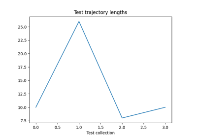
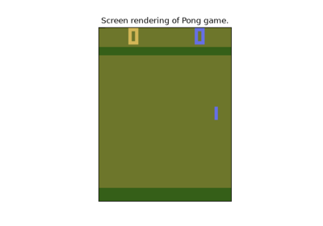
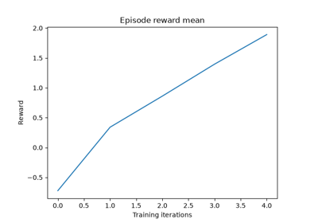
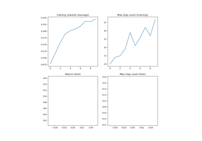
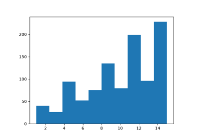
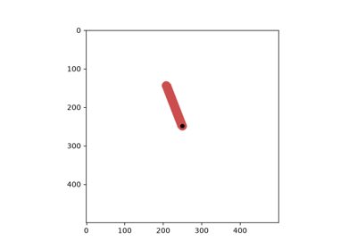
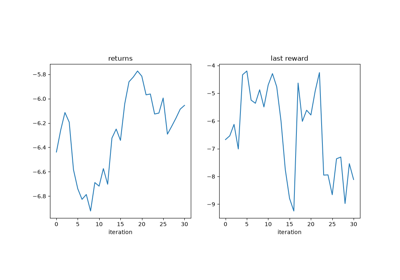
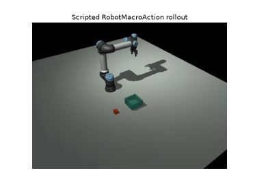
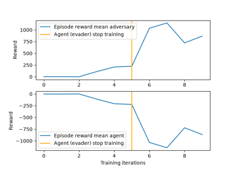
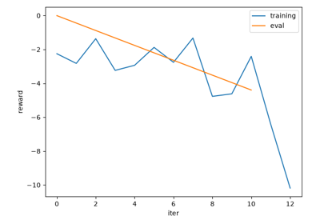

# README Tutos

Check the tutorials on torchrl documentation: [https://pytorch.org/rl](https://pytorch.org/rl)

[Get started with logging](getting-started-4.html)

Get started with logging

[Get started with Environments, TED and transforms](getting-started-0.html)

Get started with Environments, TED and transforms

[Getting started with model optimization](getting-started-2.html)

Getting started with model optimization

[Render policy rollouts with rlrender](rlrender.html)

Render policy rollouts with rlrender

[Get started with data collection and storage](getting-started-3.html)

Get started with data collection and storage

[Using pretrained models](pretrained_models.html)

Using pretrained models

[Using the Evaluator](evaluator.html)

Using the Evaluator

[Get started with your own first training loop](getting-started-5.html)

Get started with your own first training loop

[Get started with TorchRL's modules](getting-started-1.html)

Get started with TorchRL's modules

[Collectors Deep Dive: Trajectory Assembly](collector_trajectory_assembly.html)

Collectors Deep Dive: Trajectory Assembly

[Task-specific policy in multi-task environments](multi_task.html)

Task-specific policy in multi-task environments

[Vision-Language-Action (VLA) policies with TorchRL](vla.html)

Vision-Language-Action (VLA) policies with TorchRL

[Recurrent DQN: Training recurrent policies](dqn_with_rnn.html)

Recurrent DQN: Training recurrent policies

[Memory-Efficient RL Training](memory_efficient_rl.html)

Memory-Efficient RL Training

[Recurrent training on sequence batches](recurrent_sequence_training.html)

Recurrent training on sequence batches

[Introduction to TorchRL](torchrl_demo.html)

Introduction to TorchRL

[Exporting TorchRL modules](export.html)

Exporting TorchRL modules

[Multi-Agent Reinforcement Learning (PPO) with TorchRL Tutorial](multiagent_ppo.html)

Multi-Agent Reinforcement Learning (PPO) with TorchRL Tutorial

[Reinforcement Learning (PPO) with TorchRL Tutorial](coding_ppo.html)

Reinforcement Learning (PPO) with TorchRL Tutorial

[Using Replay Buffers](rb_tutorial.html)

Using Replay Buffers

[TorchRL envs](torchrl_envs.html)

TorchRL envs

[LLM Wrappers in TorchRL](llm_wrappers.html)

LLM Wrappers in TorchRL

[TorchRL trainer: A DQN example](coding_dqn.html)

TorchRL trainer: A DQN example

[Pendulum: Writing your environment and transforms with TorchRL](pendulum.html)

Pendulum: Writing your environment and transforms with TorchRL

[MuJoCo scripted manipulation with human-readable robot actions](mujoco_cube_bowl_macros.html)

MuJoCo scripted manipulation with human-readable robot actions

[Competitive Multi-Agent Reinforcement Learning (DDPG) with TorchRL Tutorial](multiagent_competitive_ddpg.html)

Competitive Multi-Agent Reinforcement Learning (DDPG) with TorchRL Tutorial

[TorchRL objectives: Coding a DDPG loss](coding_ddpg.html)

TorchRL objectives: Coding a DDPG loss

[`Download all examples in Python source code: tutorials_python.zip`](../_downloads/315c4c52fb68082a731b192d944e2ede/tutorials_python.zip)

[`Download all examples in Jupyter notebooks: tutorials_jupyter.zip`](../_downloads/a5659940aa3f8f568547d47752a43172/tutorials_jupyter.zip)

[Gallery generated by Sphinx-Gallery](https://sphinx-gallery.github.io)