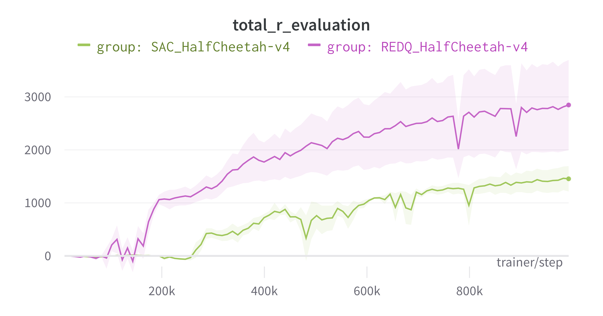
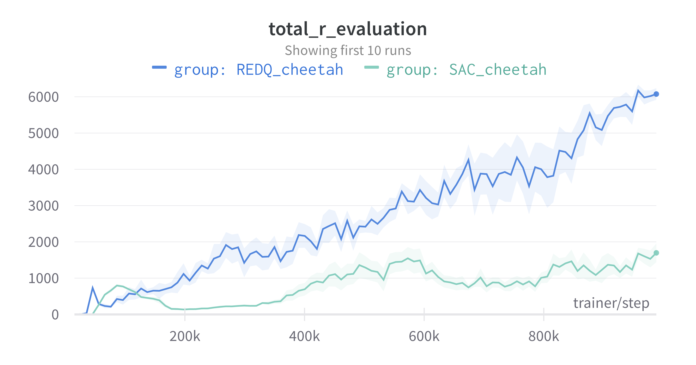
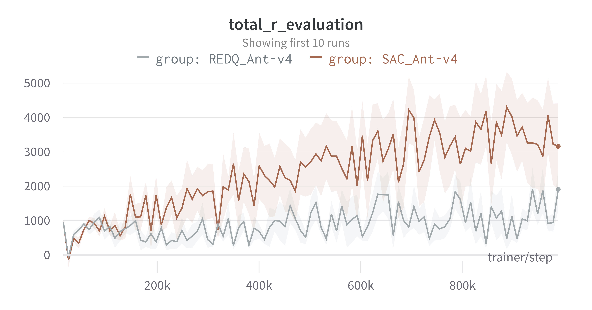
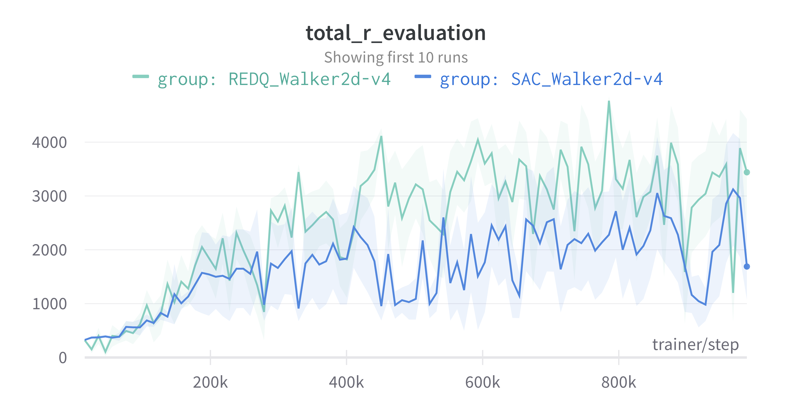

# Examples

We provide examples to train the following algorithms:
- [CQL](../sota-implementations/cql/)
- [DDPG](ddpg/ddpg.py)
- [DQN](../sota-implementations/dqn/)
- [Decision Transformers](../sota-implementations/decision_transformer)
- [Discrete SAC](discrete_sac/discrete_sac.py)
- [Dreamer](../sota-implementations/dreamer)
- [IQL](iql/)
- [Impala](impala/)
- [PPO](../sota-implementations/ppo/)
- [REDQ](redq/redq.py)
- [SAC](sac/sac.py)
- [TD3](../sota-implementations/td3/td3.py)
- [Various multiagent examples](multiagent/)

To run these examples, make sure you have installed hydra:
```
pip install hydra-core
```

Scripts can be run from the directory of interest using:
```
python sac.py
```
or similar. Hyperparameters can be easily changed by providing the arguments to hydra:
```
python sac.py collector.frames_per_batch=63
```

[//]: # (# Results)

[//]: # ()
[//]: # (Here we can see some results for the SAC and REDQ algorithm.)

[//]: # (We average the results over 5 different seeds and plot the standard error.)

[//]: # (## Gym's HalfCheetah-v4)

[//]: # ()
[//]: # (<p align="center">)

[//]: # ()

[//]: # (</p>)

[//]: # (To reproduce a single run:)

[//]: # ()
[//]: # (```)

[//]: # (python sac/sac.py env.name="HalfCheetah-v4" env.task="" env.library="gym")

[//]: # (```)

[//]: # ()
[//]: # (``` )

[//]: # (python redq/redq.py env.name="HalfCheetah-v4" env.library="gymnasium")

[//]: # (```)

[//]: # ()
[//]: # ()
[//]: # (## dm_control's cheetah-run)

[//]: # ()
[//]: # (<p align="center">)

[//]: # ()

[//]: # (</p>)

[//]: # (To reproduce a single run:)

[//]: # ()
[//]: # (```)

[//]: # (python sac/sac.py env.name="cheetah" env.task="run" env.library="dm_control")

[//]: # (```)

[//]: # ()
[//]: # (``` )

[//]: # (python redq/redq.py env.name="cheetah" env.task="run" env.library="dm_control")

[//]: # (```)

[//]: # ()
[//]: # ([//]: # &#40;TODO: adapt these scripts&#41;)
[//]: # ([//]: # &#40;## Gym's Ant-v4&#41;)
[//]: # ()
[//]: # ([//]: # &#40;&#41;)
[//]: # ([//]: # &#40;<p align="center">&#41;)
[//]: # ()
[//]: # ([//]: # &#40;&#41;)
[//]: # ()
[//]: # ([//]: # &#40;</p>&#41;)
[//]: # ()
[//]: # ([//]: # &#40;To reproduce a single run:&#41;)
[//]: # ()
[//]: # ([//]: # &#40;&#41;)
[//]: # ([//]: # &#40;```&#41;)
[//]: # ()
[//]: # ([//]: # &#40;python sac/sac.py env.name="Ant-v4" env.task="" env.library="gym"&#41;)
[//]: # ()
[//]: # ([//]: # &#40;```&#41;)
[//]: # ()
[//]: # ([//]: # &#40;&#41;)
[//]: # ([//]: # &#40;``` &#41;)
[//]: # ()
[//]: # ([//]: # &#40;python redq/redq.py env_name="Ant-v4" env_task="" env_library="gym"&#41;)
[//]: # ()
[//]: # ([//]: # &#40;```&#41;)
[//]: # ()
[//]: # ([//]: # &#40;&#41;)
[//]: # ([//]: # &#40;## Gym's Walker2D-v4&#41;)
[//]: # ()
[//]: # ([//]: # &#40;&#41;)
[//]: # ([//]: # &#40;<p align="center">&#41;)
[//]: # ()
[//]: # ([//]: # &#40;&#41;)
[//]: # ()
[//]: # ([//]: # &#40;</p>&#41;)
[//]: # ()
[//]: # ([//]: # &#40;To reproduce a single run:&#41;)
[//]: # ()
[//]: # ([//]: # &#40;&#41;)
[//]: # ([//]: # &#40;```&#41;)
[//]: # ()
[//]: # ([//]: # &#40;python sac/sac.py env_name="Walker2D-v4" env_task="" env_library="gym"&#41;)
[//]: # ()
[//]: # ([//]: # &#40;```&#41;)
[//]: # ()
[//]: # ([//]: # &#40;&#41;)
[//]: # ([//]: # &#40;``` &#41;)
[//]: # ()
[//]: # ([//]: # &#40;python redq/redq.py env_name="Walker2D-v4" env_task="" env_library="gym"&#41;)
[//]: # ()
[//]: # ([//]: # &#40;```&#41;)
