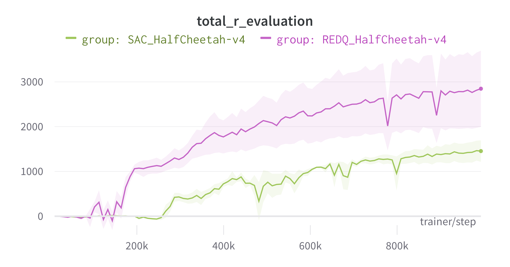
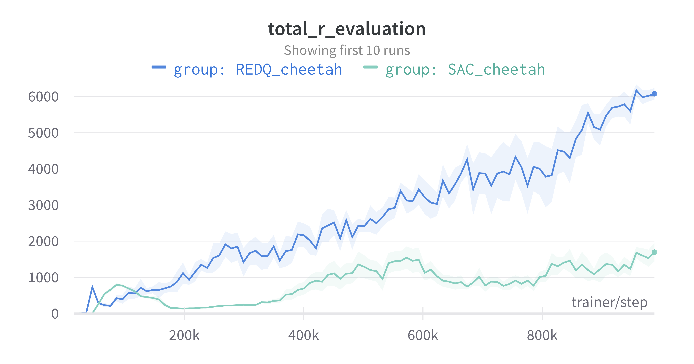
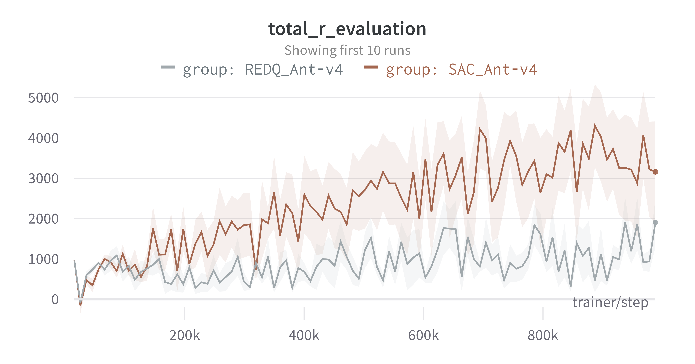
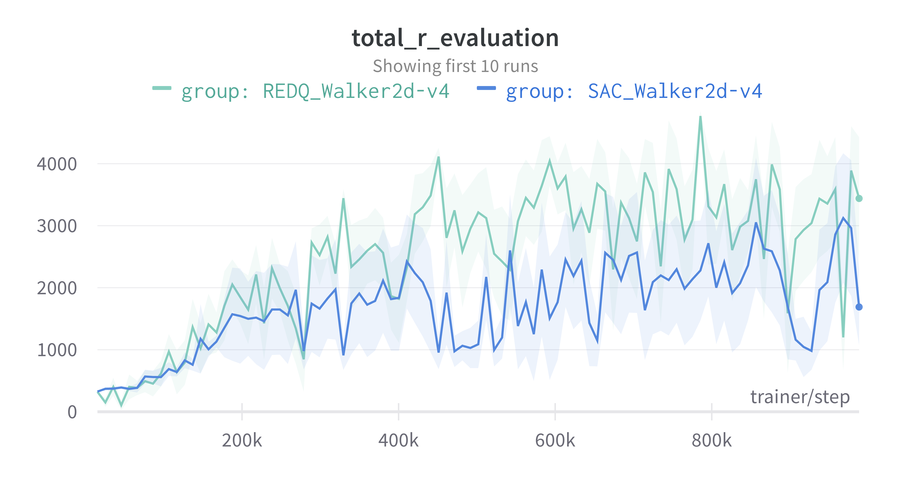

# Examples

We provide examples to train the following algorithms:
- [CQL](../sota-implementations/cql/)
- [DDPG](ddpg/ddpg.py)
- [DQN](../sota-implementations/dqn/)
- [Decision Transformers](../sota-implementations/decision_transformer)
- [Discrete SAC](discrete_sac/discrete_sac.py)
- [Dreamer](../sota-implementations/dreamer)
- [FQL](fql/)
- [IQL](iql/)
- [Impala](impala/)
- [PPO](../sota-implementations/ppo/)
- [REDQ](redq/redq.py)
- [RND (PPO + Random Network Distillation)](rnd/rnd_mujoco.py)
- [SAC](sac/sac.py)
- [TD3](../sota-implementations/td3/td3.py)
- [Various multiagent examples](multiagent/)

To run these examples, make sure you have installed hydra:
```
pip install --upgrade "hydra-core>=1.3,<1.4"
```

Scripts can be run from the directory of interest using:
```
python sac.py
```
or similar. Hyperparameters can be easily changed by providing the arguments to hydra:
```
python sac.py collector.frames_per_batch=63
```

## Stopping and resuming

The `*_trainer` recipes and the standalone `sac`, `td3` and `ddpg` recipes save
rotated checkpoints under `checkpoints/` in their Hydra run directory and stop
cleanly on Ctrl-C or SIGTERM. Continue a run from its checkpoint directory; the
saved configuration is the base and other overrides apply on top:

```
python sota-implementations/sac_trainer/train.py resume=outputs/<date>/<time>/checkpoints
python sota-implementations/sac/sac.py resume=outputs/<date>/<time>/checkpoints collector.total_frames=2_000_000
```

W&B reopens the original run, CSV and TensorBoard loggers keep appending to the
original directory, and checkpoints keep accumulating in the resumed directory.
Environments restart from a reset, so resumed trajectories are not promised to
match an uninterrupted run. `trainer.checkpoint_rotation=null` (trainer recipes)
or `checkpoint.dir=null` (standalone recipes) disables saving. The checkpointing
page of the documentation describes the flow.

[//]: # (# Results)

[//]: # ()
[//]: # (Here we can see some results for the SAC and REDQ algorithm.)

[//]: # (We average the results over 5 different seeds and plot the standard error.)

[//]: # (## Gym's HalfCheetah-v4)

[//]: # ()
[//]: # (<p align="center">)

[//]: # ()

[//]: # (</p>)

[//]: # (To reproduce a single run:)

[//]: # ()
[//]: # (```)

[//]: # (python sac/sac.py env.name="HalfCheetah-v4" env.task="" env.library="gym")

[//]: # (```)

[//]: # ()
[//]: # (``` )

[//]: # (python redq/redq.py env.name="HalfCheetah-v4" env.library="gymnasium")

[//]: # (```)

[//]: # ()
[//]: # ()
[//]: # (## dm_control's cheetah-run)

[//]: # ()
[//]: # (<p align="center">)

[//]: # ()

[//]: # (</p>)

[//]: # (To reproduce a single run:)

[//]: # ()
[//]: # (```)

[//]: # (python sac/sac.py env.name="cheetah" env.task="run" env.library="dm_control")

[//]: # (```)

[//]: # ()
[//]: # (``` )

[//]: # (python redq/redq.py env.name="cheetah" env.task="run" env.library="dm_control")

[//]: # (```)

[//]: # ()
[//]: # ([//]: # &#40;TODO: adapt these scripts&#41;)
[//]: # ([//]: # &#40;## Gym's Ant-v4&#41;)
[//]: # ()
[//]: # ([//]: # &#40;&#41;)
[//]: # ([//]: # &#40;<p align="center">&#41;)
[//]: # ()
[//]: # ([//]: # &#40;&#41;)
[//]: # ()
[//]: # ([//]: # &#40;</p>&#41;)
[//]: # ()
[//]: # ([//]: # &#40;To reproduce a single run:&#41;)
[//]: # ()
[//]: # ([//]: # &#40;&#41;)
[//]: # ([//]: # &#40;```&#41;)
[//]: # ()
[//]: # ([//]: # &#40;python sac/sac.py env.name="Ant-v4" env.task="" env.library="gym"&#41;)
[//]: # ()
[//]: # ([//]: # &#40;```&#41;)
[//]: # ()
[//]: # ([//]: # &#40;&#41;)
[//]: # ([//]: # &#40;``` &#41;)
[//]: # ()
[//]: # ([//]: # &#40;python redq/redq.py env_name="Ant-v4" env_task="" env_library="gym"&#41;)
[//]: # ()
[//]: # ([//]: # &#40;```&#41;)
[//]: # ()
[//]: # ([//]: # &#40;&#41;)
[//]: # ([//]: # &#40;## Gym's Walker2D-v4&#41;)
[//]: # ()
[//]: # ([//]: # &#40;&#41;)
[//]: # ([//]: # &#40;<p align="center">&#41;)
[//]: # ()
[//]: # ([//]: # &#40;&#41;)
[//]: # ()
[//]: # ([//]: # &#40;</p>&#41;)
[//]: # ()
[//]: # ([//]: # &#40;To reproduce a single run:&#41;)
[//]: # ()
[//]: # ([//]: # &#40;&#41;)
[//]: # ([//]: # &#40;```&#41;)
[//]: # ()
[//]: # ([//]: # &#40;python sac/sac.py env_name="Walker2D-v4" env_task="" env_library="gym"&#41;)
[//]: # ()
[//]: # ([//]: # &#40;```&#41;)
[//]: # ()
[//]: # ([//]: # &#40;&#41;)
[//]: # ([//]: # &#40;``` &#41;)
[//]: # ()
[//]: # ([//]: # &#40;python redq/redq.py env_name="Walker2D-v4" env_task="" env_library="gym"&#41;)
[//]: # ()
[//]: # ([//]: # &#40;```&#41;)
